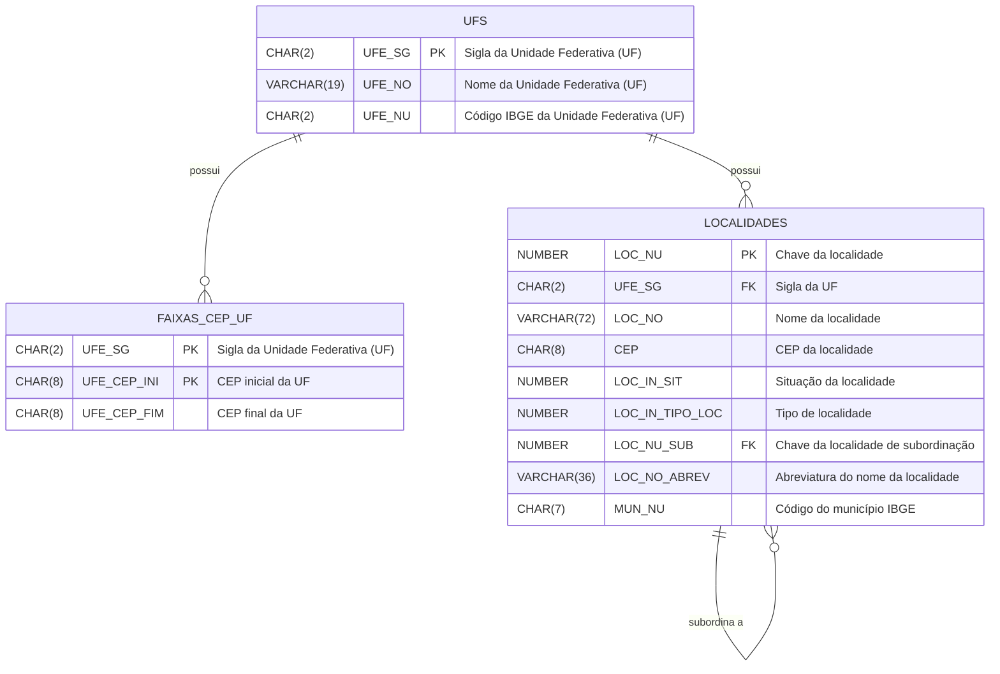

# Estrutura da Base de CEPs dos Correios - e-DNE
Segundo os Correios, O CEP (Códigos de Endereçamento Postal) pode ser definido como:

> Um conjunto numérico constituído de oito algarismos, que orienta e acelera o encaminhamento, o tratamento e a distribuição de objetos de correspondência, por meio da sua atribuição a localidades, logradouros, unidades dos Correios, serviços, órgãos públicos, empresas e edifícios.

Esse conjunto numérico é estruturado da seguinte forma:
- **Primeiros cinco dígitos**: Identificam a região, sub-região, setor, sub-setor e a unidade de distribuição.
- **Últimos três dígitos**: Identificam o ponto de entrega, que pode ser um logradouro, uma empresa ou um órgão público.

<!-- truncate -->

Exemplificando, no CEP `12345-678`:
- `1`: Região
- `2`: Sub-região
- `3`: Setor
- `4`: Sub-setor
- `5`: Unidade de distribuição
- `678`: Ponto de entrega

Você pode se aprofundar mais sobre a estrutura dos CEPs na [Wikipédia - Código de Endereçamento Postal](https://pt.wikipedia.org/wiki/C%C3%B3digo_de_Endere%C3%A7amento_Postal) ou no site oficial dos [Correios - Tudo sobre CEP](https://www.correios.com.br/enviar/precisa-de-ajuda/tudo-sobre-cep).

## Base de Dados e-DNE
Os Correios disponibilizam uma base de dados chamada e-DNE (Endereçamento Nacional Eletrônico), que contém informações sobre os CEPs e endereços no Brasil. Essa base é utilizada por empresas para fins de marketing direto, logística e outras aplicações que requerem dados precisos de endereçamento.

A base de dados e-DNE é uma ferramenta paga comercializada pelos Correios. Para a sua utilização é necessário adquirir uma licença, que pode ser feita diretamente no site dos Correios na seção de [Marketing Direto](https://www.correios.com.br/enviar/marketing-direto/marketing) ou possuir um contrato de prestação de serviços com a empresa.

O e-DNE é oferecido em duas modalidades, ambas contendo todas as informações sobre os CEPs e endereços e atualizações quinzenais durante o período de um ano, entretanto, cada uma com um diferente formato de arquivo:
1. **DNE Básico**: Um conjunto de arquivos em formato TXT, 
2. **DNE Master**: Um conjunto de arquivos em formato TXT + um banco de dados em formato Microsoft Access (MDB).


## Modalidades e valores

**DNE Básico**
| Item                       | Código | Valor       |
| :------------------------- | ------ | ----------- |
| Base de Dados e-DNE Básico | 8570-7 | R$ 1.538,27 |
| Renovação Trimestral       | 8571-5 | R$ 307,65   |
| Renovação Anual            | 8574-0 | R$ 1.174,67 |

**DNE Master**
| Item                       | Código | Valor       |
| :------------------------- | ------ | ----------- |
| Base de Dados e-DNE Master | 8572-3 | R$ 3.496,06 |
| Renovação Trimestral       | 8569-3 | R$ 769,14   |
| Renovação Anual            | 8573-1 | R$ 2.936,71 |

<small>Fonte: https://www.correios.com.br/enviar/marketing-direto/marketing (visualizado em 17/11/2025)</small>

## DNE Básico - Estrutura dos Arquivos TXT
Vamos entender a estrutura dos arquivos TXT da base DNE Básico. Iremos utilizar a versão dos arquivos que estão delimitados¹, onde cada arquivo contém registros com campos separados por arroba (@). 

Temos 16 arquivos principais na base DNE Básico. Para cada arquivo, iremos entender seus dados e criar uma classe C# representando a estrutura dos dados. Após a criação das classes, criaremos um método para ler os arquivos TXT e mapear os dados para as classes correspondentes e salvar os dados de forma estruturada em um banco de dados `PostgreSQL`. No final, criaremos uma API para consultar os dados importados.

## Criação do Projeto
Iremos utilizar o Visual Studio 2022 para criar uma solution para o nosso projeto. A solution será composta por 5 projetos:
1. **Correios.DNEBasico.Domain**: Projeto do tipo Class Library que conterá as classes representando a estrutura dos dados.
2. **Correios.DNEBasico.Data**: Projeto do tipo Class Library que conterá a lógica para ler os arquivos TXT e mapear os dados para as classes do projeto Domain.
3. **Correios.DNEBasico.App**: Projeto do tipo Console Application que será o ponto de entrada da aplicação e onde iremos chamar os métodos para ler os arquivos e salvar os dados no banco de dados.
4. **Correios.DNEBasico.Api**: Projeto do tipo ASP.NET Core Web API que fornecerá endpoints para consultar os dados importados.
5. **Correios.DNEBasico.Api.Tests**: Projeto do tipo xUnit Test Project que conterá os testes automatizados para a API.

Utilizaremos o Entity Framework Core como ORM para facilitar a manipulação dos dados no banco de dados PostgreSQL.

Para criar a solution e os projetos, siga os passos abaixo:
1. Abra o Visual Studio 2022.
2. Clique em "Create a new project".
3. Selecione "Blank Solution" e clique em "Next".
4. Dê um nome para a solution, por exemplo, `Correios.DNEBasico` e clique em "Create".
5. Clique com o botão direito na solution no Solution Explorer e selecione "Add" > "New Project".
6. Selecione "Class Library" e dê o nome `Correios.DNEBasico.Domain`. Repita o processo para criar os projetos `Correios.DNEBasico.Data`, `Correios.DNEBasico.App`, `Correios.DNEBasico.Api` e `Correios.DNEBasico.Api.Tests` selecionando o tipo apropriado para cada um.

## Estrutura dos Arquivos TXT
A seguir, apresento a estrutura dos arquivos TXT da base DNE Básico, juntamente com a descrição dos campos e as nossas classes C# correspondentes.

### UFs
A primeira tabela que iremos analisar e criar é a tabela de UFs (Unidades Federativas), que conterá informações sobre os estados do Brasil. Essa é uma tabela que não existe nos arquivos TXT do DNE Básico, mas será importante para relacionarmos os dados posteriormente.
Arquivo: Não existe arquivo específico no e-DNE Básico

Seguindo o padrão da nomenclatura de nomes utilziada nos arquivos do DNE Básico para os nomes das colunas, a nossa tabela de UFs terá a seguinte estrutura:

| Campo  | Tipo        | Descrição                              |
| ------ | ----------- | -------------------------------------- |
| UFE_SG | CHAR(2)     | Sigla da Unidade Federativa (UF)       |
| UFE_NO | VARCHAR(19) | Nome da Unidade Federativa (UF)        |
| UFE_NU | CHAR(2)     | Código IBGE da Unidade Federativa (UF) |

Vamos criar nossa classe no Projeto Domain para representar essa estrutura. Crie um diretório chamado `Entities` dentro do projeto `Correios.DNEBasico.Domain` e adicione a seguinte classe `Estado.cs`:

```csharp title="Correios.DNEBasico.Domain/Entities/Estado.cs"
namespace Correios.DneBasico.Domain.Entities;

/// <summary>
/// Unidade Federativa (Estado) do Brasil
/// </summary>
public class Estado
{
    /// <summary>
    /// Sigla do Estado
    /// </summary>
    public string Uf { get; set; } = default!;

    /// <summary>
    /// Nome do Estado
    /// </summary>
    public string Nome { get; set; } = default!;

    /// <summary>
    /// Código IBGE do Estado
    /// </summary>    
    public string Ibge { get; set; } = default!;
}

```

Para mapear essa entidade no banco de dados utilizando o Entity Framework Core, crie um diretório chamado `Configurations` dentro do projeto `Correios.DNEBasico.Data`.

Adicione uma refêrencia ao projeto `Correios.DNEBasico.Domain` no projeto `Correios.DNEBasico.Data`, instale os pacotes NuGet `Microsoft.EntityFrameworkCore` e `Npgsql.EntityFrameworkCore.PostgreSQL` no projeto `Correios.DNEBasico.Data`, e em seguida, crie o arquivo `EstadoConfiguration.cs` dentro do diretório `Configurations` com o seguinte conteúdo:

```csharp title="Correios.DNEBasico.Data/Configurations/EstadoConfiguration.cs"
using Correios.DneBasico.Domain.Entities;
using Microsoft.EntityFrameworkCore;
using Microsoft.EntityFrameworkCore.Metadata.Builders;

namespace Correios.DneBasico.Data.Configurations;
public class EstadoConfiguration : IEntityTypeConfiguration<Estado>
{
    public void Configure(EntityTypeBuilder<Estado> builder)
    {
        builder.ToTable("estados");

        builder.HasKey(u => u.Uf);

        builder.Property(u => u.Uf)
            .HasColumnName("UFE_SG")
            .IsRequired()
            .HasMaxLength(2);

        builder.Property(u => u.Nome)
            .HasColumnName("UFE_NO")
            .IsRequired()
            .HasMaxLength(19);

        builder.Property(u => u.Ibge)
            .HasColumnName("UFE_NU")
            .IsRequired()
            .HasMaxLength(2);
    }
}
```

Seguindo esse padrão, iremos criar as outras tabelas e classes correspondentes para os demais arquivos do DNE Básico.

### Faixa de CEP de UF
Arquivo: LOG_FAIXA_UF.TXT

| Campo       | Tipo    | Descrição                        |
| :---------- | :------ | :------------------------------- |
| UFE_SG      | CHAR(2) | Sigla da Unidade Federativa (UF) |
| UFE_CEP_INI | CHAR(8) | CEP inicial da UF                |
| UFE_CEP_FIM | CHAR(8) | CEP final da UF                  |

Tem como chave primária os campos `UFE_SG` e `UFE_CEP_INI`.
Iremos relacionar essa tabela com a tabela de UFs através do campo `UFE_SG`.

```csharp title="Correios.DNEBasico.Domain/Entities/FaixaCepUf.cs"
namespace Correios.DneBasico.Domain.Entities;

/// <summary>
/// Faixa de CEP do Estado
/// </summary>
public class FaixaCepEstado
{
    /// <summary>
    /// Sigla da Unidade Federativa (Estado)
    /// </summary>
    public string Uf { get; set; } = default!;

    /// <summary>
    /// CEP inicial do Estado
    /// </summary>
    public string CepInicial { get; set; } = default!;

    /// <summary>
    /// CEP final do Estado
    /// </summary>
    public string? CepFinal { get; set; } = default!;

    #region Navigation Properties
    /// <summary>
    /// Unidade Federativa (Estado)
    /// </summary>
    public Estado Estado { get; set; } = default!;
    #endregion
}
```

```csharp title="Correios.DNEBasico.Data/Configurations/FaixaCepEstadoConfiguration.cs"
using Correios.DneBasico.Domain.Entities;
using Microsoft.EntityFrameworkCore;
using Microsoft.EntityFrameworkCore.Metadata.Builders;

namespace Correios.DneBasico.Data.Configurations;
public class FaixaCepEstadoConfiguration : IEntityTypeConfiguration<FaixaCepEstado>
{
    public void Configure(EntityTypeBuilder<FaixaCepEstado> builder)
    {
        builder.ToTable("faixas_cep_estado");

        builder.HasKey(f => new { f.Uf, f.CepInicial });

        builder.Property(f => f.Uf)
            .HasColumnName("UFE_SG")
            .IsRequired()
            .HasMaxLength(2);

        builder.HasOne(l => l.Estado)
            .WithMany()
            .HasForeignKey(l => l.Uf)
            .OnDelete(DeleteBehavior.Restrict);

        builder.Property(f => f.CepInicial)
            .HasColumnName("UFE_CEP_INI")
            .IsRequired()
            .HasMaxLength(8);

        builder.Property(f => f.CepFinal)
            .HasColumnName("UFE_CEP_FIM")
            .IsRequired()
            .HasMaxLength(8);
    }
}
```

### Localidades
Arquivo: LOG_LOCALIDADE.TXT

Segundo o Guide do e-DNE:

> O arquivo LOG_LOCALIDADE contempla os municípios, distritos e povoados do Brasil. 
> Os CEPs presentes neste arquivo valem para todos os logradouros da cidade, não necessitando consulta nos demais arquivos. 
> As localidades em fase de codificação (LOC_IN_SIT=3) estão em período de  transição, sendo aceito o CEP Geral ou os CEPs de Logradouros para endereçamento.

| Campo           | Tipo        | Descrição                                                                                                                                                                                                                                                                               |
| :-------------- | :---------- | :-------------------------------------------------------------------------------------------------------------------------------------------------------------------------------------------------------------------------------------------------------------------------------------- |
| LOC_NU          | NUMBER(8)   | Chave da localidade                                                                                                                                                                                                                                                                     |
| UFE_SG          | CHAR(2)     | Sigla da UF                                                                                                                                                                                                                                                                             |
| LOC_NO          | VARCHAR(72) | Nome da localidade                                                                                                                                                                                                                                                                      |
| CEP             | CHAR(8)     | CEP da localidade (para  localidade  não codificada, ou seja loc_in_sit = 0) (opcional)                                                                                                                                                                                                 |
| LOC_IN_SIT      | CHAR(1)     | Situação da localidade:<br/>0 = Localidade  não codificada em nível de Logradouro, <br/>1 = Localidade codificada em nível de Logradouro<br/>2 = Distrito ou Povoado inserido na codificação em nível de Logradouro.<br/>3 = Localidade em fase de codificação  em nível de Logradouro. |
| LOC_IN_TIPO_LOC | CHAR(1)     | Tipo de localidade:<br/>D – Distrito,<br/>M – Município,<br/>P – Povoado.                                                                                                                                                                                                               |
| LOC_NU_SUB      | NUMBER(8)   | Chave da localidade de subordinação (opcional)                                                                                                                                                                                                                                          |
| LOC_NO_ABREV    | VARCHAR(36) | Abreviatura do nome da localidade (opcional)                                                                                                                                                                                                                                            |
| MUN_NU          | CHAR(7)     | Código do município IBGE (opcional)                                                                                                                                                                                                                                                     |

Chave primária: `LOC_NU`

:::warning
A tabela de Localidades contém a listagem de todos os municípios, distritos e povoados do Brasil conforme os dados dos Correios. Tenha cuidado para não expor todos os dados da tabela como se cada registro fosse um município, pois muitos registros representam distritos e povoados que não são municípios independentes.
:::

Vamos criar duas enums para os campos `LOC_IN_SIT` e `LOC_IN_TIPO_LOC`, e em seguida, a classe `Localidade.cs` e a configuração `LocalidadeConfiguration.cs`.

```csharp title="Correios.DNEBasico.Domain/Enums/SituacaoLocalidade.cs"
using System.ComponentModel;

namespace Correios.DneBasico.Domain.Enums;

/// <summary>
/// Situação da Localidade
/// </summary>
/// <remarks>
/// 0 = Localidade  não codificada em nível de Logradouro,
/// 1 = Localidade codificada em nível de Logradouro
/// 2 = Distrito ou Povoado inserido na codificação em nível de Logradouro
/// 3 = Localidade em fase de codificação em nível de Logradouro
/// </remarks>
public enum SituacaoLocalidade
{
    /// <summary>
    /// Localidade não codificada em nível de Logradouro
    /// </summary>
    [Description("Não codificada")]
    NAO_CODIFICADA = 0,

    /// <summary>
    /// Localidade codificada em nível de Logradouro
    /// </summary>
    [Description("Localidade codificada")]
    CODIFICADA = 1,

    /// <summary>
    /// Distrito ou Povoado inserido na codificação em 
    /// nível de Logradouro
    /// </summary>
    [Description("Distrito ou Povoado")]
    DISTRITO_OU_POVOADO = 2,

    /// <summary>
    /// Localidade em fase de codificação em nível de Logradouro
    /// </summary>
    [Description("Fase de Codificação")]
    FASE_DE_CODIFICACAO = 3,
}    
```

```csharp title="Correios.DNEBasico.Domain/Enums/TipoLocalidade.cs"
using System.ComponentModel;
namespace Correios.DneBasico.Domain.Enums;
/// <summary>
/// Tipo da Localidade
/// </summary>
/// <remarks>
/// D – Distrito,
/// M – Município,
/// P – Povoado.
/// </remarks>
public enum TipoLocalidade
{
    /// <summary>
    /// Distrito (D)
    /// </summary>
    [Description("Distrito")]
    DISTRITO = 'D',

    /// <summary>
    /// Município (M)
    /// </summary>
    [Description("Município")]
    MUNICIPIO = 'M',

    /// <summary>
    /// Povoado 
    /// </summary>
    [Description("Povoado")]
    POVOADO = 'P',
}
```

```csharp title="Correios.DNEBasico.Domain/Entities/Localidade.cs"
using Correios.DneBasico.Domain.Enums;

namespace Correios.DneBasico.Domain.Entities;

/// <summary>
/// O arquivo LOG_LOCALIDADE contempla os municípios, distritos e povoados do Brasil.
/// </summary>
/// <remarks>
/// Os CEPs presentes neste arquivo valem para todos os logradouros da cidade, não necessitando consulta nos demais arquivos. 
/// 
/// As localidades em fase de codificação(LOC_IN_SIT= 3) estão em período de transição, sendo aceito o CEP Geral ou os CEPs de Logradouros para endereçamento.
/// </remarks>
public class Localidade
{
    /// <summary>
    /// chave da localidade
    /// </summary>
    public int Id { get; set; }

    /// <summary>
    /// sigla da UF
    /// </summary>
    public string Uf { get; set; } = default!;

    /// <summary>
    /// nome da localidade
    /// </summary>
    public string Nome { get; set; } = default!;

    /// <summary>
    /// CEP da localidade (para  localidade  não codificada, ou seja loc_in_sit = 0) (opcional)
    /// </summary>
    public string? Cep { get; set; }

    /// <summary>
    /// situação da localidade:
    /// </summary>
    /// <remarks>
    /// 0 = Localidade não codificada em nível de Logradouro,
    /// 1 = Localidade codificada em nível de Logradouro e
    /// 2 = Distrito ou Povoado inserido na codificação em nível de Logradouro.
    /// 3 = Localidade em fase de codificação em nível de Logradouro.
    /// </remarks>
    public SituacaoLocalidade Situacao { get; set; } = default!;

    /// <summary>
    /// tipo de localidade
    /// </summary>  
    /// <remarks>
    /// D - Distrito,
    /// M - Município,
    /// P - Povoado.
    /// </remarks>
    public TipoLocalidade Tipo { get; set; } = default!;

    /// <summary>
    /// chave da localidade de subordinação (opcional)
    /// </summary>
    public int? SubordinadaId { get; set; }

    /// <summary>
    /// abreviatura do nome da localidade (opcional)
    /// </summary>
    public string? NomeAbreviado { get; set; }

    /// <summary>
    /// Código do município IBGE (opcional)
    /// </summary>
    public string? Ibge { get; set; }


    #region Navigation Properties

    public Estado Estado { get; set; } = default!;

    public Localidade? Subordinada { get; set; } = default!;
    #endregion
}
```

```csharp title="Correios.DNEBasico.Data/Configurations/LocalidadeConfiguration.cs"
using Correios.DneBasico.Domain.Entities;
using Microsoft.EntityFrameworkCore;
using Microsoft.EntityFrameworkCore.Metadata.Builders;

namespace Correios.DneBasico.Data.Configurations;
public class LocalidadeConfiguration : IEntityTypeConfiguration<Localidade>
{
    public void Configure(EntityTypeBuilder<Localidade> builder)
    {
        builder.ToTable("localidades");

        builder.HasKey(l => l.Id);

        builder.Property(l => l.Id)
            .HasColumnName("LOC_NU")
            .ValueGeneratedNever();

        builder.Property(l => l.Uf)
            .HasColumnName("UFE_SG")
            .IsRequired()
            .HasMaxLength(2);

        builder.HasOne(l => l.Estado)
            .WithMany()
            .HasForeignKey(l => l.Uf)
            .OnDelete(DeleteBehavior.Restrict);

        builder.Property(l => l.Nome)
            .HasColumnName("LOC_NO")
            .IsRequired()
            .HasMaxLength(72);

        builder.Property(l => l.Cep)
            .HasColumnName("LOC_CEP")
            .HasMaxLength(8);

        builder.Property(l => l.Situacao)
            .HasColumnName("LOC_IN_SIT");

        builder.Property(l => l.Tipo)
            .HasColumnName("LOC_IN_TIPO_LOC");

        builder.Property(l => l.SubordinadaId)
            .HasColumnName("LOC_NU_SUB");

        builder.Property(l => l.NomeAbreviado)
            .HasColumnName("LOC_NO_ABREV")
            .HasMaxLength(36);

        builder.Property(l => l.Ibge)
            .HasColumnName("MUN_NU")
            .HasMaxLength(7);
    }
}
```

Cada localidade deve ser relacionada com a seu respectivo Estado através do campo `UFE_SG`. Além disso, se a localidade for um distrito ou povoado, ela deve ser relacionada com a localidade de subordinação através do campo `LOC_NU_SUB`, que é uma chave estrangeira para a própria tabela de localidades.

Até agora temos a seguinte estrutura de tabelas no banco de dados:




Ainda temos mais 14 arquivos para analisar! Vamos em frente!

### Outras denominações de localidades
Arquivo: LOG_VAR_LOC.TXT

Outras denominações da Localidade (denominação popular, denominação anterior)

| Campo  | Tipo        | Descrição            |
| :----- | :---------- | :------------------- |
| LOC_NU | NUMBER(8)   | Chave da localidade  |
| VAL_NU | NUMBER(8)   | Ordem da denominação |
| VAL_TX | VARCHAR(72) | Denominação          |

Chave primária: `LOC_NU`, `VAL_NU`

```csharp title="Correios.DNEBasico.Domain/Entities/VariacaoLocalidade.cs"
using System.Text.Json.Serialization;

namespace Correios.DneBasico.Domain.Entities;

/// <summary>
/// Outras denominações da Localidade (denominação popular, denominação anterior)
/// </summary>
public class VariacaoLocalidade
{
    /// <summary>
    /// chave da localidade
    /// </summary>
    public int LocalidadeId { get; set; }

    /// <summary>
    /// ordem da denominação
    /// </summary>
    public int Ordem { get; set; }

    /// <summary>
    /// Denominação
    /// </summary>
    public string Denominacao { get; set; } = default!;

    #region Navigation Properties
    /// <summary>
    /// Localidade
    /// </summary>
    [JsonIgnore]
    public Localidade Localidade { get; set; } = default!;
    #endregion
}
```

Na entidade `Localidade`, precisamos adicionar uma coleção de variações de localidade para representar o relacionamento um-para-muitos entre `Localidade` e `VariacaoLocalidade`. Adicione a seguinte propriedade na classe `Localidade`:

```csharp title="Correios.DNEBasico.Domain/Entities/Localidade.cs"
    /// <summary>
    /// Variações da Localidade
    /// </summary>
    public ICollection<VariacaoLocalidade> Variacoes { get; set; } = [];
```

Quando serializamos a entidade `Localidade` para JSON, a propriedade `Variacoes` incluirá todas as variações associadas. Cada `VariacaoLocalidade`, por sua vez, possui uma referência de volta para a `Localidade` através da propriedade `Localidade`. Isso cria uma referência circular entre as duas entidades. Não pretendemos serializar o modelo completo nos endpoints da API, mas, para evitar a fadiga, utilizaremos o atributo `[JsonIgnore]` na propriedade `Localidade` da classe `VariacaoLocalidade` para evitar essa referência circular durante a serialização.


```csharp title="Correios.DNEBasico.Data/Configurations/VariacaoLocalidadeConfiguration.cs"
using Correios.DneBasico.Domain.Entities;
using Microsoft.EntityFrameworkCore;
using Microsoft.EntityFrameworkCore.Metadata.Builders;

namespace Correios.DneBasico.Data.Configurations;
public class VariacaoLocalidadeConfiguration : IEntityTypeConfiguration<VariacaoLocalidade>
{
    public void Configure(EntityTypeBuilder<VariacaoLocalidade> builder)
    {
        builder.ToTable("variacoes_localidade");

        builder.HasKey(b => new { b.LocalidadeId, b.Ordem });

        builder.Property(b => b.LocalidadeId)
            .HasColumnName("LOC_NU")
            .ValueGeneratedNever();

        builder.Property(b => b.Ordem)
            .HasColumnName("VAL_NU")
            .ValueGeneratedNever();

        builder.Property(b => b.Denominacao)
            .HasColumnName("VAL_TX")
            .IsRequired()
            .HasMaxLength(72);
    }
}
```

### Faixa de CEP de Localidade
Arquivo: LOG_FAIXA_LOCALIDADE.TXT
Faixa de CEP das Localidades codificadas  
Contém dados relativos às faixas de CEP das localidades classificadas na categoria político-administrativa de município codificadas com CEP único ou codificadas por logradouros.

| Campo          | Tipo      | Descrição                                                                         |
| :------------- | :-------- | :-------------------------------------------------------------------------------- |
| LOC_NU         | NUMBER(8) | Chave da localidade                                                               |
| LOC_CEP_INI    | CHAR(8)   | CEP inicial da localidade                                                         |
| LOC_CEP_FIM    | CHAR(8)   | CEP final da localidade                                                           |
| LOC_TIPO_FAIXA | CHAR(1)   | Tipo de Faixa de CEP<br/>T – Total do Município<br/>C – Exclusiva da  Sede Urbana |

Chave primária: `LOC_NU`, `LOC_CEP_INI`

Vamos precisar de uma nova enum para o campo `LOC_TIPO_FAIXA`:

```csharp title="Correios.DNEBasico.Domain/Enums/TipoFaixaCep.cs"
using System.ComponentModel;

namespace Correios.DneBasico.Domain.Enums;

public enum TipoFaixaCep
{
    /// <summary>
    /// Total do Município
    /// </summary>
    [Description("Total do Município")]
    TOTAL_DO_MUNICIPIO = 1,

    /// <summary>
    /// Exclusiva da Sede Urbana
    /// </summary>
    [Description("Exclusiva da Sede Urbana")]
    EXCLUSIVA_SEDE_URBANA = 2,
}
```


```csharp title="Correios.DNEBasico.Domain/Entities/FaixaCepLocalidade.cs"
using Correios.DneBasico.Domain.Enums;

namespace Correios.DneBasico.Domain.Entities;

/// <summary>
/// Faixa de CEP das Localidades codificadas
/// </summary>
/// <remarks>
/// Este arquivo contém dados relativos às faixas de CEP das localidades
/// classificadas na categoria político-administrativa de município 
/// codificadas com CEP único ou codificadas por logradouros.
/// </remarks>
public class FaixaCepLocalidade
{
    /// <summary>
    /// chave da localidade
    /// </summary>
    public int LocalidadeId { get; set; }

    /// <summary>
    /// Localidade
    /// </summary>
    public Localidade Localidade { get; set; } = default!;

    /// <summary>
    /// CEP inicial da localidade
    /// </summary>
    public string CepInicial { get; set; } = default!;

    /// <summary>
    /// CEP final da localidade
    /// </summary>
    public string CepFinal { get; set; } = default!;

    /// <summary>
    /// tipo de Faixa de CEP: T – Total do Município, C – Exclusiva da  Sede Urbana
    /// </summary>
    public TipoFaixaCep TipoFaixa { get; set; } = default!;
}
```

```csharp title="Correios.DNEBasico.Data/Configurations/FaixaCepLocalidadeConfiguration.cs"
using Correios.DneBasico.Domain.Entities;
using Microsoft.EntityFrameworkCore;
using Microsoft.EntityFrameworkCore.Metadata.Builders;

public class FaixaCepLocalidadeConfiguration : 
             IEntityTypeConfiguration<FaixaCepLocalidade>
{
    public void Configure(EntityTypeBuilder<FaixaCepLocalidade> builder)
    {
        builder.ToTable("faixas_cep_localidade");

        builder.HasKey(f => new { f.LocalidadeId, f.CepInicial, f.TipoFaixa });

        builder.Property(f => f.LocalidadeId)
            .HasColumnName("LOC_NU")
            .ValueGeneratedNever();

        builder.Property(f => f.CepInicial)
            .HasColumnName("LOC_CEP_INI")
            .IsRequired()
            .HasMaxLength(8);

        builder.Property(f => f.CepFinal)
            .HasColumnName("LOC_CEP_FIM")
            .IsRequired()
            .HasMaxLength(8);

        builder.Property(f => f.TipoFaixa)
            .HasColumnName("LOC_TIPO_FAIXA")
            .IsRequired();
    }
}
```

Como diria o Buzz Lightyear: "Ao infinito e além!" :rocket: Ainda temos mais arquivos para analisar e criar as classes correspondentes. Na sequência, iremos criar a nossa tabela de bairros

### Bairros
Arquivo: LOG_BAIRRO.TXT

| Campo        | Tipo        | Descrição                                |
| :----------- | :---------- | :--------------------------------------- |
| BAI_NU       | NUMBER(8)   | Chave do bairro                          |
| UFE_SG       | CHAR(2)     | Sigla da UF                              |
| LOC_NU       | NUMBER(8)   | Chave da localidade                      |
| BAI_NO       | VARCHAR(72) | Nome do bairro                           |
| BAI_NO_ABREV | VARCHAR(36) | Abreviatura do nome do bairro (opcional) |

Chave primária: `BAI_NU`

```csharp title="Correios.DNEBasico.Domain/Entities/Bairro.cs"
namespace Correios.DneBasico.Domain.Entities;

/// <summary>
/// Bairro
/// </summary>
public class Bairro
{
    /// <summary>
    /// Chave do bairro
    /// </summary>
    public int Id { get; set; }

    /// <summary>
    /// Sigla da UF
    /// </summary>
    public string UF { get; set; } = default!;

    /// <summary>
    /// Chave da localidade
    /// </summary>
    public int LocalidadeId { get; set; }
    
    /// <summary>
    /// Nome do bairro
    /// </summary>
    public string Nome { get; set; } = default!;

    /// <summary>
    /// Abreviatura do nome do bairro (opcional)
    /// </summary>
    public string? NomeAbreviado { get; set; }

    #region Navigation Properties
    /// <summary>
    /// Localidade
    /// </summary>
    public Localidade Localidade { get; set; } = default!;    
    #endregion
}
```

```csharp title="Correios.DNEBasico.Data/Configurations/BairroConfiguration.cs"
using Correios.DneBasico.Domain.Entities;
using Microsoft.EntityFrameworkCore;
using Microsoft.EntityFrameworkCore.Metadata.Builders;

namespace Correios.DneBasico.Data.Configurations;
public class BairroConfiguration : IEntityTypeConfiguration<Bairro>
{
    public void Configure(EntityTypeBuilder<Bairro> builder)
    {
        builder.ToTable("bairros");

        builder.HasKey(b => b.Id);

        builder.Property(b => b.Id)
            .HasColumnName("BAI_NU")
            .ValueGeneratedNever();

        builder.Property(b => b.UF)
            .HasColumnName("UFE_SG")
            .IsRequired()
            .HasMaxLength(2);

        builder.Property(b => b.LocalidadeId)
            .HasColumnName("LOC_NU")
            .IsRequired();

        builder.Property(b => b.Nome)
            .HasColumnName("BAI_NO")
            .IsRequired()
            .HasMaxLength(72);

        builder.Property(b => b.NomeAbreviado)
            .HasColumnName("BAI_NO_ABREV")
            .HasMaxLength(36);
    }
}
```
### Outras denominações de bairros
Arquivo: LOG_VAR_BAIRRO.TXT
Outras denominações do Bairro Localidade (denominação popular, denominação anterior)

| Campo  | Tipo        | Descrição            |
| :----- | :---------- | :------------------- |
| BAI_NU | NUMBER(8)   | Chave do bairro      |
| VDB_NU | NUMBER(8)   | Ordem da denominação |
| VDB_TX | VARCHAR(72) | Denominação          |

Chave primária: BAI_NU, VDB_NU

```csharp title="Correios.DNEBasico.Domain/Entities/VariacaoBairro.cs"
namespace Correios.DneBasico.Domain.Entities;

/// <summary>
/// Outras denominações do Bairro Localidade
/// (denominação popular, denominação anterior)
/// </summary>
public class VariacaoBairro
{
    /// <summary>
    /// chave do bairro
    /// </summary>
    public int BairroId { get; set; }

    /// <summary>
    /// ordem da denominação
    /// </summary>
    public int Ordem { get; set; }

    /// <summary>
    /// Denominação
    /// </summary>
    public string Denominacao { get; set; } = default!;

    #region Navigation Properties
    /// <summary>
    /// Bairro
    /// </summary>
    [JsonIgnore]
    public Bairro Bairro { get; set; } = default!;
    #endregion
}
```

Igualmente à entidade `Localidade`, precisamos adicionar uma coleção de variações de bairro para representar o relacionamento um-para-muitos entre `Bairro` e `VariacaoBairro`. Adicione a seguinte propriedade na classe `Bairro`:

```csharp title="Correios.DNEBasico.Domain/Entities/Bairro.cs"
    /// <summary>
    /// Variações do Bairro
    /// </summary>
    public ICollection<VariacaoBairro> Variacoes { get; set; } = [];
```

```csharp title="Correios.DNEBasico.Data/Configurations/VariacaoBairroConfiguration.cs"
using Correios.DneBasico.Domain.Entities;
using Microsoft.EntityFrameworkCore;
using Microsoft.EntityFrameworkCore.Metadata.Builders;

namespace Correios.DneBasico.Data.Configurations;
public class VariacaoBairroConfiguration : 
             IEntityTypeConfiguration<VariacaoBairro>
{
    public void Configure(EntityTypeBuilder<VariacaoBairro> builder)
    {
        builder.ToTable("variacoes_bairro");

        builder.HasKey(b => new { b.BairroId, b.Ordem });

        builder.Property(b => b.BairroId)
            .HasColumnName("BAI_NU")
            .ValueGeneratedNever();

        builder.Property(b => b.Ordem)
            .HasColumnName("VDB_NU")
            .ValueGeneratedNever();

        builder.Property(b => b.Denominacao)
            .HasColumnName("VDB_TX")
            .IsRequired()
            .HasMaxLength(72);
    }
}
```

Firme e forte! Indo para a 8 de 15! A tabela de faixas de CEP por bairro

### Faixa de CEP de Bairro
Arquivo: LOG_FAIXA_BAIRRO.TXT
Faixa de CEP de Bairro

| Campo       | Tipo      | Descrição             |
| :---------- | :-------- | :-------------------- |
| BAI_NU      | NUMBER(8) | Chave do bairro       |
| FCB_CEP_INI | CHAR(8)   | CEP inicial do bairro |
| FCB_CEP_FIM | CHAR(8)   | CEP final do bairro   |

Chave primária: BAI_NU, FCB_CEP_INI

```csharp title="Correios.DNEBasico.Domain/Entities/FaixaCepBairro.cs"
namespace Correios.DneBasico.Domain.Entities;

/// <summary>
/// Faixa de CEP de Bairro
/// </summary>
public class FaixaCepBairro
{
    /// <summary>
    /// Chave do bairro
    /// </summary>
    public int BairroId { get; set; }

    /// <summary>
    /// CEP inicial do bairro
    /// </summary>
    public string CepInicial { get; set; } = default!;

    /// <summary>
    /// CEP final do bairro
    /// </summary>
    public string CepFinal { get; set; } = default!;

    #region Navigation Properties
    /// <summary>
    /// Bairro
    /// </summary>
    public Bairro Bairro { get; set; } = default!;
    #endregion
}

```

```csharp title="Correios.DNEBasico.Data/Configurations/FaixaCepBairroConfiguration.cs"
using Correios.DneBasico.Domain.Entities;
using Microsoft.EntityFrameworkCore;
using Microsoft.EntityFrameworkCore.Metadata.Builders;

namespace Correios.DneBasico.Data.Configurations;
public class FaixaCepBairroConfiguration : IEntityTypeConfiguration<FaixaCepBairro>
{
    public void Configure(EntityTypeBuilder<FaixaCepBairro> builder)
    {
        builder.ToTable("faixas_cep_bairro");

        builder.HasKey(b => new { b.BairroId, b.CepInicial });

        builder.Property(b => b.BairroId)
            .HasColumnName("BAI_NU")
            .ValueGeneratedNever();

        builder.Property(b => b.CepInicial)
            .HasColumnName("FCB_CEP_INI")
            .IsRequired()
            .HasMaxLength(8);

        builder.Property(b => b.CepFinal)
            .HasColumnName("FCB_CEP_FIM")
            .IsRequired()
            .HasMaxLength(8);
    }
}
```


## Referências
- [Correios - Marketing Direto](https://www.correios.com.br/enviar/marketing-direto/marketing) 
- [Wikipédia - Código de Endereçamento Postal](https://pt.wikipedia.org/wiki/C%C3%B3digo_de_Endere%C3%A7amento_Postal) 
- [Correios - Tudo sobre CEP](https://www.correios.com.br/enviar/precisa-de-ajuda/tudo-sobre-cep) 
- [ViaCEP - Consulta CEP](https://viacep.com.br/) 

<small>
¹ No DNE Básico, os arquivos podem ser encontrados em dois formatos: delimitados e fixos. No formato delimitado, os campos são separados por um caractere específico (neste caso, o arroba @), enquanto no formato fixo, cada campo possui um tamanho pré-definido. 
</small>