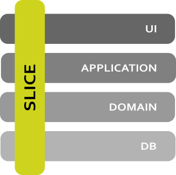
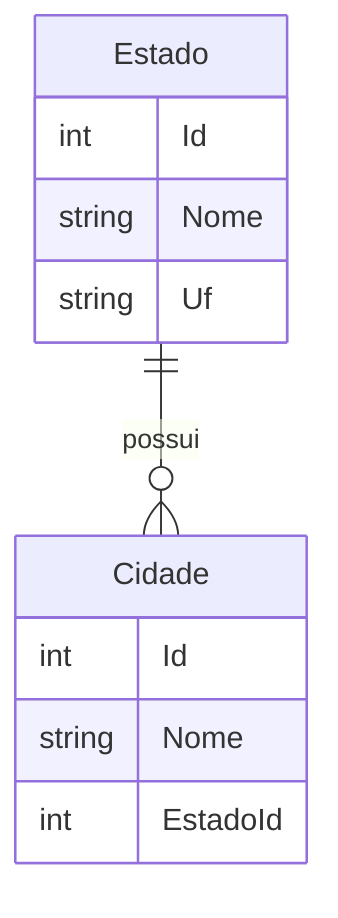
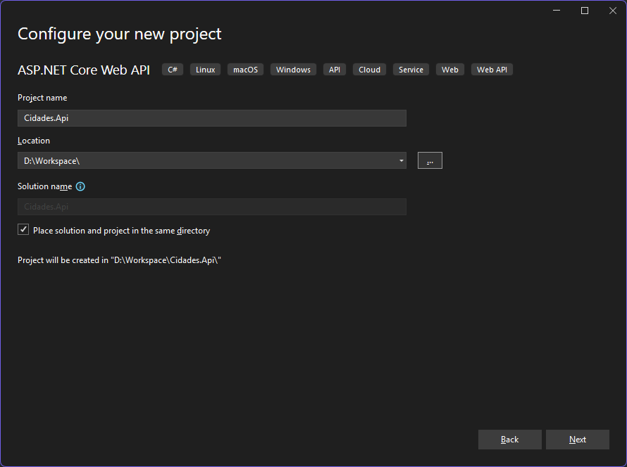
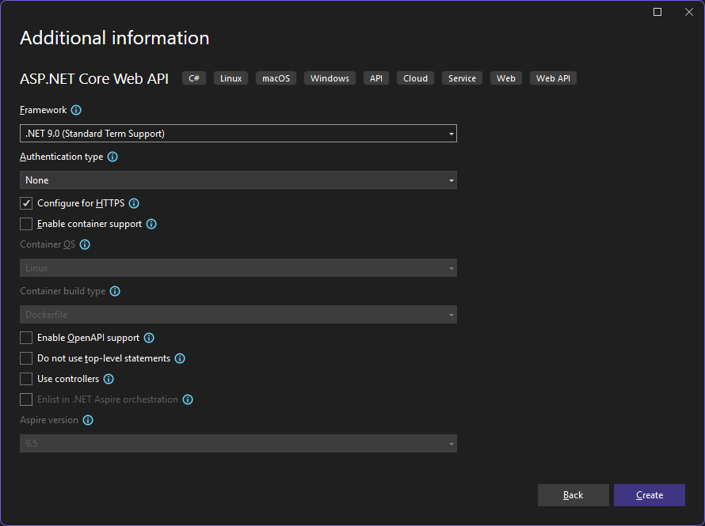
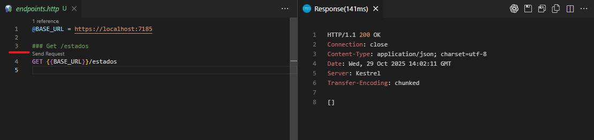
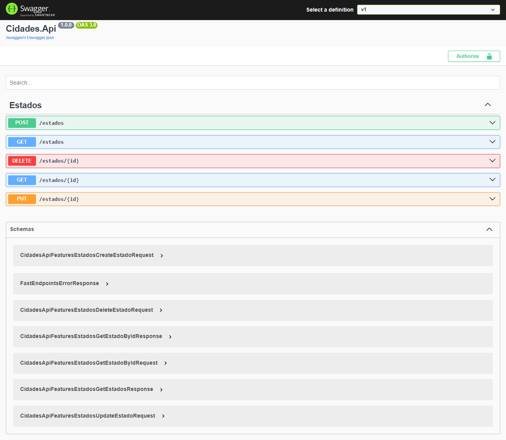
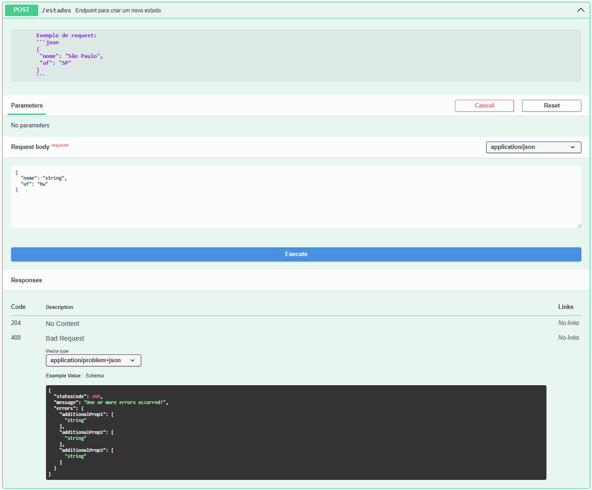
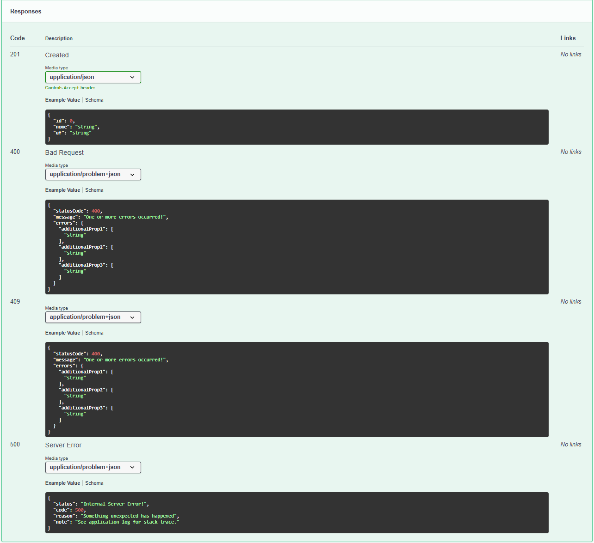

---
slug: fastendpoints-simplificando-o-desenvolvimento-de-apis-em-dotnet
title: "FastEndpoints: Simplificando o desenvolvimento de APIs em .NET"
authors: [corvello]
tags: [dotnet, fastendpoints, api, vsa]
date: 2025-11-13
toc_max_heading_level: 3
image: /img/blog/fastendpoints-simplificando-o-desenvolvimento-de-apis-em-dotnet/og_image.png
redirect_from:
  - /2025/11/fastendpoints-simplificando-o-desenvolvimento-de-apis-em-dotnet
---

# FastEndpoints: Simplificando o desenvolvimento de APIs em .NET

Iniciei há alguns poucos anos um processo de `exploração alternativa` para encontrar maneiras de desenvolvimento alternativas aos tradicionais `Controllers` do ASP.NET Core no desenvolvimento de APIs. Explorei o Minimal API por um tempo, porém, não me senti completamente confortável com ele. A cada novo projeto, o processo de configuração e estruturação da API me parecia muito repetitivo e trabalhoso sendo necesssária a configuração manual de diversos aspectos, como rotas, validação de modelos, tratamento de erros, registro dos endpoints, CQRS, Repositórios, entre outros. Foi então que, em meados de 2022, descobri o [FastEndpoints](https://fast-endpoints.com/), uma biblioteca que nos direciona para a utilização do padrão `REPR (Request-Endpoint-Response)`.

<!-- truncate -->

O padrão [REPR](https://deviq.com/design-patterns/repr-design-pattern) propõe uma alternativa ao tradicional `MVC (Model-View-Controller)`, onde cada endpoint é representado por uma classe que encapsula a lógica de manipulação de requisições e respostas. Isso resulta em um código mais organizado, modular e fácil de manter, além de promover uma separação clara entre as responsabilidades de cada componente.

Após eu ter entrado em contato com o `FastEndpoints` e `REPR`, continuei minha pesquisa e encontrei o conceito de `Vertical Slice Architecture (VSA)` proposto por [Jimmy Bogard](https://www.jimmybogard.com/about/)¹. A partir daqui iniciou-se uma nova fase de desenvolvimento para mim e meus projetos, e é sobre isso que quero compartilhar com você neste artigo.

## O que é FastEndpoints?
Segundo a [documentação oficial](https://fast-endpoints.com/docs/):

> FastEndpoints é uma alternativa amigável ao desenvolvedor para APIs mínimas e MVC.
>
> Ele o direciona para o Padrão de Design REPR  para uma criação de endpoints conveniente e sustentável, praticamente sem clichês.

O `FastEndpoints` é uma biblioteca de código aberto para .NET que facilita a criação de APIs RESTful. Ele oferece uma abordagem simplificada para o rápido desenvolvimento de endpoints, eliminando a necessidade de escrever código repetitivo e boilerplate. Com o FastEndpoints, você pode definir seus endpoints de forma declarativa, utilizando atributos e classes específicas para cada endpoint.

## Principais benefícios do FastEndpoints
O uso do `FastEndpoints` traz diversos benefícios para o desenvolvimento de APIs em .NET, entre eles, os que mais se destacam para mim são o Modelo Vertical Slice Architecture (VSA), a simplicidade na criação de endpoints, o suporte embarcado para validação de modelos e mapeamento de objetos, integração com Swagger, Teste de Integração facilitado, Error Handling automático e Model Binding simplificado.

Antes de prosseguir com a criação de uma API do zero, darei uma breve explicação sobre o conceito de `Vertical Slice Architecture (VSA)`.

## Vertical Slice Architecture (VSA)

A __Vertical Slice Architecture (VSA)__ é um padrão de arquitetura de software que promove a organização do código em "fatias verticais" ou "slices". Cada fatia representa uma funcionalidade completa do sistema, abrangendo todas as camadas necessárias para atender a uma solicitação específica, desde a interface do usuário até o banco de dados. 


<div class="img-center"></div>

Com essa abordagem, cada fatia é independente e pode ser desenvolvida, testada e implantada de forma isolada. No desenvolvimento de APIs, cada endpoint pode ser considerado uma fatia vertical, ou uma Feature, e cada Feature pode conter sua própria lógica de negócio, validação, mapeamento e manipulação de dados. Essa abordagem difere do modelo Clean Architecture, que organiza o código em camadas horizontais, como apresentação, aplicação, domínio e infraestrutura.

## Criando uma API com FastEndpoints e VSA

Agora que você já conhece os conceitos básicos do `FastEndpoints` e da `Vertical Slice Architecture (VSA)`, vamos criar uma API simples utilizando essas abordagens.

### Passo 1: Definindo o escopo do Projeto

Antes de começarmos a codificar, é importante definir o escopo do nosso projeto. Para este exemplo, vamos criar uma API para gerenciar uma listagem de cidades e estados. A API terá os seguintes endpoints:

__Estados:__
- `GET /estados`: Retorna uma lista de todos os estados.
- `GET /estados/{estadoId}`: Retorna os detalhes de um estado específico.
- `POST /estados`: Adiciona um novo estado.
- `PUT /estados/{estadoId}`: Atualiza os detalhes de um estado existente.
- `DELETE /estados/{estadoId}`: Remove um estado.

__Cidades:__
- `GET /estados/{estadoId}/cidades`: Retorna uma lista de todas as cidades de um estado específico.
- `GET /estados/{estadoId}/cidades/{cidadeId}`: Retorna os detalhes de uma cidade específica.
- `POST /estados/{estadoId}/cidades`: Adiciona uma cidade a um estado específico.
- `PUT /estados/{estadoId}/cidades/{cidadeId}`: Atualiza os detalhes de uma cidade existente.
- `DELETE /estados/{estadoId}/cidades/{cidadeId}`: Remove uma cidade.

O domínio do projeto será simples, consistindo em duas entidades principais: `Estado` e `Cidade`. Cada estado terá um identificador único, nome e uf, enquanto cada cidade terá um identificador único, nome e uma referência ao estado ao qual pertence.



Para fins demonstrativos, este modelo será suficiente para ilustrar o uso do `FastEndpoints` e da `Vertical Slice Architecture (VSA)` no desenvolvimento de APIs em .NET

Para continuar, certifique-se de ter o .NET SDK instalado em sua máquina. Você pode baixar a versão mais recente do .NET SDK no site oficial da Microsoft: [Download .NET](https://dotnet.microsoft.com/download). Estarei utilizando a versão .NET 9 para este exemplo.

Uma IDE recomendada para o desenvolvimento em .NET é o [Visual Studio 2022](https://visualstudio.microsoft.com/pt-br/vs/) ou o [Visual Studio Code](https://code.visualstudio.com/). Sinta-se à vontade para utilizar a IDE de sua preferência.

### Passo 2: Configuração do Projeto

Primeiramente, crie um novo projeto ASP.NET Core vazio utilizando o seguinte comando no terminal:

```bash
dotnet new web -n Cidades.Api
cd Cidades.Api
```

ou, se preferir, crie o projeto diretamente pela IDE de sua preferência. Usando o Visual Studio, selecione a opção "Create a new project", escolha o template "ASP.NET Core Web API" e, em seguida, preencha as informações do projeto conforme necessário.





Em seguida, adicione o pacote `FastEndpoints` ao seu projeto através do NuGet  utilizando o seguinte comando:

```bash
dotnet add package FastEndpoints
```

Neste momento, a versão mais recente do `FastEndpoints` é a `7.1.1`. Seu `.csproj` deve se parecer com o seguinte:

```xml
<Project Sdk="Microsoft.NET.Sdk.Web">

  <PropertyGroup>
    <TargetFramework>net9.0</TargetFramework>
    <Nullable>enable</Nullable>
    <ImplicitUsings>enable</ImplicitUsings>
  </PropertyGroup>

  <ItemGroup>
    <PackageReference Include="FastEndpoints" Version="7.1.1" />
  </ItemGroup>

</Project>
```

Agora iremos configurar o `FastEndpoints` no arquivo `Program.cs`:

```csharp
using FastEndpoints;

var builder = WebApplication.CreateBuilder(args);
builder.Services.AddFastEndpoints();

var app = builder.Build();

app.UseFastEndpoints();

app.UseHttpsRedirection();

app.Run();
```

#### Criando as Entidades

Antes de criar os endpoints, vamos definir as entidades `Estado` e `Cidade` em uma pasta chamada `Domain/Entities`:

```csharp showLineNumbers title="Domain/Entities/Estado.cs"
namespace Cidades.Api.Domain.Entities;

public class Estado
{
    public int Id { get; set; }
    public string Nome { get; set; } = default!;
    public string Uf { get; set; } = default!;

    // Navigation property
    public ICollection<Cidade> Cidades { get; set; } = [];
}
```

```csharp showLineNumbers title="Domain/Entities/Cidade.cs"
namespace Cidades.Api.Domain.Entities;

public class Cidade
{
    public int Id { get; set; }
    public string Nome { get; set; } = default!;
    public int EstadoId { get; set; }

    // Navigation property
    public Estado Estado { get; set; } = default!;
}
```

:::info
REGRA DE NEGÓCIO: Os Ids das entidades `Estado` e `Cidade` devem corresponder aos códigos IBGE oficiais.
:::

#### Criando o DbContext

Adicione os pacotes do Entity Framework Core para SQL Lite e ferramentas de design:

```bash
dotnet add package Microsoft.EntityFrameworkCore.Sqlite --version 9.0.11
dotnet add package Microsoft.EntityFrameworkCore.Design --version 9.0.11
```

Crie um DbContext para gerenciar a persistência dos dados em `Infrastructure/Data/AppDbContext.cs`:

```csharp showLineNumbers title="Infrastructure/Data/AppDbContext.cs"

using Cidades.Api.Domain.Entities;
using Microsoft.EntityFrameworkCore;

namespace Cidades.Api.Infrastructure.Data;

public class AppDbContext : DbContext
{
    public AppDbContext(DbContextOptions<AppDbContext> options) : base(options)
    {
    }

    public DbSet<Estado> Estados { get; set; } = default!;
    public DbSet<Cidade> Cidades { get; set; } = default!;

    protected override void OnModelCreating(ModelBuilder modelBuilder)
    {
        base.OnModelCreating(modelBuilder);

        modelBuilder.Entity<Estado>(entity =>
        {
            entity.HasKey(e => e.Id);
            // Garante que o Id não será gerado automaticamente
            entity.Property(e => e.Id).ValueGeneratedNever();
            entity.Property(e => e.Nome).IsRequired().HasMaxLength(100);
            entity.Property(e => e.Uf).IsRequired().HasMaxLength(2);
            entity.HasIndex(e => e.Uf).IsUnique();
        });

        modelBuilder.Entity<Cidade>(entity =>
        {
            entity.HasKey(c => c.Id);
            entity.Property(c => c.Id).ValueGeneratedNever();
            entity.Property(c => c.Nome).IsRequired().HasMaxLength(100);
        });
    }
}
```

Agora, precisamos registrar o `AppDbContext` no contêiner de injeção de dependência no arquivo `Program.cs`:

```csharp showLineNumbers title="Program.cs"
using FastEndpoints;
// highlight-start
using Cidades.Api.Infrastructure.Data;
using Microsoft.EntityFrameworkCore;
// highlight-end

var builder = WebApplication.CreateBuilder(args);
builder.Services.AddFastEndpoints();

// highlight-start
builder.Services.AddDbContext<AppDbContext>(options =>
    options.UseSqlite("Data Source=cidades.db"));
// highlight-end

var app = builder.Build();

app.UseFastEndpoints();

app.UseHttpsRedirection();

app.Run();
```

Por enquanto é isso! Agora temos o `FastEndpoints` e o `Entity Framework Core` configurados em nosso projeto. Se tentarmos criar uma migration agora, ou tentarmos executar a aplicação, receberemos um erro informando que o FastEndpoints não conseguiu encontrar nenhum endpoint registrado. Vamos corrigir isso criando nossos primeiros endpoints.

### Passo 3: Criando os Endpoints
Vamos criar os endpoints para gerenciar os estados. Crie uma pasta chamada `Features/Estados` e adicione os seguintes arquivos:
- [`GetEstadosEndpoint.cs`](#getestadosendpointcs)
- [`GetEstadoByIdEndpoint.cs`](#getestadobyidendpointcs)
- [`CreateEstadoEndpoint.cs`](#createestadoendpointcs)
- [`UpdateEstadoEndpoint.cs`](#updateestadoendpointcs)
- [`DeleteEstadoEndpoint.cs`](#deleteestadoendpointcs)

Cada endpoint será responsável por uma operação específica relacionada aos estados. Abaixo estão os códigos para cada um dos endpoints:

#### GetEstadosEndpoint.cs

Este endpoint só terá a funcionalidade de retornar todos os estados cadastrados no banco de dados. Como ele é uma operação de leitura e não espera nenhum parâmetro de entrada, ele herda de `EndpointWithoutRequest<TResponse>`. Nossa response será uma lista de objetos `GetEstadosResponse`, que é um record simples contendo as propriedades que queremos retornar.

```csharp showLineNumbers title="Features/Estados/GetEstadosEndpoint.cs"
using Cidades.Api.Infrastructure.Data;
using FastEndpoints;
using Microsoft.EntityFrameworkCore;

namespace Cidades.Api.Features.Estados;

public record GetEstadosResponse(int Id, string Nome, string Uf);

public class GetEstadosEndpoint : EndpointWithoutRequest<List<GetEstadosResponse>>
{
    private readonly AppDbContext _dbContext;

    public GetEstadosEndpoint(AppDbContext dbContext)
    {
        _dbContext = dbContext;
    }

    public override void Configure()
    {
        Get("/estados");
        AllowAnonymous();
    }

    public override async Task HandleAsync(CancellationToken ct)
    {
        var estados = await _dbContext.Estados
            .AsNoTracking()
            .Select(e => new GetEstadosResponse(e.Id, e.Nome, e.Uf))
            .ToListAsync(ct);

        await Send.OkAsync(estados, cancellation: ct);
    }
}
```

O método `Configure` é onde definimos a rota do endpoint e outras configurações, como autorização. Nele estamos definindo que este endpoint responde a requisições `GET` na rota `/estados` e que ele permite acesso anônimo. Todos endpoints do FastEndpoints são seguros por padrão, então precisamos explicitamente permitir acesso anônimo (utilizando `AllowAnonymous()`) ou configurar a autenticação/autorização conforme necessário. 

:::info
Você pode continuar utilizando atributos para configurar os endpoins [[Veja mais na documentação oficial](https://fast-endpoints.com/docs/get-started#configuring-with-attributes/)].
:::

O método `HandleAsync` é onde implementamos a lógica do endpoint. Neste caso, estamos consultando o banco de dados para obter todos os estados, mapeando-os para o tipo de resposta `GetEstadosResponse` e enviando a resposta com o método `Send.OkAsync`. A propriedade `Send` é uma forma conveniente no FastEndpoints para enviarmos respostas HTTP. Os métodos da propriedade Send podem ser visualizados em [Send Methods](https://fast-endpoints.com/docs/misc-conveniences#send-methods) na documentação oficial.

#### Migrando o Banco de Dados
Agora que temos nosso primeiro endpoint criado, podemos criar a migração inicial do banco de dados.

Adicione o pacote do Entity Framework Core Tools para permitir a criação de migrações:

```bash
dotnet add package Microsoft.EntityFrameworkCore.Tools --version 9.0.11
```
Agora, crie a primeira migração e atualize o banco de dados:

```bash
dotnet ef migrations add Initial
dotnet ef database update
```
:::info
Caso esteja utilizando o Visual Studio, você pode executar esses comandos através do `Package Manager Console` acessível pelo menu `Tools > NuGet Package Manager > Package Manager Console`.
:::

#### Testando o Endpoint com .http Files
Para testar nosso endpoint, podemos utilizar arquivos `.http` que são suportados nativamente no Visual Studio 2022 e no Visual Studio Code com a extensão [REST Client](https://marketplace.visualstudio.com/items?itemName=humao.rest-client). Crie um arquivo chamado `endpoints.http` na raiz do projeto com o seguinte conteúdo:

```http title="endpoints.http"
### Definindo a URL base
### Ajuste a URL conforme a configuração do seu projeto
@BASE_URL = https://localhost:7185

### Get /estados
GET {{BASE_URL}}/estados
```

Execute o projeto e utilize o arquivo `endpoints.http` para enviar uma requisição `GET` para o endpoint `/estados`. Você deve receber uma resposta vazia, já que ainda não temos estados cadastrados no banco de dados.

No VS Code, você pode clicar no link `Send Request` acima da requisição para enviá-la. No Visual Studio 2022, você pode clicar com o botão direito do mouse na requisição e selecionar `Send Request`.



Vamos continuar criando os outros endpoints para completar a funcionalidade de gerenciamento de estados.

Antes, vamos criar uma classe Global Usings para evitar a repetição de namespaces em cada arquivo. Crie um arquivo chamado `Global.Usings.cs` na raiz do projeto com o seguinte conteúdo:

```csharp showLineNumbers title="Global.Usings.cs"
global using Cidades.Api.Infrastructure.Data;
global using FastEndpoints;
global using Microsoft.EntityFrameworkCore;
```

Com isso, podemos remover os `using` repetidos dos arquivos dos endpoints. A seguir estão os códigos dos próximos endpoints:

#### GetEstadoByIdEndpoint.cs

```csharp showLineNumbers title="Features/Estados/GetEstadoByIdEndpoint.cs"
namespace Cidades.Api.Features.Estados;

public class GetEstadoByIdRequest()
{
    [RouteParam]
    public int EstadoId { get; set; }
}
public record GetEstadoByIdResponse(int Id, string Nome, string Uf);

public class GetEstadoByIdEndpoint : Endpoint<GetEstadoByIdRequest, 
                                              GetEstadoByIdResponse>
{
    private readonly AppDbContext _dbContext;

    public GetEstadoByIdEndpoint(AppDbContext dbContext)
    {
        _dbContext = dbContext;
    }

    public override void Configure()
    {
        Get("/estados/{estadoId}");
        AllowAnonymous();
    }

    public override async Task HandleAsync(GetEstadoByIdRequest request,
                                           CancellationToken ct)
    {
        var estado = await _dbContext.Estados
            .AsNoTracking()
            .Where(e => e.Id == request.EstadoId)
            .FirstOrDefaultAsync(ct);

        if (estado is null)
        {
            await Send.NotFoundAsync(cancellation: ct);
            return;
        }

        await Send.OkAsync(
            new GetEstadoByIdResponse(estado.Id, estado.Nome, estado.Uf), 
            cancellation: ct);
        return;
    }
}
```

Diferente do endpoint anterior, este endpoint espera um parâmetro de entrada, o `EstadoId` do estado que queremos buscar. Por isso, ele herda de `Endpoint<TRequest, TResponse>`, onde `TRequest` é o tipo da requisição e `TResponse` é o tipo da resposta. No método `HandleAsync`, verificamos se o estado existe no banco de dados e retornamos a resposta apropriada.

Se precisarmos validar o request, podemos adicionar uma classe de validação para o request. Essa classe deve herdar de `Validator<TRequest>` e implementar as regras de validação no construtor. Veja um exemplo:

```csharp title="Features/Estados/GetEstadoByIdEndpoint.cs"
using FluentValidation;

// ... outro código do endpoint

public class  GetEstadoByIdRequestValidator : Validator<GetEstadoByIdRequest>
{
    public GetEstadoByIdRequestValidator()
    {
        RuleFor(x => x.EstadoId)
            .GreaterThan(0)
            .WithMessage("O Id do estado deve ser maior que zero.");
    }
}
```

Adicione `global using FluentValidation;` no arquivo `Global.Usings.cs` para evitar a repetição do namespace.

Diferente da implementação tradicional do FluentValidation, o Validator deve herdar da classe `Validator<TRequest>` do FastEndpoints ao invés de `AbstractValidator<TRequest>` do FluentValidation. Não é necessário configurar o FluentValidation no `Program.cs`, o FastEndpoints faz isso automaticamente ao encontrar classes que herdam de `Validator<TRequest>`. E, para quem está acostumado com o modelo CQRS com MediatR, veja que não precisamos criar um pipeline de validação, o FastEndpoints já faz isso para nós.

Vamos adicionar o teste deste endpoint no arquivo `endpoints.http`:

```http title="endpoints.http"
### implementação anterior

### Get /estados/{estadoId}
GET {{BASE_URL}}/estados/1
Accept: application/json
```

Se testarmos este endpoint agora, com o `estadoId = 1` receberemos uma resposta `404 Not Found`, pois ainda não temos nenhum estado cadastrado no banco de dados.
Se testarmos com um `estadoId` inválido, como `estadoId = 0`, receberemos uma resposta `400 Bad Request` com a mensagem de validação que definimos na classe `GetEstadoByIdRequestValidator`.

```json
{
  "statusCode": 400,
  "message": "One or more errors occurred!",
  "errors": {
    "estadoId": [
      "O Id do estado deve ser maior que zero."
    ]
  }
}
```

Mais um ponto positivo para o FastEndpoints: validação automática de requests!
E, configuração de Error Handling automática retornando Problem Details conforme a [RFC 7807](https://datatracker.ietf.org/doc/html/rfc7807).

#### CreateEstadoEndpoint.cs

```csharp showLineNumbers title="Features/Estados/CreateEstadoEndpoint.cs"
using Cidades.Api.Domain.Entities;
using System.Net;

namespace Cidades.Api.Features.Estados;

public record CreateEstadoRequest(int Id, string Nome, string Uf);
public record CreateEstadoResponse(int Id, string Nome, string Uf);

public class CreateEstadoEndpoint : Endpoint<CreateEstadoRequest>
{
    private readonly AppDbContext _dbContext;

    public CreateEstadoEndpoint(AppDbContext dbContext)
    {
        _dbContext = dbContext;
    }

    public override void Configure()
    {
        Post("/estados");
        AllowAnonymous();
    }

    public override async Task HandleAsync(CreateEstadoRequest req,
                                           CancellationToken ct)
    {
        var estadoExists = await _dbContext.Estados
            .AsNoTracking()
            .AnyAsync(e => e.Uf == req.Uf || e.Id == req.Id, ct);
        if (estadoExists)
        {
            AddError("Já existe um estado com essa uf ou id.");
            await Send.ErrorsAsync((int)HttpStatusCode.Conflict,
                                  cancellation: ct);
            return;
        }

        var estado = new Estado
        {
            Id = req.Id,
            Nome = req.Nome,
            Uf = req.Uf.ToUpper()
        };

        _dbContext.Estados.Add(estado);

        await _dbContext.SaveChangesAsync(ct);

        await Send.CreatedAtAsync<GetEstadoByIdEndpoint>(
            new GetEstadoByIdRequest() { EstadoId = estado.Id },
            new CreateEstadoResponse(estado.Id, estado.Nome, estado.Uf),
            cancellation: ct);
            }
}

public class CreateEstadoRequestValidator : Validator<CreateEstadoRequest>
{
    public CreateEstadoRequestValidator()
    {
        RuleFor(x => x.Id)
            .GreaterThan(0)
            .WithMessage("O Id do estado deve ser maior que zero.");

        RuleFor(x => x.Nome)
            .NotEmpty()
            .WithMessage("O nome do estado é obrigatório.")
            .Length(1, 100)
            .WithMessage("O nome do estado deve ter no máximo 100 caracteres.");

        RuleFor(x => x.Uf)
            .NotEmpty()
            .WithMessage("A uf do estado é obrigatória.")
            .Length(2)
            .WithMessage("A uf do estado deve ter exatamente 2 caracteres.")
            .Matches("^[A-Za-z]{2}$")
            .WithMessage("A uf do estado deve conter apenas letras.");
    }
}
```

#### Testando o Endpoint Create /estados

Adicione o teste deste endpoint no arquivo `endpoints.http`:

```http title="endpoints.http"
### implementação anterior

### Post /estados
POST {{BASE_URL}}/estados
Content-Type: application/json
{
  "id": 33,
  "nome": "Rio de Janeiro",
  "uf": "RJ"
}
```
O resultado deverá ser uma resposta `201 Created` com o estado criado:

```json
{
  "id": 33,
  "nome": "Rio de Janeiro",
  "uf": "RJ"
}
```
Se executarmos a mesma requisição novamente, receberemos uma resposta `409 Conflict`, pois já existe um estado com a mesma `uf` cadastrada:

```json 
// 409 Conflict
{
  "statusCode": 409,
  "message": "One or more errors occurred!",
  "errors": {
    "generalErrors": [
      "Já existe um estado com essa uf ou id."
    ]
  }
}
```

Ao enviarmos uma requisição com dados inválidos, como no exemplo abaixo:

```http title="endpoints.http"

### Post /estados
POST {{BASE_URL}}/estados
Content-Type: application/json
{
  "id": 1,
  "nome": "",
  "uf": "R4"
}
```

Receberemos uma resposta `400 Bad Request` com as mensagens de validação:

```json
{
  "statusCode": 400,
  "message": "One or more errors occurred!",
  "errors": {
    "nome": [
      "O nome do estado é obrigatório.",
      "O nome do estado deve ter no máximo 100 caracteres."
    ],
    "uf": [
      "A uf do estado deve conter apenas letras."
    ]
  }
}
```

A diferença entre o `CreateEstadoEndpoint` e os endpoints anteriores é que este endpoint retorna um status `201 Created` com a localização do recurso criado no cabeçalho `Location`. Para isso, utilizamos o método `Send.CreatedAtAsync<TEndpoint>` do FastEndpoints. No `Configure()`, definimos que este endpoint responde a requisições `POST` na rota `/estados`. 

#### UpdateEstadoEndpoint.cs

```csharp showLineNumbers title="Features/Estados/UpdateEstadoEndpoint.cs"
using System.Net;
namespace Cidades.Api.Features.Estados;
public class UpdateEstadoRequest
{
    [RouteParam]
    public int EstadoId { get; set; }

    public string Nome { get; set; } = default!;
    public string Uf { get; set; } = default!;
};

public class UpdateEstadoEndpoint : Endpoint<UpdateEstadoRequest>
{
    private readonly AppDbContext _dbContext;

    public UpdateEstadoEndpoint(AppDbContext dbContext)
    {
        _dbContext = dbContext;
    }

    public override void Configure()
    {
        Put("/estados/{estadoId}");
        AllowAnonymous();
    }

    public override async Task HandleAsync(UpdateEstadoRequest req,
                                           CancellationToken ct)
    {
        var estado = await _dbContext.Estados
            .Where(e => e.Id == req.EstadoId)
            .FirstOrDefaultAsync(ct);

        if (estado is null)
        {
            await Send.NotFoundAsync(cancellation: ct);
            return;
        }

        var estadoExists = await _dbContext.Estados
            .AsNoTracking()
            .AnyAsync(e => e.Uf == req.Uf && e.Id != req.EstadoId, ct);
        if (estadoExists)
        {
            AddError(e => e.Uf, "Já existe um estado com essa uf.");
            await Send.ErrorsAsync((int)HttpStatusCode.Conflict,
                       cancellation: ct);
            return;
        }

        estado.Nome = req.Nome;
        estado.Uf = req.Uf.ToUpper();

        await _dbContext.SaveChangesAsync(ct);

        await Send.NoContentAsync(cancellation: ct);
    }
}

public class UpdateEstadoRequestValidator : Validator<UpdateEstadoRequest>
{
    public UpdateEstadoRequestValidator()
    {
        RuleFor(x => x.EstadoId)
            .GreaterThan(0)
            .WithMessage("O Id do estado deve ser maior que zero.");

        RuleFor(x => x.Nome)
            .NotEmpty()
            .WithMessage("O nome do estado é obrigatório.")
            .MaximumLength(100)
            .WithMessage("O nome do estado deve ter no máximo 100 caracteres.");

        RuleFor(x => x.Uf)
            .NotEmpty()
            .WithMessage("A uf do estado é obrigatória.")
            .Length(2)
            .WithMessage("A uf do estado deve ter exatamente 2 caracteres.")
            .Matches("^[A-Za-z]{2}$")
            .WithMessage("A uf do estado deve conter apenas letras.");
    }
}
```

Reparem no parâmetro `EstadoId` da classe `UpdateEstadoRequest`. Estamos utilizando o atributo `[RouteParam]` para indicar que este parâmetro será obtido somente da rota, e não do corpo da requisição. Devemos fazer isso para evitar conflitos entre os dados da rota e do corpo da requisição.

Teste este endpoint adicionando o seguinte conteúdo no arquivo `endpoints.http`:

```http title="endpoints.http"
### Put /estados/{estadoId}
PUT {{BASE_URL}}/estados/33
Content-Type: application/json
{  
  "nome": "Rio de Janeiro atualizado",
  "uf": "RJ"
}
```
#### DeleteEstadoEndpoint.cs

```csharp showLineNumbers title="Features/Estados/DeleteEstadoEndpoint.cs"
namespace Cidades.Api.Features.Estados;
public class DeleteEstadoRequest
{
    [RouteParam]
    public int EstadoId { get; set; }
}
public class DeleteEstadoEndpoint : Endpoint<DeleteEstadoRequest>
{
    private readonly AppDbContext _dbContext;

    public DeleteEstadoEndpoint(AppDbContext dbContext)
    {
        _dbContext = dbContext;
    }

    public override void Configure()
    {
        Delete("/estados/{estadoId}");
        AllowAnonymous();
    }

    public override async Task HandleAsync(DeleteEstadoRequest req,
                                           CancellationToken ct)
    {
        var estado = await _dbContext.Estados
            .Where(e => e.Id == req.EstadoId)
            .FirstOrDefaultAsync(ct);

        if (estado is null)
        {
            await Send.NotFoundAsync(cancellation: ct);
            return;
        }

        _dbContext.Estados.Remove(estado);

        await _dbContext.SaveChangesAsync(ct);

        await Send.NoContentAsync(cancellation: ct);
    }
}
```
Teste este endpoint adicionando o seguinte conteúdo no arquivo `endpoints.http`:

```http title="endpoints.http"

### ...

### Delete /estados/{estadoId}
DELETE {{BASE_URL}}/estados/1
```

Até o momento, criamos todos os endpoints necessários para gerenciar os estados. Temos ao todo cinco endpoints: `Get /estados`, `Get /estados/{estadoId}`, `POST /estados`, `PUT /estados/{estadoId}` e `DELETE /estados/{estadoId}`. Uma API não estaria completa sem a documentação, certo? Felizmente, o FastEndpoints possui integração nativa com o Swagger, facilitando a geração automática da documentação da API.

### Passo 4: Documentação com Swagger
Para adicionar o Swagger à nossa API, precisamos adicionar o pacote `FastEndpoints.Swagger` ao nosso projeto:

```bash
dotnet add package FastEndpoints.Swagger --version 7.1.1
```
Em seguida, precisamos configurar o Swagger no arquivo `Program.cs`:

```csharp showLineNumbers title="Program.cs"
using FastEndpoints.Swagger;

var builder = WebApplication.CreateBuilder(args);

builder.Services.AddFastEndpoints()
// highlight-next-line
                .SwaggerDocument(); // Adicionar

builder.Services.AddDbContext<AppDbContext>(options =>
    options.UseSqlite("Data Source=cidades.db"));

var app = builder.Build();

app.UseFastEndpoints()
// highlight-next-line
    .UseSwaggerGen(); // Adicionar

app.UseHttpsRedirection();

app.Run();
```

Agora, ao executar a aplicação, você poderá acessar a documentação da API no Swagger UI através da URL `https://localhost:7185/swagger` (ajuste a porta conforme a configuração do seu projeto). Você também pode alterar as configurações de inicialização da API no arquivo `Properties/launchSettings.json` para definir a porta desejada e incluir o Swagger como página inicial.

```json title="Properties/launchSettings.json"
{
  "profiles": {
    "https": {
      "commandName": "Project",
      "dotnetRunMessages": true,
      // highlight-start
      "launchBrowser": true,      
      "launchUrl": "swagger",
      // highlight-end
      "applicationUrl": "https://localhost:7185;http://localhost:5299",
      "environmentVariables": {
        "ASPNETCORE_ENVIRONMENT": "Development"
      }
    },
    // ... outros perfis
  }
}
```

Execute o projeto novamente e o Swagger UI será aberto automaticamente no navegador, exibindo a documentação dos endpoints que criamos. A documentação inclui detalhes sobre os métodos HTTP, rotas, parâmetros de entrada e respostas esperadas. O FastEndpoints gera automaticamente a documentação com base nas definições dos endpoints e nas classes de request e response. Até agora nos concentramos apenas no código principal relacionado aos estados. Antes de prosseguirmos para os endpoints de cidades, vamos explorar mais alguns recursos do FastEndpoints relacionados à documentação.

#### Customizando a Documentação dos Endpoints

Com a inclusão do pacote `FastEndpoints.Swagger` e mais duas linhas de configuração no `Program.cs`, o FastEndpoints já gera automaticamente a documentação da API no Swagger UI. No entanto, podemos (e devemos) customizar a documentação para torná-la mais informativa e útil para os consumidores da API. O FastEndpoints oferece diversas maneiras de customizar a documentação dos endpoints, como adicionar descrições, exemplos de request e response, e definir códigos de status HTTP personalizados. A seguir iremos explorar algumas dessas opções.

Para fins comparativos, nosso Swagger UI sem customizações se parece com a imagem abaixo:



Vamos adicionar algumas customizações ao endpoint `CreateEstadoEndpoint` para ilustrar como podemos melhorar a documentação.

```csharp showLineNumbers title="Features/Estados/CreateEstadoEndpoint.cs"
using Cidades.Api.Domain.Entities;
using System.Net;
namespace Cidades.Api.Features.Estados;

/// <summary>
/// Endpoint para criar um novo estado.
/// </summary>
/// <remarks> 
/// Exemplo de request:
/// ```json
/// {
///  "nome": "São Paulo",
///  "uf": "SP"
/// }
/// ```
/// </remarks>
public class CreateEstadoEndpoint : Endpoint<CreateEstadoRequest>
{
    // ... código do endpoint
}
```

O que estamos fazendo? Estamos utilizando atributos XML para adicionar descrições e exemplos ao endpoint. O atributo `<summary>` fornece uma breve descrição do endpoint, enquanto o atributo `<remarks>` permite adicionar informações adicionais, como exemplos de request. 

Se você estiver utilizando o Visual Studio, certifique-se de habilitar a geração de comentários XML nas propriedades do projeto, na aba "Build", marcando a opção "XML documentation file". Isso garantirá que os comentários XML sejam incluídos na documentação gerada pelo Swagger. Para isso, inclua as seguinte linhas no seu arquivo `.csproj`:

```xml
<Project Sdk="Microsoft.NET.Sdk.Web">
  <PropertyGroup>
    ...
    // highlight-start
    <GenerateDocumentationFile>true</GenerateDocumentationFile>
    <DocumentationFile>Cidades.Api.xml</DocumentationFile>
    <NoWarn>$(NoWarn);1591</NoWarn>
    // highlight-end
  </PropertyGroup>
  ...
</Project>
```

A "Supressão de warnings" é opcional, mas, se você já utilizou comentários XML em seu projeto, você deve estar familiarizado com o aviso `CS1591`, que indica a ausência de comentários XML para elementos públicos. Adicionando essas linhas ao arquivo `.csproj`, você pode suprimir esses avisos específicos relacionados à documentação XML.

Após adicionar essas configurações e esses comentários XML, o Swagger UI será atualizado para refletir as customizações que fizemos. O endpoint `CreateEstadoEndpoint` agora terá uma descrição mais detalhada, incluindo um exemplo de request na descrição do endpoint.



Veja que temos uma descrição clara do endpoint e um exemplo de request, o que facilita a compreensão para os consumidores da API. Porém, ainda podemos melhorar mais a documentação adicionando exemplos de response e definindo códigos de status HTTP personalizados. Para isso iremos utilizar algumas funcionalidades adicionais do FastEndpoints dentro do método `Configure()` do endpoint.

```csharp showLineNumbers title="Features/Estados/CreateEstadoEndpoint.cs"
// ... código do endpoint

public override void Configure()
{
    Post("/estados");
    AllowAnonymous();

    Description(b => b
        .Accepts<CreateEstadoRequest>("application/json")
        .Produces<CreateEstadoResponse>(201, "application/json")
        .ProducesProblemFE((int)HttpStatusCode.BadRequest)
        .ProducesProblemFE((int)HttpStatusCode.Conflict)
        .ProducesProblemFE<InternalErrorResponse>(500),
    clearDefaults: true);
}

// ... código do endpoint
```

Com essa configuração adicional, estamos definindo explicitamente os tipos de request e response que o endpoint aceita e produz, bem como os códigos de status HTTP esperados. O método `Description` permite configurar essas informações de forma fluente. A propriedade `clearDefaults: true` é utilizada para limpar as configurações padrão geradas automaticamente pelo FastEndpoints. Veja na documentação oficial quais Produces são padronizados pelo FastEndpoints em [Describe Endpoints](https://fast-endpoints.com/docs/swagger-support#describe-endpoints).

Nossa área de `Responses` no Swagger UI agora está mais completa, mostrando os tipos de resposta esperados para cada código de status HTTP.




Conseguimos melhorar ainda mais a documentação do endpoint `CreateEstadoEndpoint` utilizando o método `Summary()` do FastEndpoints.

```csharp showLineNumbers title="Features/Estados/CreateEstadoEndpoint.cs"
public override void Configure()
{
    Post("/estados");
    AllowAnonymous();

    // ... código anterior
    
    Summary(s => {
        s.Summary = "Cria um novo estado.";
        s.Description = "Este endpoint permite criar um novo estado na base de dados.";
        s.ExampleRequest = new CreateEstadoRequest(Id: 35, Nome: "São Paulo", Uf: "SP");
        s.Responses[(int)HttpStatusCode.Created] = "Estado criado com sucesso.";
        s.Responses[(int)HttpStatusCode.BadRequest] = "Request inválido.";
        s.Responses[(int)HttpStatusCode.Conflict] = "Conflito";
        s.Responses[500] = "Erro interno do servidor.";
        s.ResponseExamples[(int)HttpStatusCode.Created] = new CreateEstadoResponse(
            Id: 35, Nome: "São Paulo", Uf: "SP");
    });
}
```

Feito isso, nossa documentação do endpoint `CreateEstadoEndpoint` no Swagger UI ficará ainda mais detalhada e informativa. Podemos remover a documentação XML se desejarmos, já que todas as informações relevantes, para o SWAGGER, foram adicionadas através do método `Summary()`.


Agora temos mais detalhes sobre o endpoint, incluindo exemplos de request e response, bem como descrições para cada código de status HTTP. Vamos fazer alguns pequenios ajustes nas configurações gerais do Swagger no `Program.cs` para melhorar a experiência do usuário ao navegar pela documentação.

```csharp showLineNumbers title="Program.cs"
using FastEndpoints.Swagger;
using NSwag;

var builder = WebApplication.CreateBuilder(args);

builder.Services.AddFastEndpoints()
                .SwaggerDocument(o =>
                {
                    // Desabilita autenticação JWT no Swagger
                    o.EnableJWTBearerAuth = false;
                    // Exibe os nomes dos DTOs de forma curta no Swagger
                    o.ShortSchemaNames = true;
                });

builder.Services.AddDbContext<AppDbContext>(options =>
    options.UseSqlite("Data Source=cidades.db"));

var app = builder.Build();

app.UseFastEndpoints(c =>
{
    // Usa os nomes curtos para os endpoints
    // Exemplo: "GetEstadosEndpoint" ao invés de "Cidades.Api.Features.Estados.GetEstadosEndpoint"
    // Isso torna a documentação mais limpa e fácil de ler
    c.Endpoints.ShortNames = true;
}).UseSwaggerGen(o =>
{
    o.Path = "/swagger/{documentName}/swagger.json";
    o.PostProcess = (document, request) =>
    {
        document.Info.Title = "Cidade API";
        document.Info.Version = "v1";
        document.Info.Contact = new OpenApiContact
        {
            Name = "CORVELLO",
            Email = "danielcorvello@gmail.com"
        };
    };
}, ui =>
{
    // Título da documentação no Swagger UI
    ui.DocumentTitle = "Cidade API";
    // Define a expansão dos documentos como "list"
    ui.DocExpansion = "list";
    // Desativa o botão "Try it out" como clicado por padrão
    ui.DeActivateTryItOut();
    // Exibe os IDs das operações no Swagger UI
    ui.ShowOperationIDs();
});

app.UseHttpsRedirection();

app.Run();
```

Essas configurações funcionarão para os endpoints que criamos anteriormente, bem como para os endpoints de cidades que criaremos a seguir.
Uma melhoria que podemos fazer na documentação é adicionar XML comments nas classes de request e response. Isso ajudará a fornecer mais contexto sobre os dados que estão sendo enviados e recebidos pela API.

```csharp showLineNumbers title="Features/Estados/CreateEstadoEndpoint.cs"
// ...

/// <summary>
/// Request para criar um novo estado.
/// </summary>
/// <param name="Id">Identificador único do estado.</param>
/// <param name="Nome">Nome do estado.</param>
/// <param name="Uf">Sigla da unidade federativa (UF) do estado.</param>
public record CreateEstadoRequest(int Id, string Nome, string Uf);

/// <summary>
/// Response após a criação de um novo estado.
/// </summary>
/// <param name="Id">Identificador único do estado.</param>
/// <param name="Nome">Nome do estado.</param>
/// <param name="Uf">Sigla da unidade federativa (UF) do estado.</param>
public record CreateEstadoResponse(int Id, string Nome, string Uf);

//...
```
Com isso, nossa documentação da API ficará bem estruturada e informativa, permitindo que os consumidores entendam facilmente como utilizar os endpoints disponíveis.

### Passo 5: Criando os Endpoints para Cidades
Agora que temos os endpoints para gerenciar estados, podemos criar os endpoints para gerenciar cidades. Crie uma pasta chamada `Features/Cidades` e adicione os seguintes arquivos:
- [`GetCidadesEndpoint.cs`](#getcidadesendpointcs)
- [`GetCidadeByIdEndpoint.cs`](#getcidadebyidendpointcs)
- [`CreateCidadeEndpoint.cs`](#createcidadeendpointcs)
- [`UpdateCidadeEndpoint.cs`](#updatecidadeendpointcs)
- [`DeleteCidadeEndpoint.cs`](#deletecidadeendpointcs)

Cada endpoint será responsável por uma operação específica relacionada às cidades. Abaixo estão os códigos para cada um dos endpoints:

#### GetCidadesEndpoint.cs

```csharp showLineNumbers title="Features/Cidades/GetCidadesEndpoint.cs"
using System.ComponentModel;

namespace Cidades.Api.Features.Cidades;


/// <summary>
/// Request para obter as cidades de um estado específico.
/// </summary>
public class GetCidadesRequest
{
    /// <summary>
    /// Identificador único do estado.
    /// </summary>
    [RouteParam]
    public int EstadoId { get; set; }

    /// <summary>
    /// Critério de filtro para o nome da cidade.
    /// </summary>
    [QueryParam]
    public string? Filter { get; set; }

    /// <summary>
    /// Página atual para paginação.
    /// </summary>
    [QueryParam]
    [DefaultValue(1)]
    public int? PageNumber { get; set; }

    /// <summary>
    /// Quantidade de itens por página para paginação.
    /// </summary>
    [QueryParam]
    [DefaultValue(100)]
    public int? PageSize { get; set; }
}

/// <summary>
/// Response para retornar as cidades.
/// </summary>
/// <param name="Id">Identificador único da cidade.</param>
/// <param name="Nome">Nome da cidade.</param>
/// <param name="Uf">Unidade federativa (UF) da cidade.</param>
public record GetCidadesResponse(int Id, string Nome, string Uf);

public class GetCidadesEndpoint : Endpoint<GetCidadesRequest, List<GetCidadesResponse>>
{
    private readonly AppDbContext _dbContext;

    public GetCidadesEndpoint(AppDbContext dbContext)
    {
        _dbContext = dbContext;
    }

    public override void Configure()
    {
        Get("/estados/{estadoId}/cidades");
        AllowAnonymous();
    }

    public override async Task HandleAsync(GetCidadesRequest Request,
                                           CancellationToken ct)
    {
        var query = _dbContext.Cidades
            .AsNoTracking()
            .Where(c => c.EstadoId == Request.EstadoId &&
                        (string.IsNullOrEmpty(Request.Filter) ||
                         c.Nome.Contains(Request.Filter!)))
            .OrderBy(c => c.Nome)
            .Select(c => new GetCidadesResponse(c.Id, c.Nome, c.Estado.Uf));

        if (Request.PageNumber.HasValue && Request.PageSize.HasValue)
        {
            var skip = (Request.PageNumber.Value - 1) * Request.PageSize.Value;
            query = query.Skip(skip).Take(Request.PageSize.Value);
        }

        var cidades = await query
            .ToListAsync(ct);

        await Send.OkAsync(cidades, cancellation: ct);
        return;
    }
}

public class GetCidadesRequestValidator : Validator<GetCidadesRequest>
{
    public GetCidadesRequestValidator()
    {
        RuleFor(x => x.EstadoId)
            .GreaterThan(0)
            .WithMessage("O Id do estado deve ser maior que zero.");

        RuleFor(x => x.Filter!)
            .MinimumLength(3)
            .WithMessage("O filtro deve ter no mínimo 3 caracteres.");

        When(x => x.PageNumber.HasValue || x.PageSize.HasValue, () =>
        {
            RuleFor(x => x.PageNumber)
                .NotNull()
                .WithMessage("O número da página é obrigatório quando o tamanho da página é fornecido.")
                .GreaterThan(0)
                .WithMessage("O número da página deve ser maior que zero.");

            RuleFor(x => x.PageSize)
                .NotNull()
                .WithMessage("O tamanho da página é obrigatório quando o número da página é fornecido.")
                .GreaterThan(0)
                .WithMessage("O tamanho da página deve ser maior que zero.");
        });
    }
}
```

#### GetCidadeByIdEndpoint.cs

```csharp showLineNumbers title="Features/Cidades/GetCidadeByIdEndpoint.cs"
namespace Cidades.Api.Features.Cidades;

/// <summary>
/// Request para obter uma cidade pelo seu Id.
/// </summary>
public class GetCidadeByIdRequest
{
    /// <summary>
    /// Identificador único do estado.
    /// </summary>
    [RouteParam]
    public int EstadoId { get; set; }

    /// <summary>
    /// Identificador único da cidade.
    /// </summary>
    [RouteParam]
    public int CidadeId { get; set; }
}

/// <summary>
/// Response para obter uma cidade pelo seu Id.
/// </summary>
/// <param name="Id">Identificador único da cidade.</param>
/// <param name="Nome">Nome da cidade.</param>
/// <param name="Uf">Sigla da unidade federativa (UF) da cidade.</param>
public record GetCidadeByIdResponse(int Id, string Nome, string Uf);

public class GetCidadeByIdEndpoint : Endpoint<GetCidadeByIdRequest, GetCidadeByIdResponse>
{
    private readonly AppDbContext _dbContext;
    public GetCidadeByIdEndpoint(AppDbContext dbContext)
    {
        _dbContext = dbContext;
    }
    public override void Configure()
    {
        Get("/estados/{estadoId}/cidades/{cidadeId}");
        AllowAnonymous();
    }
    public override async Task HandleAsync(GetCidadeByIdRequest req,
                                           CancellationToken ct)
    {
        var cidade = await _dbContext.Cidades
            .AsNoTracking()
            .Where(c => c.EstadoId == req.EstadoId &&
                        c.Id == req.CidadeId)
            .Select(c => new GetCidadeByIdResponse(c.Id, c.Nome, c.Estado.Uf))
            .FirstOrDefaultAsync(ct);
        if (cidade is null)
        {
            await Send.NotFoundAsync(cancellation: ct);
            return;
        }

        await Send.OkAsync(cidade, cancellation: ct);
    }
}

public class GetCidadeByIdRequestValidator : Validator<GetCidadeByIdRequest>
{
    public GetCidadeByIdRequestValidator()
    {
        RuleFor(x => x.EstadoId)
            .GreaterThan(0)
            .WithMessage("O Id do estado deve ser maior que zero.");
 
        RuleFor(x => x.CidadeId)
            .GreaterThan(0)
            .WithMessage("O Id da cidade deve ser maior que zero.");
    }
}
```

#### CreateCidadeEndpoint.cs

```csharp showLineNumbers title="Features/Cidades/CreateCidadeEndpoint.cs"
using Cidades.Api.Domain.Entities;
using System.Net;

namespace Cidades.Api.Features.Cidades;

/// <summary>
/// Request para criar uma nova cidade.
/// </summary>
/// <param name="Id">Identificador único da cidade.</param>
/// <param name="Nome">Nome da cidade.</param>
/// <param name="EstadoId">Identificador único do estado.</param>
public record CreateCidadeRequest(int Id, string Nome, int EstadoId);

/// <summary>
/// Response após a criação de uma nova cidade.
/// </summary>
/// <param name="Id">Identificador único da cidade.</param>
/// <param name="Nome">Nome da cidade.</param>
/// <param name="Uf">Sigla da unidade federativa (UF) da cidade.</param>
public record CreateCidadeResponse(int Id, string Nome, string Uf);

public class CreateCidadeEndpoint : Endpoint<CreateCidadeRequest>
{
    private readonly AppDbContext _dbContext;

    public CreateCidadeEndpoint(AppDbContext dbContext)
    {
        _dbContext = dbContext;
    }

    public override void Configure()
    {
        Post("/estados/{estadoId}/cidades");
        AllowAnonymous();
    }

    public override async Task HandleAsync(CreateCidadeRequest req,
                                           CancellationToken ct)
    {
        var estado = await _dbContext.Estados
            .AsNoTracking()
            .Where(e => e.Id == req.EstadoId)
            .FirstOrDefaultAsync(ct);
        if (estado is null)
        {
            AddError("Estado não encontrado.");
            await Send.ErrorsAsync((int)HttpStatusCode.BadRequest,
                                  cancellation: ct);
            return;
        }

        var cidadeExists = await _dbContext.Cidades
            .AsNoTracking()
            .AnyAsync(c => c.Id == req.Id, ct);
        if (cidadeExists)
        {
            AddError("Já existe uma cidade com esse id.");
            await Send.ErrorsAsync((int)HttpStatusCode.Conflict,
                                  cancellation: ct);
            return;
        }

        var cidade = new Cidade
        {
            Id = req.Id,
            Nome = req.Nome,
            EstadoId = req.EstadoId
        };

        _dbContext.Cidades.Add(cidade);

        await _dbContext.SaveChangesAsync(ct);

        await Send.CreatedAtAsync<GetCidadeByIdEndpoint>(
            new GetCidadeByIdRequest
            {
                EstadoId = cidade.EstadoId,
                CidadeId = cidade.Id
            },
            new CreateCidadeResponse(cidade.Id, cidade.Nome, estado.Uf),
            cancellation: ct);
    }
}

public class CreateCidadeRequestValidator : Validator<CreateCidadeRequest>
{
    public CreateCidadeRequestValidator()
    {
        RuleFor(x => x.Id)
            .GreaterThan(0)
            .WithMessage("O Id da cidade deve ser maior que zero.");
 
        RuleFor(x => x.Nome)
            .NotEmpty()
            .WithMessage("O nome da cidade é obrigatório.")
            .MaximumLength(100)
            .WithMessage("O nome da cidade deve ter no máximo 100 caracteres.");
        
        RuleFor(x => x.EstadoId)
            .GreaterThan(0)
            .WithMessage("O Id do estado deve ser maior que zero.");
    }
}
```

#### UpdateCidadeEndpoint.cs

```csharp showLineNumbers title="Features/Cidades/UpdateCidadeEndpoint.cs"
using System.Net;
namespace Cidades.Api.Features.Cidades;
public class UpdateCidadeRequest
{
    [RouteParam]
    public int EstadoId { get; set; }

    [RouteParam]
    public int CidadeId { get; set; }

    public string Nome { get; set; } = default!;
};
public class UpdateCidadeEndpoint : Endpoint<UpdateCidadeRequest>
{
    private readonly AppDbContext _dbContext;

    public UpdateCidadeEndpoint(AppDbContext dbContext)
    {
        _dbContext = dbContext;
    }

    public override void Configure()
    {
        Put("/estados/{estadoId}/cidades/{cidadeId}");
        AllowAnonymous();
    }

    public override async Task HandleAsync(UpdateCidadeRequest req,
                                           CancellationToken ct)
    {
        var cidade = await _dbContext.Cidades
            .Where(c => c.EstadoId == req.EstadoId &&
                        c.Id == req.CidadeId)
            .FirstOrDefaultAsync(ct);

        if (cidade is null)
        {
            await Send.NotFoundAsync(cancellation: ct);
            return;
        }

        cidade.Nome = req.Nome;

        await _dbContext.SaveChangesAsync(ct);

        await Send.NoContentAsync(cancellation: ct);
    }
}
public class UpdateCidadeRequestValidator : Validator<UpdateCidadeRequest>
{
    public UpdateCidadeRequestValidator()
    {
        RuleFor(x => x.EstadoId)
            .GreaterThan(0)
            .WithMessage("O Id do estado deve ser maior que zero.");

        RuleFor(x => x.CidadeId)
            .GreaterThan(0)
            .WithMessage("O Id da cidade deve ser maior que zero.");

        RuleFor(x => x.Nome)
            .NotEmpty()
            .WithMessage("O nome da cidade é obrigatório.")
            .MaximumLength(100)
            .WithMessage("O nome da cidade deve ter no máximo 100 caracteres.");
    }
}
```

#### DeleteCidadeEndpoint.cs

```csharp showLineNumbers title="Features/Cidades/DeleteCidadeEndpoint.cs"
namespace Cidades.Api.Features.Cidades;
public class DeleteCidadeRequest
{
    [RouteParam]
    public int EstadoId { get; set; }

    [RouteParam]
    public int CidadeId { get; set; }
}
public class DeleteCidadeEndpoint : Endpoint<DeleteCidadeRequest>
{
    private readonly AppDbContext _dbContext;

    public DeleteCidadeEndpoint(AppDbContext dbContext)
    {
        _dbContext = dbContext;
    }

    public override void Configure()
    {
        Delete("/estados/{estadoId}/cidades/{cidadeId}");
        AllowAnonymous();
    }

    public override async Task HandleAsync(DeleteCidadeRequest req,
                                           CancellationToken ct)
    {
        var cidade = await _dbContext.Cidades
            .Where(c => c.EstadoId == req.EstadoId &&
                        c.Id == req.CidadeId)
            .FirstOrDefaultAsync(ct);

        if (cidade is null)
        {
            await Send.NotFoundAsync(cancellation: ct);
            return;
        }

        _dbContext.Cidades.Remove(cidade);

        await _dbContext.SaveChangesAsync(ct);

        await Send.NoContentAsync(cancellation: ct);
    }
}
public class DeleteCidadeRequestValidator : Validator<DeleteCidadeRequest>
{
    public DeleteCidadeRequestValidator()
    {
        RuleFor(x => x.EstadoId)
            .GreaterThan(0)
            .WithMessage("O Id do estado deve ser maior que zero.");

        RuleFor(x => x.CidadeId)
            .GreaterThan(0)
            .WithMessage("O Id da cidade deve ser maior que zero.");
    }
}
```

#### Testando os Endpoints de Cidades
Copie o seguinte conteúdo para o arquivo `endpoints.http` para testar os endpoints de estados e cidades. Lembre-se de ajustar a variável `BASE_URL` conforme a configuração do seu projeto.

```http title="endpoints.http"
@BASE_URL = https://localhost:7185

### Post /estados
POST {{BASE_URL}}/estados
Content-Type: application/json
{
  "id": 35,
  "nome": "Sampa",
  "uf": "SP"
}

### Get /estados/{estadoId}
GET {{BASE_URL}}/estados/35
Accept: application/json

### Put /estados/{estadoId}
PUT {{BASE_URL}}/estados/35
Content-Type: application/json
{
  "nome": "São Paulo",
  "uf": "SP"
}

### Get /estados
GET {{BASE_URL}}/estados

### Delete /estados/{estadoId}
DELETE {{BASE_URL}}/estados/35


### Post /estados/{estadoId}/cidades
POST {{BASE_URL}}/estados/35/cidades
Content-Type: application/json
{
  "id": 3550308,
  "nome": "Manaus"
}

### Get /estados/{estadoId}/cidades/{cidadeId}
GET {{BASE_URL}}/estados/35/cidades/3550308

### Put /estados/{estadoId}/cidades/{cidadeId}
PUT {{BASE_URL}}/estados/35/cidades/3550308
Content-Type: application/json
{
  "nome": "São Paulo"
}

### Get /estados/{estadoId}/cidades
GET {{BASE_URL}}/estados/35/cidades

### Delete /estados/{estadoId}/cidades/{cidadeId}
DELETE {{BASE_URL}}/estados/35/cidades/3550308
```

Até este ponto, criamos uma API completa para gerenciar estados e cidades utilizando o FastEndpoints e implementamos a arquitetura Vertical Slice com o padrão REPR. Temos endpoints para criar, ler, atualizar e deletar estados e cidades, além de uma documentação automática e customizada utilizando o Swagger.

Como podemos melhorar ainda mais essa API e ao mesmo tempo demonstrar mais funcionalidades do FastEndpoints? Vamos conhecer agora o suporte integrado para `Events` e `Commands` oferecido pelo FastEndpoints.

### Passo 6: Utilizando Events e Commands do FastEndpoints
O FastEndpoints oferece suporte integrado para `Events` e `Commands`, permitindo que você implemente padrões de design como o CQRS. Um `Evento` é uma notificação de que algo aconteceu na aplicação, enquanto um `Comando` é uma solicitação para que algo seja feito. Quando um deles é disparado, o FastEndpoints cuida de encontrar e executar o `Handler` apropriado. Um evento pode ter múltiplos handlers, enquanto um comando deve ter apenas um handler.

Fazendo uma analogia com o mundo real, um evento seria como um alarme de incêndio que dispara quando há fumaça, notificando várias pessoas para agir. Já um comando seria uma ordem para um bombeiro apagar o fogo, onde apenas um bombeiro deve responder a essa ordem.

Para exemplificar, vamos criar um evento que será disparado sempre que um novo estado for criado. Esse evento notificará outros componentes da aplicação sobre a criação do estado, permitindo que eles reajam de acordo. Primeiro, vamos criar o evento `EstadoCriadoEvent` e seu handler `EstadoCriadoEventHandler`.

```csharp showLineNumbers title="Features/Estados/Events/EstadoCriadoEvent.cs"
namespace Cidades.Api.Features.Estados.Events;
public class EstadoCriadoEvent : IEvent
{
    public int Id { get; }
    public string Nome { get; }
    public string Uf { get; }

    public EstadoCriadoEvent(int id, string nome, string uf)
    {
        Id = id;
        Nome = nome;
        Uf = uf;
    }
}
```

```csharp showLineNumbers title="Handlers/EstadoCriadoEventHandler.cs"
using FastEndpoints;
namespace Cidades.Api.Features.Estados.Events;
public class EstadoCriadoEventHandler : IEventHandler<EstadoCriadoEvent>
{
    public Task HandleAsync(EstadoCriadoEvent evt, CancellationToken ct)
    {
        // Lógica para lidar com o evento de estado criado
        Console.WriteLine($"Estado criado: {evt.Nome} ({evt.Uf})");
        return Task.CompletedTask;
    }
}
```

Com isso, temos definido o evento `EstadoCriadoEvent`, que contém as informações do estado criado, e o handler `EstadoCriadoEventHandler`, que implementa a interface `IEventHandler<EstadoCriadoEvent>` e define a lógica para lidar com o evento.

Agora, precisamos modificar o endpoint `CreateEstadoEndpoint` para disparar o evento `EstadoCriadoEvent` após a criação de um novo estado.

```csharp showLineNumbers title="Features/Estados/CreateEstadoEndpoint.cs"
public class CreateEstadoEndpoint : Endpoint<CreateEstadoRequest>
{
    // ... código anterior

    public override async Task HandleAsync(CreateEstadoRequest req,
                                           CancellationToken ct)
    {
        // ... código anterior

        await _dbContext.SaveChangesAsync(ct);

        // Dispara o evento EstadoCriadoEvent
        // highlight-start
        await PublishAsync(
            new Events.EstadoCriadoEvent(estado.Id, estado.Nome, estado.Uf),
            cancellation: ct);
        // highlight-end

        await Send.CreatedAtAsync<GetEstadoByIdEndpoint>(
            new GetEstadoByIdRequest { EstadoId = estado.Id },
            new CreateEstadoResponse(estado.Id, estado.Nome, estado.Uf),
            cancellation: ct);
    }
}
```

Com essa modificação, sempre que um novo estado for criado através do endpoint `CreateEstadoEndpoint`, o evento `EstadoCriadoEvent` será disparado, e o handler `EstadoCriadoEventHandler` será executado, imprimindo uma mensagem no console com as informações do estado criado. Mas, ìmprimir no console não é muito útil em um cenário real. Vamos melhorar isso e poupar esforço para quem for implementar essa Api, fazendo com que o handler busque as cidades do estado recém-criado a partir de uma API específica. Neste caso, utilizaremos a [API do IBGE](https://servicodados.ibge.gov.br/api/docs/localidades) para buscar as cidades de um estado com base na sua sigla (UF).

Primeiro, vamos precisar configurar o HttpClient no `Program.cs` para fazer requisições à API do IBGE. No Program.cs, adicione a configuração do HttpClient:

```csharp showLineNumbers title="Program.cs"

// ... código anterior

builder.Services.AddHttpClient("IBGE", client =>
{
    client.BaseAddress = new Uri("https://servicodados.ibge.gov.br/api/v1/");
});

var app = builder.Build();

// ... código anterior
```

Em seguida, implementamos o handler `EstadoCriadoEventHandler` para buscar as cidades do estado recém-criado e criar registros de cidade na base de dados.

```csharp showLineNumbers title="Handlers/EstadoCriadoEventHandler.cs"
using Cidades.Api.Domain.Entities;
using Cidades.Api.Features.Estados.Events;

namespace Cidades.Api.Handlers;

public class EstadoCriadoEventHandler : IEventHandler<EstadoCriadoEvent>
{
    private readonly IHttpClientFactory _httpClientFactory;
    private readonly AppDbContext _dbContext;

    public EstadoCriadoEventHandler(IHttpClientFactory httpClientFactory,
                                    AppDbContext dbContext)
    {
        _httpClientFactory = httpClientFactory;
        _dbContext = dbContext;
    }

    public async Task HandleAsync(EstadoCriadoEvent evt, CancellationToken ct)
    {
        var httpClient = _httpClientFactory.CreateClient("IBGE");

        var response = await httpClient
            .GetFromJsonAsync<List<IbgeCidade>>(
                $"localidades/estados/{evt.Uf}/municipios?view=nivelado",
                cancellationToken: ct);

        if (response is null || response.Count == 0)
            return;

        // Adiciona as cidades retornadas pela API do IBGE ao banco de dados
        foreach (var ibgeCidade in response)
        {
            var cidade = new Cidade
            {
                Id = ibgeCidade.Id,
                Nome = ibgeCidade.Nome,
                EstadoId = evt.Id
            };

            _dbContext.Cidades.Add(cidade);
        }

        // Salva as mudanças no banco de dados
        // Importante: Certifique-se de que SaveChangesAsync seja chamado apenas uma vez
        await _dbContext.SaveChangesAsync(ct);
    }

    private class IbgeCidade
    {
        [JsonPropertyName("municipio-id")]
        public int Id { get; set; }

        [JsonPropertyName("municipio-nome")]
        public string Nome { get; set; } = default!;

        [JsonPropertyName("UF-sigla")]
        public string Uf { get; set; } = default!;
    }
}
```

Hora de testarmos! Sempre que criarmos um novo estado através do endpoint `CreateEstadoEndpoint`, o evento `EstadoCriadoEvent` será disparado, e o handler `EstadoCriadoEventHandler` buscará as cidades do estado recém-criado na API do IBGE e as adicionará à base de dados.

:::info
**Nota:** Certifique-se de que a tabela de cidades no banco de dados esteja vazia antes de testar a criação de um novo estado, para evitar conflitos de chave primária ao adicionar as cidades retornadas pela API do IBGE.
:::

Agora, podemos testar o endpoint `CreateEstadoEndpoint` novamente utilizando o arquivo `endpoints.http`. Após criar um novo estado, podemos verificar se as cidades foram adicionadas corretamente à base de dados consultando o endpoint `GetCidadesEndpoint`.

``` http title="endpoints.http"
### Post /estados
POST {{BASE_URL}}/estados
Content-Type: application/json
{
  "id": 35,
  "nome": "São Paulo",
  "uf": "SP"
}

### Get /estados/{estadoId}/cidades
GET {{BASE_URL}}/estados/35/cidades
Accept: application/json
```

Se tudo estiver funcionando corretamente, ao criar o estado "São Paulo" com a sigla "SP", o handler `EstadoCriadoEventHandler` buscará as cidades do estado na API do IBGE e as adicionará à base de dados. Em seguida, ao consultar o endpoint `GetCidadesEndpoint`, você verá a lista de cidades associadas ao estado "São Paulo".

Já que chegamos até este ponto, porque não automatizamos a criação dos estados e suas respectivas cidades utilizando a API do IBGE? Vamos criar um comando `ImportarEstadosECidadesCommand` que buscará todos os estados e suas cidades na API do IBGE e os adicionará à base de dados.

```csharp showLineNumbers title="Commands/ImportarEstadosECidadesCommand.cs"
using Cidades.Api.Domain.Entities;
using System.Text.Json.Serialization;
namespace Cidades.Api.Commands;
public class ImportarEstadosECidadesCommand : ICommand<int>
{
}
public class ImportarEstadosECidadesCommandHandler : ICommandHandler<ImportarEstadosECidadesCommand, int>
{
    private readonly IHttpClientFactory _httpClientFactory;
    private readonly AppDbContext _dbContext;

    public ImportarEstadosECidadesCommandHandler(IHttpClientFactory httpClientFactory,
                                                 AppDbContext dbContext)
    {
        _httpClientFactory = httpClientFactory;
        _dbContext = dbContext;
    }

    public async Task<int> ExecuteAsync(ImportarEstadosECidadesCommand cmd,
                                  CancellationToken ct)
    {
        // Limpa o banco de dados antes de importar novos dados
        _dbContext.Estados.RemoveRange(_dbContext.Estados);
        await _dbContext.SaveChangesAsync(ct);

        var httpClient = _httpClientFactory.CreateClient("IBGE");

        var estados = await httpClient
            .GetFromJsonAsync<List<IbgeEstado>>(
                "localidades/estados?view=nivelado",
                cancellationToken: ct);

        if (estados is null || estados.Count == 0)
            throw new Exception("Nenhum estado foi encontrado na API do IBGE.");

        foreach (var ibgeEstado in estados)
        {
            var estado = new Estado
            {
                Id = ibgeEstado.Id,
                Nome = ibgeEstado.Nome,
                Uf = ibgeEstado.Uf
            };

            _dbContext.Estados.Add(estado);
        }

        var cidades = await httpClient
            .GetFromJsonAsync<List<IbgeCidade>>(
                $"localidades/municipios?view=nivelado",
                cancellationToken: ct);

        if (cidades is null || cidades.Count == 0)
            throw new Exception("Nenhuma cidade foi encontrada na API do IBGE.");

        foreach (var ibgeCidade in cidades)
        {
            var cidade = new Cidade
            {
                Id = ibgeCidade.Id,
                Nome = ibgeCidade.Nome,
                EstadoId = ibgeCidade.EstadoId
            };

            _dbContext.Cidades.Add(cidade);
        }

        await _dbContext.SaveChangesAsync(ct);

        return cidades.Count;
    }

    private class IbgeEstado
    {
        [JsonPropertyName("uf-id")]
        public int Id { get; set; }

        [JsonPropertyName("uf-nome")]
        public string Nome { get; set; } = default!;

        [JsonPropertyName("uf-sigla")]
        public string Uf { get; set; } = default!;
    }

    private class IbgeCidade
    {
        [JsonPropertyName("municipio-id")]
        public int Id { get; set; }
        [JsonPropertyName("municipio-nome")]
        public string Nome { get; set; } = default!;
        [JsonPropertyName("uf-id")]
        public int EstadoId { get; set; }
    }
}
```
Com o comando `ImportarEstadosECidadesCommand` e seu handler `ImportarEstadosECidadesCommandHandler`, podemos importar todos os estados e suas respectivas cidades da API do IBGE para a nossa base de dados. Para executar esse comando, podemos criar um endpoint simples ou chamar o comando diretamente em algum ponto da aplicação, como no `Program.cs` ou em um serviço de inicialização. Vamos criar um endpoint para isso.

```csharp showLineNumbers title="Features/Importar/ImportarEstadosECidadesEndpoint.cs"
using Cidades.Api.Commands;
namespace Cidades.Api.Features.Importar;

public record ImportarEstadosECidadesResponse(int TotalCidadesImportadas);

/// <summary>
/// Importar estados e cidades do IBGE.
/// </summary>
public class ImportarEstadosECidadesEndpoint : EndpointWithoutRequest<ImportarEstadosECidadesResponse>
{
    public override void Configure()
    {
        Post("/importar/estados-cidades");
        AllowAnonymous();
    }

    public override async Task HandleAsync(CancellationToken ct)
    {
        var totalCidades = await new ImportarEstadosECidadesCommand()
            .ExecuteAsync(ct: ct);

        var response = new ImportarEstadosECidadesResponse(totalCidades);

        await Send.OkAsync(response, cancellation: ct);
        return;
    }
}
```

Com o endpoint `ImportarEstadosECidadesEndpoint`, podemos iniciar a importação de estados e cidades simplesmente fazendo uma requisição POST para `/importar/estados-cidades`. O comando `ImportarEstadosECidadesCommand` será executado, buscando os dados na API do IBGE e populando nossa base de dados.

## Conclusão
Estas são algumas das funcionalidades do FastEndpoints que podemos utilizar para construir nossas APIs seguindo a arquitetura Vertical Slice com o padrão REPR. É interessante que você explore mais a documentação oficial do [FastEndpoints](https://fast-endpoints.com/docs/) para descobrir outras funcionalidades e recursos que podem ser úteis em seus projetos.
Esta API de cidades e estados pode ser expandida com mais funcionalidades, como autenticação, autorização, logging, testes automatizados, entre outros. O FastEndpoints oferece uma base sólida para construir APIs rápidas e eficientes com uma estrutura clara e organizada. Ela ainda não está pronta para produção, mas serve como um excelente ponto de partida para entender como utilizar o FastEndpoints e aplicar VSA / REPR em seus projetos. 

O Código-fonte completo deste projeto está disponível no meu repositório do GitHub: [Cidades.Api](https://github.com/danielcorvello/Cidades.Api). 

Abaixo segue uma lista de melhorias que podem ser feitas nesta API para torná-la mais robusta e pronta para produção.

## ToDo
- Dockerização da aplicação
- Alterar o banco de dados para SQL Server ou PostgreSQL
- Adicionar versionamento na API
- Adicionar paginação nos endpoints de listagem 
- Remover o uso de `IHttpClientFactory` diretamente nos handlers, utilizando um serviço dedicado para chamadas HTTP
- Remover os endpoints de criação manual de estados e cidades (ou marcar como obsoletos), já que agora as cidades são importadas automaticamente a partir da API do IBGE
- Classe PagedResult para retorno de listas paginadas
- Padronizar mensagens de erro em toda a API
- Adicionar logging / telemetria e monitoramento
- Adicionar autenticação e autorização
- Documentação dos endpoints
- Testes automatizados
- Melhoria na estrutura de pastas
- Refatoração do código para seguir melhores práticas


## Referências
- [FastEndpoints Documentation](https://fast-endpoints.com/docs/)
- [REPR Pattern](https://deviq.com/design-patterns/repr-design-pattern)
- [Vertical Slice Architecture](https://www.jimmybogard.com/vertical-slice-architecture/)
- [Vertical Slice Architecture (Jimmy Bogard) @ Youtube](https://www.youtube.com/watch?v=oAoaMlS1PWo)
- [FastEndpoints - From Zero to Hero](https://www.dandoescode.com/blog/fastendpoints-from-zero-to-hero)
- [FastEndpoints in C# .NET](https://osamadev.medium.com/fastendpoints-in-c-net-0ca5bc929e7e)
- [API do IBGE](https://servicodados.ibge.gov.br/api/docs/localidades)

----
<small>
¹ Jimmy Bogard, desenvolvedor de software e autor, reconhecido principalmente pela criação das bibliotecas [MediatR](https://mediatr.io/), [AutoMapper](https://automapper.io/) e [Respawn](https://github.com/jbogard/respawn)
</small>