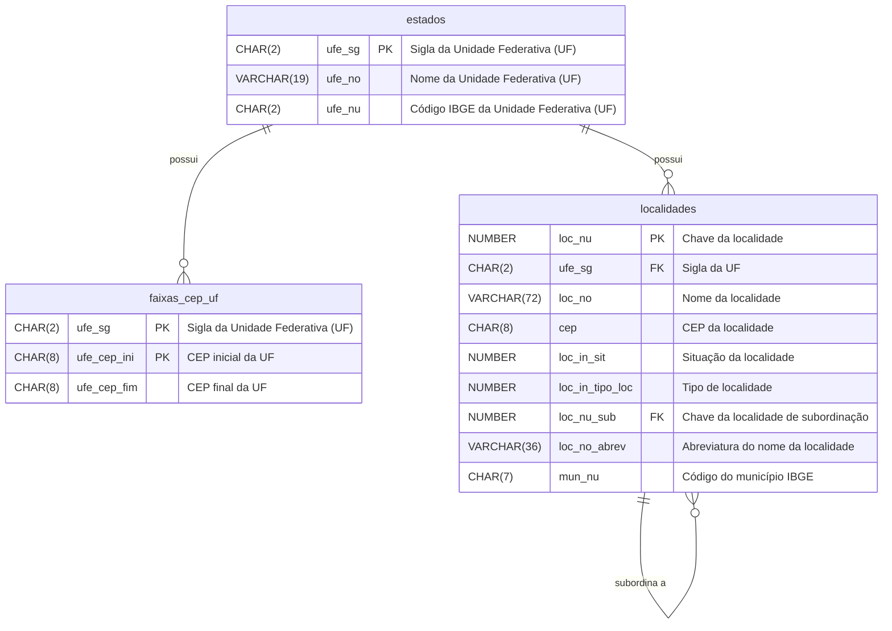
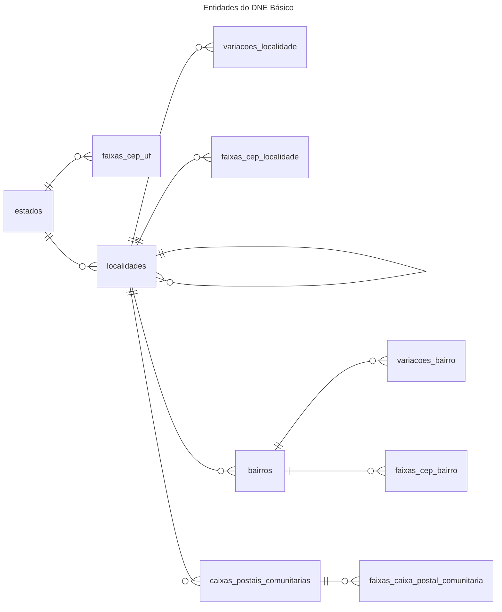
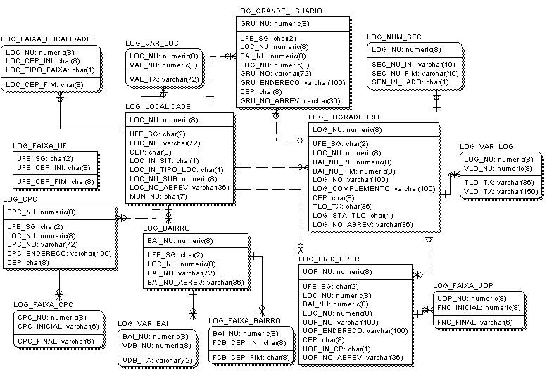
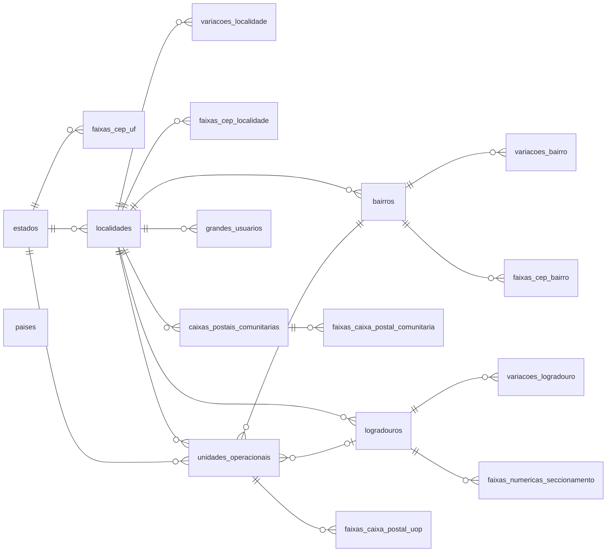
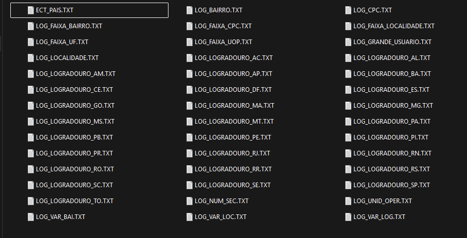

# e-DNE - Estrutura da Base de CEPs dos Correios - parte 1 de 3
Nesta série de artigos, exploraremos a estrutura da base de CEPs dos Correios, conhecida como e-DNE (Endereçamento Nacional Eletrônico). Ireremos dividir o conteúdo em três partes para facilitar a compreensão e implementação. Na primeira parte, abordaremos a estrutura dos CEPs e a base de dados e-DNE e criaremos as classes C# representando a estrutura dos dados. Na segunda parte implementaremos a leitura dos arquivos TXT e a persistência dos dados em um banco de dados PostgreSQL. Na terceira e última parte, criaremos uma API utilizando [FastEndpoints](../11/fastendpoints-simplificando-o-desenvolvimento-de-apis-em-dotnet.md) para consultar os dados importados. 

<!-- truncate -->
## Estrutura dos CEPs
Segundo os Correios, O CEP (Códigos de Endereçamento Postal) pode ser definido como:

> Um conjunto numérico constituído de oito algarismos, que orienta e acelera o encaminhamento, o tratamento e a distribuição de objetos de correspondência, por meio da sua atribuição a localidades, logradouros, unidades dos Correios, serviços, órgãos públicos, empresas e edifícios.

Esse conjunto numérico é estruturado da seguinte forma:
- **Primeiros cinco dígitos**: Identificam a região, sub-região, setor, sub-setor e a unidade de distribuição.
- **Últimos três dígitos**: Identificam o ponto de entrega, que pode ser um logradouro, uma empresa ou um órgão público.


Exemplificando, no CEP `12345-678`:
- `1`: Região
- `2`: Sub-região
- `3`: Setor
- `4`: Sub-setor
- `5`: Unidade de distribuição
- `678`: Ponto de entrega

Você pode se aprofundar mais sobre a estrutura dos CEPs na [Wikipédia - Código de Endereçamento Postal](https://pt.wikipedia.org/wiki/C%C3%B3digo_de_Endere%C3%A7amento_Postal) ou no site oficial dos [Correios - Tudo sobre CEP](https://www.correios.com.br/enviar/precisa-de-ajuda/tudo-sobre-cep).

## Base de Dados e-DNE
Os Correios disponibilizam uma base de dados chamada e-DNE (Endereçamento Nacional Eletrônico), que contém informações sobre os CEPs e endereços no Brasil. Essa base é utilizada por empresas para fins de marketing direto, logística e outras aplicações que requerem dados precisos de endereçamento.

A base de dados e-DNE é uma ferramenta paga comercializada pelos Correios. Para a sua utilização é necessário adquirir uma licença, que pode ser feita diretamente no site dos Correios na seção de [Marketing Direto](https://www.correios.com.br/enviar/marketing-direto/marketing) ou possuir um contrato de prestação de serviços com a empresa.

O e-DNE é oferecido em duas modalidades, ambas contendo todas as informações sobre os CEPs e endereços e atualizações quinzenais durante o período de um ano, entretanto, cada uma com um diferente formato de arquivo:
1. **DNE Básico**: Um conjunto de arquivos em formato TXT, 
2. **DNE Master**: Um conjunto de arquivos em formato TXT + um banco de dados em formato Microsoft Access (MDB).


## Modalidades e valores

**DNE Básico**
| Item                       | Código | Valor       |
| :------------------------- | ------ | ----------- |
| Base de Dados e-DNE Básico | 8570-7 | R$ 1.538,27 |
| Renovação Trimestral       | 8571-5 | R$ 307,65   |
| Renovação Anual            | 8574-0 | R$ 1.174,67 |

**DNE Master**
| Item                       | Código | Valor       |
| :------------------------- | ------ | ----------- |
| Base de Dados e-DNE Master | 8572-3 | R$ 3.496,06 |
| Renovação Trimestral       | 8569-3 | R$ 769,14   |
| Renovação Anual            | 8573-1 | R$ 2.936,71 |

<small>Fonte: https://www.correios.com.br/enviar/marketing-direto/marketing (visualizado em 01/12/2025)</small>

## DNE Básico - Estrutura dos Arquivos TXT
Vamos entender a estrutura dos arquivos TXT da base DNE Básico. Iremos utilizar a versão dos arquivos que estão delimitados¹, onde cada arquivo contém registros com campos separados por arroba (@). 

Temos 16 arquivos principais na base DNE Básico. Para cada arquivo, iremos entender seus dados e criar uma classe C# representando a estrutura dos dados. Após a criação das classes, criaremos um método para ler os arquivos TXT e mapear os dados para as classes correspondentes e salvar os dados de forma estruturada em um banco de dados `PostgreSQL`. No final, criaremos uma API para consultar os dados importados.

## Criação do Projeto
Iremos utilizar o Visual Studio 2022 para criar uma solution para o nosso projeto. A solution será composta por 5 projetos:
1. **Correios.DNEBasico.Domain**: Projeto do tipo Class Library que conterá as classes representando a estrutura dos dados.
2. **Correios.DNEBasico.Data**: Projeto do tipo Class Library que conterá a lógica para ler os arquivos TXT e mapear os dados para as classes do projeto Domain.
3. **Correios.DNEBasico.App**: Projeto do tipo Console Application que será o ponto de entrada da aplicação e onde iremos chamar os métodos para ler os arquivos e salvar os dados no banco de dados.
4. **Correios.DNEBasico.Api**: Projeto do tipo ASP.NET Core Web API que fornecerá endpoints para consultar os dados importados.
5. **Correios.DNEBasico.Api.Tests**: Projeto do tipo xUnit Test Project que conterá os testes automatizados para a API.

Utilizaremos o Entity Framework Core como ORM para facilitar a manipulação dos dados no banco de dados PostgreSQL.

Para criar a solution e os projetos, siga os passos abaixo:
1. Abra o Visual Studio 2022.
2. Clique em "Create a new project".
3. Selecione "Blank Solution" e clique em "Next".
4. Dê um nome para a solution, por exemplo, `Correios.DNEBasico` e clique em "Create".
5. Clique com o botão direito na solution no Solution Explorer e selecione "Add" > "New Project".
6. Selecione "Class Library" e dê o nome `Correios.DNEBasico.Domain`. Repita o processo para criar os projetos `Correios.DNEBasico.Data`, `Correios.DNEBasico.App`, `Correios.DNEBasico.Api` e `Correios.DNEBasico.Api.Tests` selecionando o tipo apropriado para cada um.

## Estrutura dos Arquivos TXT
A seguir, apresento a estrutura dos arquivos TXT da base DNE Básico, juntamente com a descrição dos campos e as nossas classes C# correspondentes.

### UFs
A primeira tabela que iremos analisar e criar é a tabela de UFs (Unidades Federativas), que conterá informações sobre os estados do Brasil. Essa é uma tabela que não existe nos arquivos TXT do DNE Básico, mas será importante para relacionarmos os dados posteriormente.
Arquivo: Não existe arquivo específico no e-DNE Básico

Seguindo o padrão da nomenclatura de nomes utilziada nos arquivos do DNE Básico para os nomes das colunas, a nossa tabela de UFs terá a seguinte estrutura:

| Campo  | Tipo        | Descrição                              |
| ------ | ----------- | -------------------------------------- |
| UFE_SG | CHAR(2)     | Sigla da Unidade Federativa (UF)       |
| UFE_NO | VARCHAR(19) | Nome da Unidade Federativa (UF)        |
| UFE_NU | CHAR(2)     | Código IBGE da Unidade Federativa (UF) |

Vamos criar nossa classe no Projeto Domain para representar essa estrutura. Crie um diretório chamado `Entities` dentro do projeto `Correios.DNEBasico.Domain` e adicione a seguinte classe `Estado.cs`:

```csharp title="Correios.DNEBasico.Domain/Entities/Estado.cs"
namespace Correios.DneBasico.Domain.Entities;

/// <summary>
/// Unidade Federativa (Estado) do Brasil
/// </summary>
public class Estado
{
    /// <summary>
    /// Sigla do Estado
    /// </summary>
    public string Uf { get; set; } = default!;

    /// <summary>
    /// Nome do Estado
    /// </summary>
    public string Nome { get; set; } = default!;

    /// <summary>
    /// Código IBGE do Estado
    /// </summary>    
    public string Ibge { get; set; } = default!;
}

```

Para mapear essa entidade no banco de dados utilizando o Entity Framework Core, crie um diretório chamado `Configurations` dentro do projeto `Correios.DNEBasico.Data`.

Adicione uma refêrencia ao projeto `Correios.DNEBasico.Domain` no projeto `Correios.DNEBasico.Data`, instale os pacotes NuGet `Microsoft.EntityFrameworkCore` e `Npgsql.EntityFrameworkCore.PostgreSQL` no projeto `Correios.DNEBasico.Data`, e em seguida, crie o arquivo `EstadoConfiguration.cs` dentro do diretório `Configurations` com o seguinte conteúdo:

```csharp title="Correios.DNEBasico.Data/Configurations/EstadoConfiguration.cs"
using Correios.DneBasico.Domain.Entities;
using Microsoft.EntityFrameworkCore;
using Microsoft.EntityFrameworkCore.Metadata.Builders;

namespace Correios.DneBasico.Data.Configurations;
public class EstadoConfiguration : IEntityTypeConfiguration<Estado>
{
    public void Configure(EntityTypeBuilder<Estado> builder)
    {
        builder.ToTable("estados");

        builder.HasKey(u => u.Uf);

        builder.Property(u => u.Uf)
            .HasColumnName("ufe_sg")
            .IsRequired()
            .HasMaxLength(2);

        builder.Property(u => u.Nome)
            .HasColumnName("ufe_no")
            .IsRequired()
            .HasMaxLength(19);

        builder.Property(u => u.Ibge)
            .HasColumnName("ufe_nu")
            .IsRequired()
            .HasMaxLength(2);
    }
}
```

Seguindo esse padrão, iremos criar as outras tabelas e classes correspondentes para os demais arquivos do DNE Básico.

### Faixa de CEP de UF
Arquivo: LOG_FAIXA_UF.TXT

| Campo       | Tipo    | Descrição                        |
| :---------- | :------ | :------------------------------- |
| UFE_SG      | CHAR(2) | Sigla da Unidade Federativa (UF) |
| UFE_CEP_INI | CHAR(8) | CEP inicial da UF                |
| UFE_CEP_FIM | CHAR(8) | CEP final da UF                  |

Tem como chave primária os campos `UFE_SG` e `UFE_CEP_INI`.
Iremos relacionar essa tabela com a tabela de UFs através do campo `UFE_SG`.

```csharp title="Correios.DNEBasico.Domain/Entities/FaixaCepUf.cs"
namespace Correios.DneBasico.Domain.Entities;

/// <summary>
/// Faixa de CEP do Estado
/// </summary>
public class FaixaCepEstado
{
    /// <summary>
    /// Sigla da Unidade Federativa (Estado)
    /// </summary>
    public string Uf { get; set; } = default!;

    /// <summary>
    /// CEP inicial do Estado
    /// </summary>
    public string CepInicial { get; set; } = default!;

    /// <summary>
    /// CEP final do Estado
    /// </summary>
    public string? CepFinal { get; set; } = default!;

    #region Navigation Properties
    /// <summary>
    /// Unidade Federativa (Estado)
    /// </summary>
    public Estado Estado { get; set; } = default!;
    #endregion
}
```

```csharp title="Correios.DNEBasico.Data/Configurations/FaixaCepEstadoConfiguration.cs"
using Correios.DneBasico.Domain.Entities;
using Microsoft.EntityFrameworkCore;
using Microsoft.EntityFrameworkCore.Metadata.Builders;

namespace Correios.DneBasico.Data.Configurations;
public class FaixaCepEstadoConfiguration : IEntityTypeConfiguration<FaixaCepEstado>
{
    public void Configure(EntityTypeBuilder<FaixaCepEstado> builder)
    {
        builder.ToTable("faixas_cep_estado");

        builder.HasKey(f => new { f.Uf, f.CepInicial });

        builder.Property(f => f.Uf)
            .HasColumnName("ufe_sg")
            .IsRequired()
            .HasMaxLength(2);

        builder.HasOne(l => l.Estado)
            .WithMany()
            .HasForeignKey(l => l.Uf)
            .OnDelete(DeleteBehavior.Restrict);

        builder.Property(f => f.CepInicial)
            .HasColumnName("ufe_cep_ini")
            .IsRequired()
            .HasMaxLength(8);

        builder.Property(f => f.CepFinal)
            .HasColumnName("ufe_cep_fim")
            .IsRequired()
            .HasMaxLength(8);
    }
}
```

### Localidades
Arquivo: LOG_LOCALIDADE.TXT

Segundo o Guide do e-DNE:

> O arquivo LOG_LOCALIDADE contempla os municípios, distritos e povoados do Brasil. 
> Os CEPs presentes neste arquivo valem para todos os logradouros da cidade, não necessitando consulta nos demais arquivos. 
> As localidades em fase de codificação (LOC_IN_SIT=3) estão em período de  transição, sendo aceito o CEP Geral ou os CEPs de Logradouros para endereçamento.

| Campo           | Tipo        | Descrição                                                                                                                                                                                                                                                                               |
| :-------------- | :---------- | :-------------------------------------------------------------------------------------------------------------------------------------------------------------------------------------------------------------------------------------------------------------------------------------- |
| LOC_NU          | NUMBER(8)   | Chave da localidade                                                                                                                                                                                                                                                                     |
| UFE_SG          | CHAR(2)     | Sigla da UF                                                                                                                                                                                                                                                                             |
| LOC_NO          | VARCHAR(72) | Nome da localidade                                                                                                                                                                                                                                                                      |
| CEP             | CHAR(8)     | CEP da localidade (para  localidade  não codificada, ou seja loc_in_sit = 0) (opcional)                                                                                                                                                                                                 |
| LOC_IN_SIT      | CHAR(1)     | Situação da localidade:<br/>0 = Localidade  não codificada em nível de Logradouro, <br/>1 = Localidade codificada em nível de Logradouro<br/>2 = Distrito ou Povoado inserido na codificação em nível de Logradouro.<br/>3 = Localidade em fase de codificação  em nível de Logradouro. |
| LOC_IN_TIPO_LOC | CHAR(1)     | Tipo de localidade:<br/>D – Distrito,<br/>M – Município,<br/>P – Povoado.                                                                                                                                                                                                               |
| LOC_NU_SUB      | NUMBER(8)   | Chave da localidade de subordinação (opcional)                                                                                                                                                                                                                                          |
| LOC_NO_ABREV    | VARCHAR(36) | Abreviatura do nome da localidade (opcional)                                                                                                                                                                                                                                            |
| MUN_NU          | CHAR(7)     | Código do município IBGE (opcional)                                                                                                                                                                                                                                                     |

Chave primária: `LOC_NU`

:::warning
A tabela de Localidades contém a listagem de todos os municípios, distritos e povoados do Brasil conforme os dados dos Correios. Tenha cuidado para não expor todos os dados da tabela como se cada registro fosse um município, pois muitos registros representam distritos e povoados que não são municípios independentes.
:::

Vamos criar duas enums para os campos `LOC_IN_SIT` e `LOC_IN_TIPO_LOC`, e em seguida, a classe `Localidade.cs` e a configuração `LocalidadeConfiguration.cs`.

```csharp title="Correios.DNEBasico.Domain/Enums/SituacaoLocalidade.cs"
using System.ComponentModel;

namespace Correios.DneBasico.Domain.Enums;

/// <summary>
/// Situação da Localidade
/// </summary>
/// <remarks>
/// 0 = Localidade  não codificada em nível de Logradouro,
/// 1 = Localidade codificada em nível de Logradouro
/// 2 = Distrito ou Povoado inserido na codificação em nível de Logradouro
/// 3 = Localidade em fase de codificação em nível de Logradouro
/// </remarks>
public enum SituacaoLocalidade
{
    /// <summary>
    /// Localidade não codificada em nível de Logradouro
    /// </summary>
    [Description("Não codificada")]
    NAO_CODIFICADA = 0,

    /// <summary>
    /// Localidade codificada em nível de Logradouro
    /// </summary>
    [Description("Localidade codificada")]
    CODIFICADA = 1,

    /// <summary>
    /// Distrito ou Povoado inserido na codificação em 
    /// nível de Logradouro
    /// </summary>
    [Description("Distrito ou Povoado")]
    DISTRITO_OU_POVOADO = 2,

    /// <summary>
    /// Localidade em fase de codificação em nível de Logradouro
    /// </summary>
    [Description("Fase de Codificação")]
    FASE_DE_CODIFICACAO = 3,
}    
```

```csharp title="Correios.DNEBasico.Domain/Enums/TipoLocalidade.cs"
using System.ComponentModel;
namespace Correios.DneBasico.Domain.Enums;
/// <summary>
/// Tipo da Localidade
/// </summary>
/// <remarks>
/// D – Distrito,
/// M – Município,
/// P – Povoado.
/// </remarks>
public enum TipoLocalidade
{
    /// <summary>
    /// Distrito (D)
    /// </summary>
    [Description("Distrito")]
    DISTRITO = 'D',

    /// <summary>
    /// Município (M)
    /// </summary>
    [Description("Município")]
    MUNICIPIO = 'M',

    /// <summary>
    /// Povoado 
    /// </summary>
    [Description("Povoado")]
    POVOADO = 'P',
}
```

```csharp title="Correios.DNEBasico.Domain/Entities/Localidade.cs"
using Correios.DneBasico.Domain.Enums;

namespace Correios.DneBasico.Domain.Entities;

/// <summary>
/// O arquivo LOG_LOCALIDADE contempla os municípios, distritos e povoados do Brasil.
/// </summary>
/// <remarks>
/// Os CEPs presentes neste arquivo valem para todos os logradouros da cidade, não necessitando consulta nos demais arquivos. 
/// 
/// As localidades em fase de codificação(LOC_IN_SIT= 3) estão em período de transição, sendo aceito o CEP Geral ou os CEPs de Logradouros para endereçamento.
/// </remarks>
public class Localidade
{
    /// <summary>
    /// chave da localidade
    /// </summary>
    public int Id { get; set; }

    /// <summary>
    /// sigla da UF
    /// </summary>
    public string Uf { get; set; } = default!;

    /// <summary>
    /// nome da localidade
    /// </summary>
    public string Nome { get; set; } = default!;

    /// <summary>
    /// CEP da localidade (para  localidade  não codificada, ou seja loc_in_sit = 0) (opcional)
    /// </summary>
    public string? Cep { get; set; }

    /// <summary>
    /// situação da localidade:
    /// </summary>
    /// <remarks>
    /// 0 = Localidade não codificada em nível de Logradouro,
    /// 1 = Localidade codificada em nível de Logradouro e
    /// 2 = Distrito ou Povoado inserido na codificação em nível de Logradouro.
    /// 3 = Localidade em fase de codificação em nível de Logradouro.
    /// </remarks>
    public SituacaoLocalidade Situacao { get; set; } = default!;

    /// <summary>
    /// tipo de localidade
    /// </summary>  
    /// <remarks>
    /// D - Distrito,
    /// M - Município,
    /// P - Povoado.
    /// </remarks>
    public TipoLocalidade Tipo { get; set; } = default!;

    /// <summary>
    /// chave da localidade de subordinação (opcional)
    /// </summary>
    public int? SubordinadaId { get; set; }

    /// <summary>
    /// abreviatura do nome da localidade (opcional)
    /// </summary>
    public string? NomeAbreviado { get; set; }

    /// <summary>
    /// Código do município IBGE (opcional)
    /// </summary>
    public string? Ibge { get; set; }


    #region Navigation Properties
    /// <summary>
    /// Estado (UF)
    /// </summary>
    public Estado Estado { get; set; } = default!;

    /// <summary>
    /// Localidade de subordinação
    /// </summary>
    public Localidade? Subordinada { get; set; } = default!;

    /// <summary>
    /// Variações da Localidade
    /// </summary>
    public ICollection<VariacaoLocalidade> Variacoes { get; set; } = [];
    #endregion
}
```

```csharp title="Correios.DNEBasico.Data/Configurations/LocalidadeConfiguration.cs"
using Correios.DneBasico.Domain.Entities;
using Microsoft.EntityFrameworkCore;
using Microsoft.EntityFrameworkCore.Metadata.Builders;

namespace Correios.DneBasico.Data.Configurations;
public class LocalidadeConfiguration : IEntityTypeConfiguration<Localidade>
{
    public void Configure(EntityTypeBuilder<Localidade> builder)
    {
        builder.ToTable("localidades");

        builder.HasKey(l => l.Id);

        builder.Property(l => l.Id)
            .HasColumnName("loc_nu")
            .ValueGeneratedNever();

        builder.Property(l => l.Uf)
            .HasColumnName("ufe_sg")
            .IsRequired()
            .HasMaxLength(2);

        builder.HasOne(l => l.Estado)
            .WithMany()
            .HasForeignKey(l => l.Uf)
            .OnDelete(DeleteBehavior.Restrict);

        builder.Property(l => l.Nome)
            .HasColumnName("loc_no")
            .IsRequired()
            .HasMaxLength(72);

        builder.Property(l => l.Cep)
            .HasColumnName("loc_cep")
            .HasMaxLength(8);

        builder.Property(l => l.Situacao)
            .HasColumnName("loc_in_sit");

        builder.Property(l => l.Tipo)
            .HasColumnName("loc_in_tipo_loc");

        builder.Property(l => l.SubordinadaId)
            .HasColumnName("loc_nu_sub");

        builder.Property(l => l.NomeAbreviado)
            .HasColumnName("loc_no_abrev")
            .HasMaxLength(36);

        builder.Property(l => l.Ibge)
            .HasColumnName("mun_nu")
            .HasMaxLength(7);
    }
}
```

Cada localidade deve ser relacionada com a seu respectivo Estado através do campo `UFE_SG`. Além disso, se a localidade for um distrito ou povoado, ela deve ser relacionada com a localidade de subordinação através do campo `LOC_NU_SUB`, que é uma chave estrangeira para a própria tabela de localidades.

Até agora temos a seguinte estrutura de tabelas no banco de dados:




Ainda temos mais 14 arquivos para analisar! Vamos em frente!

### Outras denominações de localidades
Arquivo: LOG_VAR_LOC.TXT

Outras denominações da Localidade (denominação popular, denominação anterior)

| Campo  | Tipo        | Descrição            |
| :----- | :---------- | :------------------- |
| LOC_NU | NUMBER(8)   | Chave da localidade  |
| VAL_NU | NUMBER(8)   | Ordem da denominação |
| VAL_TX | VARCHAR(72) | Denominação          |

Chave primária: `LOC_NU`, `VAL_NU`

```csharp title="Correios.DNEBasico.Domain/Entities/VariacaoLocalidade.cs"
using System.Text.Json.Serialization;

namespace Correios.DneBasico.Domain.Entities;

/// <summary>
/// Outras denominações da Localidade (denominação popular, denominação anterior)
/// </summary>
public class VariacaoLocalidade
{
    /// <summary>
    /// chave da localidade
    /// </summary>
    public int LocalidadeId { get; set; }

    /// <summary>
    /// ordem da denominação
    /// </summary>
    public int Ordem { get; set; }

    /// <summary>
    /// Denominação
    /// </summary>
    public string Denominacao { get; set; } = default!;

    #region Navigation Properties
    /// <summary>
    /// Localidade
    /// </summary>
    [JsonIgnore]
    public Localidade Localidade { get; set; } = default!;
    #endregion
}
```

Na entidade `Localidade`, precisamos adicionar uma coleção de variações de localidade para representar o relacionamento um-para-muitos entre `Localidade` e `VariacaoLocalidade`. Adicione a seguinte propriedade na classe `Localidade`:

```csharp title="Correios.DNEBasico.Domain/Entities/Localidade.cs"
    /// <summary>
    /// Variações da Localidade
    /// </summary>
    public ICollection<VariacaoLocalidade> Variacoes { get; set; } = [];
```

Quando serializamos a entidade `Localidade` para JSON, a propriedade `Variacoes` incluirá todas as variações associadas. Cada `VariacaoLocalidade`, por sua vez, possui uma referência de volta para a `Localidade` através da propriedade `Localidade`. Isso cria uma referência circular entre as duas entidades. Não pretendemos serializar o modelo completo nos endpoints da API, mas, para evitar a fadiga, utilizaremos o atributo `[JsonIgnore]` na propriedade `Localidade` da classe `VariacaoLocalidade` para evitar essa referência circular durante a serialização.


```csharp title="Correios.DNEBasico.Data/Configurations/VariacaoLocalidadeConfiguration.cs"
using Correios.DneBasico.Domain.Entities;
using Microsoft.EntityFrameworkCore;
using Microsoft.EntityFrameworkCore.Metadata.Builders;

namespace Correios.DneBasico.Data.Configurations;
public class VariacaoLocalidadeConfiguration : IEntityTypeConfiguration<VariacaoLocalidade>
{
    public void Configure(EntityTypeBuilder<VariacaoLocalidade> builder)
    {
        builder.ToTable("variacoes_localidade");

        builder.HasKey(b => new { b.LocalidadeId, b.Ordem });

        builder.Property(b => b.LocalidadeId)
            .HasColumnName("loc_nu")
            .ValueGeneratedNever();

        builder.Property(b => b.Ordem)
            .HasColumnName("val_nu")
            .ValueGeneratedNever();

        builder.Property(b => b.Denominacao)
            .HasColumnName("val_tx")
            .IsRequired()
            .HasMaxLength(72);
    }
}
```

### Faixa de CEP de Localidade
Arquivo: LOG_FAIXA_LOCALIDADE.TXT
Faixa de CEP das Localidades codificadas  
Contém dados relativos às faixas de CEP das localidades classificadas na categoria político-administrativa de município codificadas com CEP único ou codificadas por logradouros.

| Campo          | Tipo      | Descrição                                                                         |
| :------------- | :-------- | :-------------------------------------------------------------------------------- |
| LOC_NU         | NUMBER(8) | Chave da localidade                                                               |
| LOC_CEP_INI    | CHAR(8)   | CEP inicial da localidade                                                         |
| LOC_CEP_FIM    | CHAR(8)   | CEP final da localidade                                                           |
| LOC_TIPO_FAIXA | CHAR(1)   | Tipo de Faixa de CEP<br/>T – Total do Município<br/>C – Exclusiva da  Sede Urbana |

Chave primária: `LOC_NU`, `LOC_CEP_INI`

Vamos precisar de uma nova enum para o campo `LOC_TIPO_FAIXA`:

```csharp title="Correios.DNEBasico.Domain/Enums/TipoFaixaCep.cs"
using System.ComponentModel;

namespace Correios.DneBasico.Domain.Enums;

public enum TipoFaixaCep
{
    /// <summary>
    /// Total do Município
    /// </summary>
    [Description("Total do Município")]
    TOTAL_DO_MUNICIPIO = 1,

    /// <summary>
    /// Exclusiva da Sede Urbana
    /// </summary>
    [Description("Exclusiva da Sede Urbana")]
    EXCLUSIVA_SEDE_URBANA = 2,
}
```


```csharp title="Correios.DNEBasico.Domain/Entities/FaixaCepLocalidade.cs"
using Correios.DneBasico.Domain.Enums;

namespace Correios.DneBasico.Domain.Entities;

/// <summary>
/// Faixa de CEP das Localidades codificadas
/// </summary>
/// <remarks>
/// Este arquivo contém dados relativos às faixas de CEP das localidades
/// classificadas na categoria político-administrativa de município 
/// codificadas com CEP único ou codificadas por logradouros.
/// </remarks>
public class FaixaCepLocalidade
{
    /// <summary>
    /// chave da localidade
    /// </summary>
    public int LocalidadeId { get; set; }

    /// <summary>
    /// Localidade
    /// </summary>
    public Localidade Localidade { get; set; } = default!;

    /// <summary>
    /// CEP inicial da localidade
    /// </summary>
    public string CepInicial { get; set; } = default!;

    /// <summary>
    /// CEP final da localidade
    /// </summary>
    public string CepFinal { get; set; } = default!;

    /// <summary>
    /// tipo de Faixa de CEP: T – Total do Município, C – Exclusiva da  Sede Urbana
    /// </summary>
    public TipoFaixaCep TipoFaixa { get; set; } = default!;
}
```

```csharp title="Correios.DNEBasico.Data/Configurations/FaixaCepLocalidadeConfiguration.cs"
using Correios.DneBasico.Domain.Entities;
using Microsoft.EntityFrameworkCore;
using Microsoft.EntityFrameworkCore.Metadata.Builders;

public class FaixaCepLocalidadeConfiguration : IEntityTypeConfiguration<FaixaCepLocalidade>
{
    public void Configure(EntityTypeBuilder<FaixaCepLocalidade> builder)
    {
        builder.ToTable("faixas_cep_localidade");

        builder.HasKey(f => new { f.LocalidadeId, f.CepInicial, f.TipoFaixa });

        builder.Property(f => f.LocalidadeId)
            .HasColumnName("loc_nu")
            .ValueGeneratedNever();

        builder.Property(f => f.CepInicial)
            .HasColumnName("loc_cep_ini")
            .IsRequired()
            .HasMaxLength(8);

        builder.Property(f => f.CepFinal)
            .HasColumnName("loc_cep_fim")
            .IsRequired()
            .HasMaxLength(8);

        builder.Property(f => f.TipoFaixa)
            .HasColumnName("loc_tipo_faixa")
            .IsRequired();
    }
}
```

Como diria o Buzz Lightyear: "Ao infinito e além!" :rocket: Ainda temos mais arquivos para analisar e criar as classes correspondentes. Na sequência, iremos criar a nossa tabela de bairros

### Bairros
Arquivo: LOG_BAIRRO.TXT

| Campo        | Tipo        | Descrição                                |
| :----------- | :---------- | :--------------------------------------- |
| BAI_NU       | NUMBER(8)   | Chave do bairro                          |
| UFE_SG       | CHAR(2)     | Sigla da UF                              |
| LOC_NU       | NUMBER(8)   | Chave da localidade                      |
| BAI_NO       | VARCHAR(72) | Nome do bairro                           |
| BAI_NO_ABREV | VARCHAR(36) | Abreviatura do nome do bairro (opcional) |

Chave primária: `BAI_NU`

```csharp title="Correios.DNEBasico.Domain/Entities/Bairro.cs"
namespace Correios.DneBasico.Domain.Entities;

/// <summary>
/// Bairro
/// </summary>
public class Bairro
{
    /// <summary>
    /// Chave do bairro
    /// </summary>
    public int Id { get; set; }

    /// <summary>
    /// Sigla da UF
    /// </summary>
    public string UF { get; set; } = default!;

    /// <summary>
    /// Chave da localidade
    /// </summary>
    public int LocalidadeId { get; set; }
    
    /// <summary>
    /// Nome do bairro
    /// </summary>
    public string Nome { get; set; } = default!;

    /// <summary>
    /// Abreviatura do nome do bairro (opcional)
    /// </summary>
    public string? NomeAbreviado { get; set; }

    #region Navigation Properties
    /// <summary>
    /// Localidade
    /// </summary>
    public Localidade Localidade { get; set; } = default!;    
    #endregion
}
```

```csharp title="Correios.DNEBasico.Data/Configurations/BairroConfiguration.cs"
using Correios.DneBasico.Domain.Entities;
using Microsoft.EntityFrameworkCore;
using Microsoft.EntityFrameworkCore.Metadata.Builders;

namespace Correios.DneBasico.Data.Configurations;
public class BairroConfiguration : IEntityTypeConfiguration<Bairro>
{
    public void Configure(EntityTypeBuilder<Bairro> builder)
    {
        builder.ToTable("bairros");

        builder.HasKey(b => b.Id);

        builder.Property(b => b.Id)
            .HasColumnName("bai_nu")
            .ValueGeneratedNever();

        builder.Property(b => b.UF)
            .HasColumnName("ufe_sg")
            .IsRequired()
            .HasMaxLength(2);

        builder.Property(b => b.LocalidadeId)
            .HasColumnName("loc_nu")
            .IsRequired();

        builder.Property(b => b.Nome)
            .HasColumnName("bai_no")
            .IsRequired()
            .HasMaxLength(72);

        builder.Property(b => b.NomeAbreviado)
            .HasColumnName("bai_no_abrev")
            .HasMaxLength(36);
    }
}
```
### Outras denominações de bairros
Arquivo: LOG_VAR_BAIRRO.TXT
Outras denominações do Bairro Localidade (denominação popular, denominação anterior)

| Campo  | Tipo        | Descrição            |
| :----- | :---------- | :------------------- |
| BAI_NU | NUMBER(8)   | Chave do bairro      |
| VDB_NU | NUMBER(8)   | Ordem da denominação |
| VDB_TX | VARCHAR(72) | Denominação          |

Chave primária: BAI_NU, VDB_NU

```csharp title="Correios.DNEBasico.Domain/Entities/VariacaoBairro.cs"
namespace Correios.DneBasico.Domain.Entities;

/// <summary>
/// Outras denominações do Bairro Localidade
/// (denominação popular, denominação anterior)
/// </summary>
public class VariacaoBairro
{
    /// <summary>
    /// chave do bairro
    /// </summary>
    public int BairroId { get; set; }

    /// <summary>
    /// ordem da denominação
    /// </summary>
    public int Ordem { get; set; }

    /// <summary>
    /// Denominação
    /// </summary>
    public string Denominacao { get; set; } = default!;

    #region Navigation Properties
    /// <summary>
    /// Bairro
    /// </summary>
    [JsonIgnore]
    public Bairro Bairro { get; set; } = default!;
    #endregion
}
```

Igualmente à entidade `Localidade`, precisamos adicionar uma coleção de variações de bairro para representar o relacionamento um-para-muitos entre `Bairro` e `VariacaoBairro`. Adicione a seguinte propriedade na classe `Bairro`:

```csharp title="Correios.DNEBasico.Domain/Entities/Bairro.cs"
    /// <summary>
    /// Variações do Bairro
    /// </summary>
    public ICollection<VariacaoBairro> Variacoes { get; set; } = [];
```

```csharp title="Correios.DNEBasico.Data/Configurations/VariacaoBairroConfiguration.cs"
using Correios.DneBasico.Domain.Entities;
using Microsoft.EntityFrameworkCore;
using Microsoft.EntityFrameworkCore.Metadata.Builders;

namespace Correios.DneBasico.Data.Configurations;
public class VariacaoBairroConfiguration : IEntityTypeConfiguration<VariacaoBairro>
{
    public void Configure(EntityTypeBuilder<VariacaoBairro> builder)
    {
        builder.ToTable("variacoes_bairro");

        builder.HasKey(b => new { b.BairroId, b.Ordem });

        builder.Property(b => b.BairroId)
            .HasColumnName("bai_nu")
            .ValueGeneratedNever();

        builder.Property(b => b.Ordem)
            .HasColumnName("vdb_nu")
            .ValueGeneratedNever();

        builder.Property(b => b.Denominacao)
            .HasColumnName("vdb_tx")
            .IsRequired()
            .HasMaxLength(72);
    }
}
```

Firme e forte! Indo para a 8 de 15! A tabela de faixas de CEP por bairro

### Faixa de CEP de Bairro
Arquivo: LOG_FAIXA_BAIRRO.TXT
Faixa de CEP de Bairro

| Campo       | Tipo      | Descrição             |
| :---------- | :-------- | :-------------------- |
| BAI_NU      | NUMBER(8) | Chave do bairro       |
| FCB_CEP_INI | CHAR(8)   | CEP inicial do bairro |
| FCB_CEP_FIM | CHAR(8)   | CEP final do bairro   |

Chave primária: BAI_NU, FCB_CEP_INI

```csharp title="Correios.DNEBasico.Domain/Entities/FaixaCepBairro.cs"
namespace Correios.DneBasico.Domain.Entities;

/// <summary>
/// Faixa de CEP de Bairro
/// </summary>
public class FaixaCepBairro
{
    /// <summary>
    /// Chave do bairro
    /// </summary>
    public int BairroId { get; set; }

    /// <summary>
    /// CEP inicial do bairro
    /// </summary>
    public string CepInicial { get; set; } = default!;

    /// <summary>
    /// CEP final do bairro
    /// </summary>
    public string CepFinal { get; set; } = default!;

    #region Navigation Properties
    /// <summary>
    /// Bairro
    /// </summary>
    public Bairro Bairro { get; set; } = default!;
    #endregion
}

```

```csharp title="Correios.DNEBasico.Data/Configurations/FaixaCepBairroConfiguration.cs"
using Correios.DneBasico.Domain.Entities;
using Microsoft.EntityFrameworkCore;
using Microsoft.EntityFrameworkCore.Metadata.Builders;

namespace Correios.DneBasico.Data.Configurations;
public class FaixaCepBairroConfiguration : IEntityTypeConfiguration<FaixaCepBairro>
{
    public void Configure(EntityTypeBuilder<FaixaCepBairro> builder)
    {
        builder.ToTable("faixas_cep_bairro");

        builder.HasKey(b => new { b.BairroId, b.CepInicial });

        builder.Property(b => b.BairroId)
            .HasColumnName("bai_nu")
            .ValueGeneratedNever();

        builder.Property(b => b.CepInicial)
            .HasColumnName("fcb_cep_ini")
            .IsRequired()
            .HasMaxLength(8);

        builder.Property(b => b.CepFinal)
            .HasColumnName("fcb_cep_fim")
            .IsRequired()
            .HasMaxLength(8);
    }
}
```

### Caixa Postal Comunitária (CPC)
Arquivo: LOG_CPC.TXT  
Caixa Postal Comunitária(CPC) - são áreas rurais e/ou urbanas periféricas não atendidas pela distribuição domiciliária.

| Campo        | Tipo         | Descrição                         |
| :----------- | :----------- | :-------------------------------- |
| CPC_NU       | NUMBER(8)    | Chave da caixa postal comunitária |
| UFE_SG       | CHAR(2)      | Sigla da UF                       |
| LOC_NU       | NUMBER(8)    | Chave da localidade               |
| CPC_NO       | VARCHAR(72)  | Nome da CPC                       |
| CPC_ENDERECO | VARCHAR(100) | Endereço da CPC                   |
| CEP          | CHAR(8)      | CEP da CPC                        |

Chave primária: CPC_NU

```csharp title="Correios.DNEBasico.Domain/Entities/CaixaPostalComunitaria.cs"
/// <summary>
/// Caixa Postal Comunitária(CPC) - são áreas rurais e/ou urbanas periféricas não atendidas pela distribuição domiciliária.
/// </summary>
public class CaixaPostalComunitaria
{
    /// <summary>
    /// chave da caixa postal comunitária
    /// </summary>
    public int Id { get; set; }

    /// <summary>
    /// sigla da UF
    /// </summary>
    public string UF { get; set; } = default!;

    /// <summary>
    /// chave da localidade
    /// </summary>
    public int LocalidadeId { get; set; }

    /// <summary>
    /// nome da CPC
    /// </summary>
    public string Nome { get; set; } = default!;

    /// <summary>
    /// endereço da CPC
    /// </summary>
    public string Endereco { get; set; } = default!;

    /// <summary>
    /// CEP da CPC
    /// </summary>
    public string Cep { get; set; } = default!;

    #region Navigation Properties
    /// <summary>
    /// Localidade
    /// </summary>
    public Localidade Localidade { get; set; } = default!;
    #endregion
}
```

```csharp title="Correios.DNEBasico.Data/Configurations/CaixaPostalComunitariaConfiguration.cs"
using Correios.DneBasico.Domain.Entities;
using Microsoft.EntityFrameworkCore;
using Microsoft.EntityFrameworkCore.Metadata.Builders;

namespace Correios.DneBasico.Data.Configurations;

public class CaixaPostalComunitariaConfiguration : IEntityTypeConfiguration<CaixaPostalComunitaria>
{
    public void Configure(EntityTypeBuilder<CaixaPostalComunitaria> builder)
    {
        builder.ToTable("caixas_postais_comunitarias");

        builder.HasKey(c => c.Id);

        builder.Property(c => c.Id)
            .HasColumnName("cpc_nu")
            .ValueGeneratedNever();

        builder.Property(c => c.UF)
            .HasColumnName("ufe_sg")
            .IsRequired()
            .HasMaxLength(2);

        builder.Property(c => c.LocalidadeId)
            .HasColumnName("loc_nu")
            .IsRequired();

        builder.Property(c => c.Nome)
            .HasColumnName("cpc_no")
            .IsRequired()
            .HasMaxLength(72);

        builder.Property(c => c.Endereco)
            .HasColumnName("cpc_endereco")
            .IsRequired()
            .HasMaxLength(100);

        builder.Property(c => c.Cep)
            .HasColumnName("cep")
            .IsRequired()
            .HasMaxLength(8);
    }
}
```

### Faixa de Caixa Postal Comunitária
Arquivo: LOG_FAIXA_CPC.TXT  
Faixa de Caixa Postal Comunitária

| Campo       | Tipo       | Descrição                                  |
| :---------- | :--------- | :----------------------------------------- |
| CPC_NU      | NUMBER(8)  | Chave da caixa postal comunitária          |
| CPC_INICIAL | VARCHAR(6) | número inicial da caixa postal comunitária |
| CPC_FINAL   | VARCHAR(6) | número final da caixa postal comunitária   |

Chave primária: CPC_NU, CPC_INICIAL

```csharp title="Correios.DNEBasico.Domain/Entities/FaixaCaixaPostalComunitaria.cs"
namespace Correios.DneBasico.Domain.Entities;

/// <summary>
/// Faixa de Caixa Postal Comunitária
/// </summary>
public class FaixaCaixaPostalComunitaria
{
    /// <summary>
    /// chave da caixa postal comunitária
    /// </summary>
    public int CaixaPostalComunitariaId { get; set; }

    /// <summary>
    /// número inicial da caixa postal comunitária
    /// </summary>
    public string CaixaPostalInicial { get; set; } = default!;

    /// <summary>
    /// número final da caixa postal comunitária
    /// </summary>
    public string CaixaPostalFinal { get; set; } = default!;

    #region Navigation Properties
    /// <summary>
    /// Caixa Postal Comunitária
    /// </summary>
    public CaixaPostalComunitaria CaixaPostalComunitaria { get; set; } = default!;
    #endregion
}
```

```csharp title="Correios.DNEBasico.Data/Configurations/FaixaCaixaPostalComunitariaConfiguration.cs"
using Correios.DneBasico.Domain.Entities;
using Microsoft.EntityFrameworkCore;
using Microsoft.EntityFrameworkCore.Metadata.Builders;

namespace Correios.DneBasico.Data.Configurations;

public class FaixaCaixaPostalComunitariaConfiguration : IEntityTypeConfiguration<FaixaCaixaPostalComunitaria>
{
    public void Configure(EntityTypeBuilder<FaixaCaixaPostalComunitaria> builder)
    {
        builder.ToTable("faixas_caixa_postal_comunitaria");

        builder.HasKey(f => new { f.CaixaPostalComunitariaId, f.CaixaPostalInicial });

        builder.Property(f => f.CaixaPostalComunitariaId)
            .HasColumnName("cpc_nu")
            .ValueGeneratedNever();

        builder.Property(f => f.CaixaPostalInicial)
            .HasColumnName("cpc_inicial")
            .IsRequired()
            .HasMaxLength(6);

        builder.Property(f => f.CaixaPostalFinal)
            .HasColumnName("cpc_final")
            .IsRequired()
            .HasMaxLength(6);
    }
}

```

Nossa próxima parada: a tabela de logradouros! Mas antes vamos dar uma olhada em como está o nosso diagrama entidade-relacionamento (ER) até agora:



### Logradouros
Arquivos: LOG_LOGRADOURO_XX.TXT  
Logradouro, onde XX representa a sigla da UF. 
Para cada UF é disponibilizado um arquivo distinto. Cada arquivo contém os registros das localidades codificadas por logradouro(LOC_IN_SIT=1) e de localidades em fase de codificação(LOC_IN_SIT=3). Para encontrar o bairro do logradouro, utilize o campo BAI_NU_INI(relacionamento com LOG_BAIRRO, campo BAI_NU)

| Campo           | Tipo         | Descrição                                                         |
| :-------------- | :----------- | :---------------------------------------------------------------- |
| LOG_NU          | NUMBER(8)    | Chave do logradouro                                               |
| UFE_SG          | CHAR(2)      | Sigla da UF                                                       |
| LOC_NU          | NUMBER(8)    | Chave da localidade                                               |
| BAI_NU_INI      | NUMBER(8)    | Chave do bairro inicial do logradouro                             |
| BAI_NU_FIM      | NUMBER(8)    | Chave do bairro final do logradouro (opcional)                    |
| LOG_NO          | VARCHAR(100) | Nome do logradouro                                                |
| LOG_COMPLEMENTO | VARCHAR(100) | Complemento do logradouro (opcional)                              |
| CEP             | CHAR(8)      | CEP do logradouro                                                 |
| TLO_TX          | VARCHAR(36)  | Tipo de logradouro                                                |
| LOG_STA_TLO     | CHAR(1)      | Indicador de utilização do tipo de logradouro (S ou N) (opcional) |
| LOG_NO_ABREV    | VARCHAR(36)  | Abreviatura do nome do logradouro (opcional)                      |

Chave primária: LOG_NU

```csharp title="Correios.DNEBasico.Domain/Entities/Logradouro.cs"
namespace Correios.DneBasico.Domain.Entities;

/// <summary>
/// Logradouro
/// </summary>
/// <remarks>
/// Este arquivo contém os registros das localidades codificadas 
/// por logradouro(LOC_IN_SIT=1) e de localidades em fase de 
/// codificação(LOC_IN_SIT=3). Para encontrar o bairro do logradouro, 
/// utilize o campo BAI_NU_INI (relacionamento com LOG_BAIRRO, campo BAI_NU).
/// </remarks>
public class Logradouro
{
    /// <summary>
    /// Chave do logradouro
    /// </summary>
    public int Id { get; set; }

    /// <summary>
    /// Sigla da UF
    /// </summary>
    public string UF { get; set; } = default!;

    /// <summary>
    /// Chave da localidade
    /// </summary>
    public int LocalidadeId { get; set; }

    /// <summary>
    /// Chave do bairro inicial do logradouro
    /// </summary>
    public int BairroId { get; set; }

    /// <summary>
    /// Nome do logradouro
    /// </summary>
    public string Nome { get; set; } = default!;

    /// <summary>
    /// Complemento do logradouro (opcional)
    /// </summary>
    public string? Complemento { get; set; }

    /// <summary>
    /// CEP do logradouro
    /// </summary>
    public string Cep { get; set; } = default!;

    /// <summary>
    /// Tipo de logradouro
    /// </summary>
    public string Tipo { get; set; } = default!;

    /// <summary>
    /// Indicador de utilização do tipo de logradouro
    /// (S ou N) (opcional)
    /// </summary>
    public string? StatusTipo { get; set; }

    /// <summary>
    /// Abreviatura do nome do logradouro (opcional)
    /// </summary>
    public string? NomeAbreviado { get; set; }

    #region Navigation Properties
    /// <summary>
    /// Localidade
    /// </summary>
    public Localidade Localidade { get; set; } = default!;

    /// <summary>
    /// Bairro do logradouro
    /// </summary>
    public Bairro Bairro { get; set; } = default!;
    #endregion
}

```

Algumas considerações sobre o arquivo de logradouros:  
- Campo BAI_NU_FIM: Apesar de o arquivo ainda conter esse campo, ele não é utilizado na prática, pois está marcado para ser desativado em futuras atualizações do DNE Básico.
- Tipo de logradouro (TLO_TX): Este campo é uma string que descreve o tipo de logradouro, como "Rua", "Avenida", "Travessa", etc. No entanto, não há uma enumeração (ou tabela) oficial fornecida pelos Correios para esses tipos. Portanto, por enquanto, estamos mantendo esse campo como uma string simples.
- StatusTipo (LOG_STA_TLO): Este campo indica se o tipo de logradouro está em uso ou não, com valores possíveis "S" (Sim) ou "N" (Não). Ele é opcional e pode ser nulo. Decidi mantê-lo como uma string nullable com um caractere, para refletir exatamente o que está nos arquivos.

```csharp title="Correios.DNEBasico.Data/Configurations/LogradouroConfiguration.cs"
using Correios.DneBasico.Domain.Entities;
using Microsoft.EntityFrameworkCore;
using Microsoft.EntityFrameworkCore.Metadata.Builders;

namespace Correios.DneBasico.Data.Configurations;
public class LogradouroConfiguration : IEntityTypeConfiguration<Logradouro>
{
    public void Configure(EntityTypeBuilder<Logradouro> builder)
    {
        builder.ToTable("logradouros");

        builder.HasKey(l => l.Id);

        builder.Property(l => l.Id)
            .HasColumnName("log_nu")
            .ValueGeneratedNever();

        builder.Property(l => l.UF)
            .HasColumnName("ufe_sg")
            .IsRequired()
            .HasMaxLength(2);

        builder.Property(l => l.LocalidadeId)
            .HasColumnName("loc_nu")
            .IsRequired();

        builder.Property(l => l.BairroId)
            .HasColumnName("bai_nu_ini")
            .IsRequired();

        builder.Property(l => l.Nome)
            .HasColumnName("log_no")
            .IsRequired()
            .HasMaxLength(100);

        builder.Property(l => l.Complemento)
            .HasColumnName("log_complemento")
            .HasMaxLength(100);

        builder.Property(l => l.Cep)
            .HasColumnName("cep")
            .IsRequired()
            .HasMaxLength(8);

        builder.Property(l => l.Tipo)
            .HasColumnName("tlo_tx")
            .IsRequired()
            .HasMaxLength(36);

        builder.Property(l => l.StatusTipo)
            .HasColumnName("log_sta_tlo")
            .HasMaxLength(1);

        builder.Property(l => l.NomeAbreviado)
            .HasColumnName("log_no_abrev")
            .HasMaxLength(36);
    }
}
```

### Outras denominações de logradouros
Arquivo: LOG_VAR_LOG.TXT  
Outras denominações do logradouro (denominação popular, denominação anterior)

| Campo  | Tipo         | Descrição                      |
| :----- | :----------- | :----------------------------- |
| LOG_NU | NUMBER(8)    | Chave do logradouro            |
| VLO_NU | NUMBER(8)    | Ordem da denominação           |
| TLO_TX | VARCHAR2(36) | Tipo de logradouro da variação |
| VLO_TX | VARCHAR(150) | Denominação                    |

Chave primária: LOG_NU, VLO_NU

```csharp title="Correios.DNEBasico.Domain/Entities/VariacaoLogradouro.cs"
namespace Correios.DneBasico.Domain.Entities;

/// <summary>
/// Outras denominações do logradouro
/// (denominação popular, denominação anterior)
/// </summary>
public class VariacaoLogradouro
{
    /// <summary>
    /// chave do logradouro
    /// </summary>
    public int LogradouroId { get; set; }

    /// <summary>
    /// ordem da denominação
    /// </summary>
    public int Ordem { get; set; }

    /// <summary>
    /// tipo de logradouro da variação
    /// </summary>
    public string Tipo { get; set; } = default!;

    /// <summary>
    /// nome da variação do logradouro
    /// </summary>
    public string Denominacao { get; set; } = default!;

    #region Navigation Properties
    /// <summary>
    /// Logradouro 
    /// </summary>
    public Logradouro Logradouro { get; set; } = default!;
    #endregion
}
```

```csharp title="Correios.DNEBasico.Data/Configurations/VariacaoLogradouroConfiguration.cs"
using Correios.DneBasico.Domain.Entities;
using Microsoft.EntityFrameworkCore;
using Microsoft.EntityFrameworkCore.Metadata.Builders;

namespace Correios.DneBasico.Data.Configurations;
public class VariacaoLogradouroConfiguration : IEntityTypeConfiguration<VariacaoLogradouro>
{
    public void Configure(EntityTypeBuilder<VariacaoLogradouro> builder)
    {
        builder.ToTable("variacoes_logradouro");

        builder.HasKey(b => new { b.LogradouroId, b.Ordem });

        builder.Property(b => b.LogradouroId)
            .HasColumnName("log_nu")
            .ValueGeneratedNever();

        builder.Property(b => b.Ordem)
            .HasColumnName("vlo_nu")
            .ValueGeneratedNever();

        builder.Property(b => b.Tipo)
            .HasColumnName("tlo_tx")
            .IsRequired()
            .HasMaxLength(36);

        builder.Property(b => b.Denominacao)
            .HasColumnName("vlo_tx")
            .IsRequired()
            .HasMaxLength(150);
    }
}
```

### Faixa numérica do seccionamento
Arquivo: LOG_NUM_SEC.TXT  
Faixa numérica do seccionamento

| Campo       | Tipo        | Descrição                                                                                                              |
| :---------- | :---------- | :--------------------------------------------------------------------------------------------------------------------- |
| LOG_NU      | NUMBER(8)   | Chave do logradouro                                                                                                    |
| SEC_NU_INI  | VARCHAR(10) | Número inicial do seccionmento                                                                                         |
| SEC_NU_FIM  | VARCHAR(10) | Número final do seccionmento                                                                                           |
| SEC_IN_LADO | CHAR(1)     | Indica a paridade/lado do seccionamento<br/>A – ambos,<br/>P – par,<br/>I – ímpar,<br/>D – direito e<br/>E – esquerdo. |

Chave primária: LOG_NU

Vamos criar uma enum para o campo `SEC_IN_LADO`:

```csharp title="Correios.DNEBasico.Domain/Enums/ParidadeLadoSeccionamento.cs"
using System.ComponentModel;

namespace Correios.DneBasico.Domain.Enums;

/// <summary>
/// Paridade / Lado do seccionamento
/// </summary>
public enum ParidadeLadoSeccionamento
{
    /// <summary>
    /// Ambos
    /// </summary>
    [Description("Ambos")]
    AMBOS = 1,

    /// <summary>
    /// Par
    /// </summary>
    [Description("Par")]
    PAR = 2,

    /// <summary>
    /// Ímpar
    /// </summary>
    [Description("Ímpar")]
    IMPAR = 3,

    /// <summary>
    /// Direito
    /// </summary>
    [Description("Direito")]
    DIREITO = 4,

    /// <summary>
    /// Esquerdo
    /// </summary>
    [Description("Esquerdo")]
    ESQUERDO = 5,
}
```

```csharp title="Correios.DNEBasico.Domain/Entities/FaixaNumericaSeccionamento.cs"
using Correios.DneBasico.Domain.Enums;

namespace Correios.DneBasico.Domain.Entities;

/// <summary>
/// Faixa numérica do seccionamento
/// </summary>
public class FaixaNumericaSeccionamento
{
    /// <summary>
    /// chave do logradouro
    /// </summary>
    public int LogradouroId { get; set; }

    /// <summary>
    /// número inicial do seccionamento
    /// </summary>
    public string SeccionamentoInicial { get; set; } = default!;

    /// <summary>
    /// número final do seccionamento
    /// </summary>
    public string SeccionamentoFinal { get; set; } = default!;

    /// <summary>
    /// Indica a paridade/lado do seccionamento
    /// </summary>
    /// <remarks>
    /// A – ambos,
    /// P – par,
    /// I – ímpar,
    /// D – direito e
    /// E – esquerdo.
    /// </remarks>
    public ParidadeLadoSeccionamento ParidadeLado { get; set; } = default!;

    #region Navigation Properties
    /// <summary>
    /// Logradouro
    /// </summary>
    public Logradouro Logradouro { get; set; } = default!;
    #endregion
}
```

```csharp title="Correios.DNEBasico.Data/Configurations/FaixaNumericaSeccionamentoConfiguration.cs"
using Correios.DneBasico.Domain.Entities;
using Microsoft.EntityFrameworkCore;
using Microsoft.EntityFrameworkCore.Metadata.Builders;

namespace Correios.DneBasico.Data.Configurations;
public class FaixaNumericaSeccionamentoConfiguration : IEntityTypeConfiguration<FaixaNumericaSeccionamento>
{
    public void Configure(EntityTypeBuilder<FaixaNumericaSeccionamento> builder)
    {
        builder.ToTable("faixas_numericas_seccionamento");

        builder.HasKey(x => x.LogradouroId);

        builder.Property(x => x.LogradouroId)
            .HasColumnName("log_nu")
            .ValueGeneratedNever()
            .IsRequired();

        builder.HasOne(x => x.Logradouro)
            .WithOne()
            .HasForeignKey<FaixaNumericaSeccionamento>(x => x.LogradouroId)
            .OnDelete(DeleteBehavior.Restrict);

        builder.Property(x => x.SeccionamentoInicial)
            .HasColumnName("sec_nu_ini")
            .IsRequired()
            .HasMaxLength(10);

        builder.Property(x => x.SeccionamentoFinal)
            .HasColumnName("sec_nu_fim")
            .IsRequired()
            .HasMaxLength(10);

        builder.Property(x => x.ParidadeLado)
            .HasColumnName("sec_in_lado")
            .IsRequired()
            .HasMaxLength(1);
    }
}
```

### Grandes usuários
Arquivo: LOG_GRANDE_USUARIO.TXT  
São clientes com grande volume postal (empresas, universidades, bancos, órgãos públicos, etc), O campo LOG_NU está sem conteúdo para as localidades não codificadas(LOC_IN_SIT=0), devendo ser utilizado o campo GRU_ENDEREÇO para  endereçamento.

| Campo        | Tipo         | Descrição                                        |
| :----------- | :----------- | :----------------------------------------------- |
| GRU_NU       | NUMBER(8)    | Chave do grande usuário                          |
| UFE_SG       | CHAR(2)      | Sigla da UF                                      |
| LOC_NU       | NUMBER(8)    | Chave da localidade                              |
| BAI_NU       | NUMBER(8)    | Chave do bairro                                  |
| LOG_NU       | NUMBER(8)    | Chave do logradouro (opcional)                   |
| GRU_NO       | VARCHAR(72)  | Nome do grande usuário                           |
| GRU_ENDERECO | VARCHAR(100) | Endereço do grande usuário                       |
| CEP          | CHAR(8)      | CEP do grande usuário                            |
| GRU_NO_ABREV | VARCHAR(36)  | Abreviatura do nome do grande usuário (opcional) |

Chave primária: GRU_NU

```csharp title="Correios.DNEBasico.Domain/Entities/GrandeUsuario.cs"
namespace Correios.DneBasico.Domain.Entities;

/// <summary>
/// Grande Usuário
/// </summary>
/// <remarks>
/// São clientes com grande volume postal (empresas, universidades, 
/// bancos, órgãos públicos, etc), O campo LOG_NU está sem conteúdo 
/// para as localidades não codificadas(LOC_IN_SIT=0), devendo ser 
/// utilizado o campo GRU_ENDERECO para  endereçamento.
/// </remarks>
public class GrandeUsuario
{
    /// <summary>
    /// chave do grande usuário
    /// </summary>
    public int Id { get; set; }

    /// <summary>
    /// sigla da UF
    /// </summary>
    public string UF { get; set; } = default!;

    /// <summary>
    /// chave da localidade
    /// </summary>
    public int LocalidadeId { get; set; }

    /// <summary>
    /// chave do bairro
    /// </summary>
    public int BairroId { get; set; }

    /// <summary>
    /// chave do logradouro (opcional)
    /// </summary>
    public int? LogradouroId { get; set; }

    /// <summary>
    /// nome do grande usuário
    /// </summary>
    public string Nome { get; set; } = default!;

    /// <summary>
    /// endereço do grande usuário
    /// </summary>
    public string Endereco { get; set; } = default!;

    /// <summary>
    /// CEP do grande usuário
    /// </summary>
    public string Cep { get; set; } = default!;

    /// <summary>
    /// abreviatura do nome do grande usuário (opcional)
    /// </summary>
    public string? NomeAbreviado { get; set; }

    #region Navigation Properties
    /// <summary>
    /// Localidade
    /// </summary>
    public Localidade Localidade { get; set; } = default!;

    /// <summary>
    /// Bairro
    /// </summary>
    public Bairro Bairro { get; set; } = default!;

    /// <summary>
    /// Logradouro
    /// </summary>
    public Logradouro? Logradouro { get; set; }
    #endregion
}
```

```csharp title="Correios.DNEBasico.Data/Configurations/GrandeUsuarioConfiguration.cs"
using Correios.DneBasico.Domain.Entities;
using Microsoft.EntityFrameworkCore;
using Microsoft.EntityFrameworkCore.Metadata.Builders;

namespace Correios.DneBasico.Data.Configurations;
public class GrandeUsuarioConfiguration : IEntityTypeConfiguration<GrandeUsuario>
{
    public void Configure(EntityTypeBuilder<GrandeUsuario> builder)
    {
        builder.ToTable("grandes_usuarios");

        builder.HasKey(g => g.Id);

        builder.Property(g => g.Id)
            .HasColumnName("gru_nu")
            .ValueGeneratedNever();

        builder.Property(g => g.UF)
            .HasColumnName("ufe_sg")
            .IsRequired()
            .HasMaxLength(2);

        builder.Property(g => g.LocalidadeId)
            .HasColumnName("loc_nu")
            .IsRequired();

        builder.Property(g => g.BairroId)
            .HasColumnName("bai_nu")
            .IsRequired();

        builder.Property(g => g.LogradouroId)
            .HasColumnName("log_nu");

        builder.Property(g => g.Nome)
            .HasColumnName("gru_no")
            .IsRequired()
            .HasMaxLength(72);

        builder.Property(g => g.Endereco)
            .HasColumnName("gru_endereco")
            .IsRequired()
            .HasMaxLength(100);

        builder.Property(g => g.Cep)
            .HasColumnName("cep")
            .IsRequired()
            .HasMaxLength(8);

        builder.Property(g => g.NomeAbreviado)
            .HasColumnName("gru_no_abrev")
            .HasMaxLength(36);
    }
}
```

### Unidade Operacional dos Correios
Arquivo: LOG_UNID_OPER.TXT  
São agências próprias ou terceirizadas, centros de distribuição, etc. O campo LOG_NU está sem conteúdo para as localidades não codificadas(LOC_IN_SIT=0), devendo ser utilizado o campo UOP_ENDEREÇO para endereçamento.

| Campo        | Tipo         | Descrição                                           |
| :----------- | :----------- | :-------------------------------------------------- |
| UOP_NU       | NUMBER(8)    | Chave da UOP                                        |
| UFE_SG       | CHAR(2)      | Sigla da UF                                         |
| LOC_NU       | NUMBER(8)    | Chave da localidade                                 |
| BAI_NU       | NUMBER(8)    | Chave do bairro                                     |
| LOG_NU       | NUMBER(8)    | Chave do logradouro (opcional)                      |
| UOP_NO       | VARCHAR(100) | Nome da UOP                                         |
| UOP_ENDERECO | VARCHAR(100) | Endereço da UOP                                     |
| CEP          | CHAR(8)      | CEP da UOP                                          |
| UOP_IN_CP    | CHAR(1)      | Indicador de caixa postal (S ou N)                  |
| UOP_NO_ABREV | VARCHAR(36)  | Abreviatura do nome da unid. operacional (opcional) |

Chave primária: UOP_NU

```csharp title="Correios.DNEBasico.Domain/Entities/UnidadeOperacional.cs"
namespace Correios.DneBasico.Domain.Entities;

/// <summary>
/// Unidade Operacional dos Correios
/// </summary>
/// <remarks>
/// São agências próprias ou terceirizadas, centros de distribuição, etc. O campo LOG_NU está sem conteúdo para as localidades não codificadas(LOC_IN_SIT=0), devendo ser utilizado o campo UOP_ENDEREÇO para endereçamento.
/// </remarks>
public class UnidadeOperacional
{
    /// <summary>
    /// chave da UOP
    /// </summary>
    public int Id { get; set; }

    /// <summary>
    /// sigla da UF
    /// </summary>
    public string UF { get; set; } = default!;

    /// <summary>
    /// chave da localidade
    /// </summary>
    public int LocalidadeId { get; set; }

    /// <summary>
    /// chave do bairro
    /// </summary>
    public int BairroId { get; set; }

    /// <summary>
    /// chave do logradouro (opcional)
    /// </summary>
    public int? LogradouroId { get; set; }


    /// <summary>
    /// nome da UOP
    /// </summary>
    public string Nome { get; set; } = default!;

    /// <summary>
    /// endereço da UOP
    /// </summary>
    public string Endereco { get; set; } = default!;

    /// <summary>
    /// CEP da UOP
    /// </summary>
    public string Cep { get; set; } = default!;

    /// <summary>
    /// indicador de caixa postal (S ou N)
    /// </summary>
    public string CaixasPostais { get; set; } = default!;

    /// <summary>
    /// abreviatura do nome da unid. operacional (opcional)
    /// </summary>
    public string? NomeAbreviado { get; set; }

    #region Navigation Properties
    /// <summary>
    /// Estado
    /// </summary>
    public Estado Estado { get; set; } = default!;
    /// <summary>
    /// Localidade
    /// </summary>
    public Localidade Localidade { get; set; } = default!;

    /// <summary>
    /// Bairro
    /// </summary>
    public Bairro Bairro { get; set; } = default!;

    /// <summary>
    /// Logradouro
    /// </summary>
    public Logradouro? Logradouro { get; set; }
    #endregion
}
```

```csharp title="Correios.DNEBasico.Data/Configurations/UnidadeOperacionalConfiguration.cs"
using Correios.DneBasico.Domain.Entities;
using Microsoft.EntityFrameworkCore;
using Microsoft.EntityFrameworkCore.Metadata.Builders;

namespace Correios.DneBasico.Data.Configurations;
public class UnidadeOperacionalConfiguration : IEntityTypeConfiguration<UnidadeOperacional>
{
    public void Configure(EntityTypeBuilder<UnidadeOperacional> builder)
    {
        builder.ToTable("unidades_operacionais");

        builder.HasKey(x => x.Id);

        builder.Property(x => x.Id)
            .HasColumnName("uop_nu")
            .IsRequired();

        builder.Property(x => x.Uf)
            .HasColumnName("ufe_sg")
            .IsRequired().HasMaxLength(2);

        builder.Property(x => x.LocalidadeId)
            .HasColumnName("loc_nu")
            .IsRequired();

        builder.Property(x => x.BairroId)
            .HasColumnName("bai_nu")
            .IsRequired();

        builder.Property(x => x.LogradouroId)
            .HasColumnName("log_nu");

        builder.Property(x => x.Nome)
            .HasColumnName("uop_no")
            .IsRequired().HasMaxLength(100);

        builder.Property(x => x.Endereco)
            .HasColumnName("uop_endereco")
            .IsRequired()
            .HasMaxLength(100);

        builder.Property(x => x.Cep)
            .HasColumnName("cep")
            .IsRequired()
            .HasMaxLength(8);

        builder.Property(x => x.CaixasPostais)
            .HasColumnName("uop_in_cp")
            .IsRequired()
            .HasMaxLength(1);

        builder.Property(x => x.NomeAbreviado)
            .HasColumnName("uop_no_abrev")
            .HasMaxLength(36);

        builder.HasOne(x => x.Estado)
            .WithMany()
            .HasForeignKey(x => x.Uf)
            .HasPrincipalKey(x => x.Uf);
    }
}
```

### Faixa de Caixa Postal - UOP
Arquivo: LOG_FAIXA_UOP.TXT  
Faixa de Caixa Postal - UOP

| Campo       | Tipo      | Descrição                      |
| :---------- | :-------- | :----------------------------- |
| UOP_NU      | NUMBER(8) | Chave da UOP                   |
| FNC_INICIAL | NUMBER(8) | Número inicial da caixa postal |
| FNC_FINAL   | NUMBER(8) | Número final da caixa postal   |

Chave primária: UOP_NU, FNC_INICIAL

```csharp title="Correios.DNEBasico.Domain/Entities/FaixaCaixaPostalUop.cs"
namespace Correios.DneBasico.Domain.Entities;

/// <summary>
/// Faixa de Caixa Postal – UOP
/// </summary>
public class FaixaCaixaPostalUop
{
    /// <summary>
    /// chave da UOP
    /// </summary>
    public int UnidadeOperacionalId { get; set; }

    /// <summary>
    /// número inicial da caixa postal
    /// </summary>
    public string CaixaPostalInicial { get; set; } = default!;

    /// <summary>
    /// número final da caixa postal
    /// </summary>
    public string CaixaPostalFinal { get; set; } = default!;

    #region Navigation Properties
    public UnidadeOperacional UnidadeOperacional { get; set; } = default!;
    #endregion

}
```

```csharp title="Correios.DNEBasico.Data/Configurations/FaixaCaixaPostalUopConfiguration.cs"
using Correios.DneBasico.Domain.Entities;
using Microsoft.EntityFrameworkCore;
using Microsoft.EntityFrameworkCore.Metadata.Builders;

namespace Correios.DneBasico.Data.Configurations;
public class FaixaCaixaPostalUopConfiguration : IEntityTypeConfiguration<FaixaCaixaPostalUop>
{
    public void Configure(EntityTypeBuilder<FaixaCaixaPostalUop> builder)
    {
        builder.ToTable("faixas_caixa_postal_uop");

        builder.HasKey(f => new { f.UnidadeOperacionalId, f.CaixaPostalInicial });

        builder.Property(f => f.UnidadeOperacionalId)
            .HasColumnName("uop_nu")
            .ValueGeneratedNever();

        builder.Property(f => f.CaixaPostalInicial)
            .HasColumnName("fnc_inicial")
            .IsRequired()
            .HasMaxLength(8);

        builder.Property(f => f.CaixaPostalFinal)
            .HasColumnName("fnc_final")
            .IsRequired()
            .HasMaxLength(8);
    }
}

```

E para encerrarmos, a tabela de Países:

### Países
Arquivo: LOG_PAIS.TXT  
Relação dos Nomes dos Países, suas siglas e grafias em inglês e francês(*). 

| Campo      | Tipo        | Descrição                   |
| :--------- | :---------- | :-------------------------- |
| PAI_SG     | CHAR(2)     | Sigla do País               |
| PAI_SG_ALT | CHAR(3)     | Sigla alternativa do País   |
| PAI_NO_PT  | VARCHAR(72) | Nome do País em Português   |
| PAI_NO_EN  | VARCHAR(72) | Nome do País em Inglês      |
| PAI_NO_FR  | VARCHAR(72) | Nome do País em Francês     |
| PAI_ABREV  | VARCHAR(36) | Abreviatura do nome do País |

Chave primária: PAI_SG

Esta tabela não faz relação com nenhuma outra tabela do DNE Básico. Irei adicioná-la ao nosso modelo para fins didáticos. Minha preferência pessoal, quando se trata da lisatgens de países, é utilizar a [API Países do IBGE](https://servicodados.ibge.gov.br/api/docs/paises).

```csharp title="Correios.DNEBasico.Domain/Entities/Pais.cs"
namespace Correios.DneBasico.Domain.Entities;

/// <summary>
/// Relação dos Nomes dos Países, suas siglas e grafias em inglês e francês
/// </summary>
public class Pais
{
    /// <summary>
    /// Sigla do País
    /// </summary>
    public string Sigla { get; set; } = default!;

    /// <summary>
    /// Sigla Alternativa do País
    /// </summary>
    public string SiglaAlternativa { get; set; } = default!;

    /// <summary>
    /// Nome do País em Português
    /// </summary>
    public string NomePortugues { get; set; } = default!;

    /// <summary>
    /// Nome do País em Inglês
    /// </summary>
    public string NomeIngles { get; set; } = default!;

    /// <summary>
    /// Nome do País em Francês
    /// </summary>
    public string NomeFrances { get; set; } = default!;

    /// <summary>
    /// Abreviatura do País
    /// </summary>
    public string Abreviatura { get; set; } = default!;
}
```

```csharp title="Correios.DNEBasico.Data/Configurations/PaisConfiguration.cs"
using Correios.DneBasico.Domain.Entities;
using Microsoft.EntityFrameworkCore;
using Microsoft.EntityFrameworkCore.Metadata.Builders;

namespace Correios.DneBasico.Data.Configurations;
public class PaisConfiguration : 
                IEntityTypeConfiguration<Pais>
{
    public void Configure(EntityTypeBuilder<Pais> builder)
    {
        builder.ToTable("paises");

        builder.HasKey(c => c.Sigla);

        builder.Property(c => c.Sigla)
            .HasColumnName("pai_sg")
            .ValueGeneratedNever();

        builder.Property(c => c.SiglaAlternativa)
            .HasColumnName("pai_sg_alternativa");

        builder.Property(c => c.NomePortugues)
            .HasColumnName("pai_no_portugues");

        builder.Property(c => c.NomeIngles)
            .HasColumnName("pai_no_ingles");

        builder.Property(c => c.NomeFrances)
            .HasColumnName("pai_no_frances");

        builder.Property(c => c.Abreviatura)
            .HasColumnName("pai_abreviatura");
    }
}
```

## Modelo de Dados - DNE Básico vs Nosso Modelo
Os correios, juntamente com a documentação do DNE Básico, fornecem um modelo do diagrama entidade-relacionamento (ER) no arquivo `Leaiutes_delimitador.doc`.

<div class="img-center"></div>

Nosso modelo de dados está bastante alinhado com o modelo fornecido pelos Correios, com algumas diferenças:
- Nomes das tabelas: Optei por utilizar nomes no plural e em português para as tabelas, enquanto o modelo dos Correios utiliza nomes no singular e em maiúsculas.
- Nomes dos campos: Adotei a convenção de nomenclatura em camelCase para os campos, enquanto o modelo dos Correios utiliza nomes em maiúsculas com sublinhados.
- Relacionamentos: Alguns relacionamentos foram ajustados para melhor refletir as relações entre as entidades no contexto do DNE Básico.
- Incluímos a tabela de UF (estados) e Países, que não estavam detalhadas no modelo dos Correios. 



## Mas.... e os dados?
Os arquivos de dados do DNE Básico são atualizados quinzenalmente e devem ser previamente adquiridos mediante a compra do serviço de Marketing Direto dos Correio ou através de contratos com a empresa. Após a compra e/ou contrato, eles estarão disponíveis para download no site dos Correios. Um modelo do arquivo pode ser encontrado na área de [arquivos do Marketing Direto dos Correios](https://www.correios.com.br/enviar/marketing-direto/arquivos).

O arquivo zipado do DNE Básico é composto por dois arquivos zipados menores: um contendo
os arquivos para uma base de dados completa e outro, conhecido como `DELTA`, contendo apenas as alterações desde a última atualização. Nosso foco será no arquivo completo.

Os arquivos estão disponíveis em dois formatos: delimitados e fixos. Neste exemplo, utilizaremos o formato delimitado por arroba (@). Precisaremos de todos os arquivos `.TXT` que estiverem dentro do diretório `Delimitado`. Utilizando o arquivo `eDNE_Basico_25112.zip` como exemplo, temos 42 arquivos:

  


Nossos próximos passos serão:
- Criar um DbContext com todas as entidades e suas configurações.
- Criar um projeto de console para importar os dados do DNE Básico para o banco de dados.
- Criar um banco de dados utilizando o EF Core Migrations.
- Implementar a lógica de leitura dos arquivos e mapeamento para as entidades.
  - Para cada arquivo, ler o arquivo com a ajuda do CsvHelper, mapear os dados para as entidades correspondentes e salvar no banco de dados.
- Executar a importação dos dados.

### Criando o DbContext

No projeto `Correios.DNEBasico.Data`, dentro do diretório `Contexts`, criaremos a classe `DneBasicoDbContext` que herda de `DbContext` e inclui todas as entidades que criamos anteriormente.

```csharp title="Correios.DNEBasico.Data/Contexts/DneBasicoDbContext.cs"
using Correios.DneBasico.Domain.Entities;
using Microsoft.EntityFrameworkCore;

namespace Correios.DneBasico.Data.Contexts;
public class DneBasicoDbContext : DbContext
{
    public DneBasicoDbContext(DbContextOptions<DneBasicoDbContext> options) : base(options)
    {
    }

    public DbSet<Bairro> Bairros { get; set; } = default!;
    public DbSet<CaixaPostalComunitaria> CaixasPostaisComunitarias { get; set; } = default!;
    public DbSet<Estado> Estados { get; set; } = default!;
    public DbSet<FaixaCaixaPostalComunitaria> FaixasCaixaPostalComunitaria { get; set; } = default!;
    public DbSet<FaixaCaixaPostalUop> FaixasCaixaPostalUop { get; set; } = default!;
    public DbSet<FaixaCepBairro> FaixasCepBairro { get; set; } = default!;
    public DbSet<FaixaCepEstado> FaixasCepEstado { get; set; } = default!;
    public DbSet<FaixaCepLocalidade> FaixasCepLocalidade { get; set; } = default!;
    public DbSet<FaixaNumericaSeccionamento> FaixasNumericasSeccionamento { get; set; } = default!;
    public DbSet<GrandeUsuario> GrandesUsuarios { get; set; } = default!;
    public DbSet<Localidade> Localidades { get; set; } = default!;
    public DbSet<Logradouro> Logradouros { get; set; } = default!;
    public DbSet<Pais> Paises { get; set; } = default!;
    public DbSet<UnidadeOperacional> UnidadesOperacionais { get; set; } = default!;
    public DbSet<VariacaoBairro> VariacoesBairro { get; set; } = default!;
    public DbSet<VariacaoLocalidade> VariacoesLocalidade { get; set; } = default!;
    public DbSet<VariacaoLogradouro> VariacoesLogradouro { get; set; } = default!;

    protected override void OnModelCreating(ModelBuilder modelBuilder)
    {
        modelBuilder.ApplyConfigurationsFromAssembly(typeof(DneBasicoDbContext).Assembly);
    }
}
```

Repare que estamos utilizando o método `ApplyConfigurationsFromAssembly` para aplicar todas as configurações de entidade definidas no assembly. Isso nos permite incluir novas entidades e suas configurações sem precisar modificar o DbContext diretamente e termos que registrá-las uma a uma manualmente.

## Conclusão
Neste artigo, exploramos a estrutura do banco de dados do DNE Básico dos Correios, detalhando as principais tabelas e suas relações. Criamos entidades C# para representar essas tabelas e configuramos o EF Core para mapear essas entidades para o banco de dados. No próximo artigo, abordaremos a criação de um projeto para importar os dados do DNE Básico para o banco de dados utilizando o DbContext que criamos.


## Referências
- [Correios - Marketing Direto](https://www.correios.com.br/enviar/marketing-direto/marketing) 
- [Wikipédia - Código de Endereçamento Postal](https://pt.wikipedia.org/wiki/C%C3%B3digo_de_Endere%C3%A7amento_Postal) 
- [Correios - Tudo sobre CEP](https://www.correios.com.br/enviar/precisa-de-ajuda/tudo-sobre-cep) 
- [ViaCEP - Consulta CEP](https://viacep.com.br/) 

<small>
¹ No DNE Básico, os arquivos podem ser encontrados em dois formatos: delimitados e fixos. No formato delimitado, os campos são separados por um caractere específico (neste caso, o arroba @), enquanto no formato fixo, cada campo possui um tamanho pré-definido. 
</small>