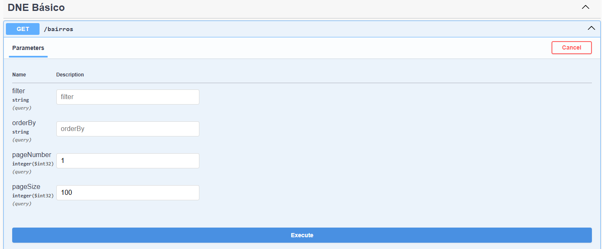

# e-DNE - Estrutura da Base de CEPs dos Correios - parte 3 de 3
Nesta terceira e última parte da série sobre a estrutura da base de dados e-DNE dos Correios, iremos finalizar com a criação de uma API RESTful para expor os dados importados. Para isso, continuaremos com o projeto que iniciamos na [parte 1](../edne-estrutura-da-base-de-ceps-dos-correios-parte-1) e [parte 2](../edne-estrutura-da-base-de-ceps-dos-correios-parte-2), onde criamos o importador dos dados da base DNE Básico. Nele adicionaremos um projeto de API que utilizará o DbContext para consultar os dados e expô-los através de endpoints RESTful. A API será construída utilizando o [FastEndpoints](https://fast-endpoints.com/) e a library [Gridify](https://alirezanet.github.io/Gridify/) para facilitar a paginação, ordenação e filtragem dos dados. Iniciaremos agora com a criação do projeto da API.

<!-- truncate -->
## Criação do projeto da API
Abra o projeto `Correios.DneBasico.sln` no Visual Studio e adicione um novo projeto chamado `Correios.DneBasico.Api`. Esse projeto será do tipo ASP.NET Core Web API.

Ao criar o projeto, selecione `.Net 9.0` como a versão do framework.

Adicione uma referência ao projeto `Correios.DneBasico.Data` no projeto `Correios.DneBasico.Api`, para que possamos utilizar o DbContext e as entidades que criamos anteriormente. Abra o gerenciador de pacotes NuGet e instale os seguintes pacotes no projeto `Correios.DneBasico.Api`:
```
FastEndpoints 7.1.1
FastEndpoints.Swagger 7.1.1
Gridify.EntityFramework 2.17.2
MicroElements.NSwag.FluentValidation 7.0.1
```

Adicione um arquivo `Global.Usings.cs` no projeto `Correios.DneBasico.Api` com o seguinte conteúdo para facilitar o uso dos namespaces comuns:

```csharp title="Correios.DneBasico.Api/Global.Usings.cs"
global using Correios.DneBasico.Api.Constants;
global using Correios.DneBasico.Api.Extensions;
global using Correios.DneBasico.Api.Models;
global using Correios.DneBasico.Data.Contexts;
global using FastEndpoints;
global using FastEndpoints.Swagger;
global using FluentValidation;
global using Gridify;
global using Microsoft.EntityFrameworkCore;
global using System.ComponentModel;
global using System.Net;
global using System.Net.Mime;
```

## Configuração do FastEndpoints, Swagger e DbContext
No arquivo `Program.cs`, iremos configurar o FastEndpoints e o Swagger para a documentação da API. Substitua o conteúdo do arquivo `Program.cs` pelo seguinte código:

```csharp title="Correios.DneBasico.Api/Program.cs"
var builder = WebApplication.CreateBuilder(args);

// Add services to the container.
builder.Services
    .AddFastEndpoints()
    .SwaggerDocument();

var app = builder.Build();

// Configure the HTTP request pipeline.
app.UseFastEndpoints()
   .UseSwaggerGen();

app.UseHttpsRedirection();

app.Run();
```

Com essa configuração básica, já temos o FastEndpoints e o Swagger configurados com o mínimo necessário para iniciar a criação dos endpoints da API. Aproveitando que estamos trabalhando no arquivo `Program.cs`, vamos adicionar a configuração do DbContext para conectar ao banco de dados PostgreSQL. Adicione o seguinte código antes da linha `var app = builder.Build();`:

```csharp
builder.Services.AddDbContext<DneBasicoDbContext>(options =>
{
    var connectionString = builder.Configuration.GetConnectionString("eDne");
    options.UseNpgsql(connectionString);
});
```

Com isso, configuramos o DbContext para utilizar o PostgreSQL, utilizando a string de conexão definida no arquivo `appsettings.json`. Adicione a conexão no arquivo `appsettings.json` caso ainda não tenha feito:

```json title="Correios.DneBasico.Api/appsettings.json"
{
  "ConnectionStrings": {
    "eDne": "Host=localhost;Database=edne;Username=seu_usuario;Password=sua_senha"
  }  
}
```

Conforme formos avançando na criação dos endpoints, iremos adicionar mais configurações no `Program.cs`, mas por enquanto, essa configuração inicial já é suficiente para começarmos a criar os endpoints da API.

## Os Endpoints da API
Antes de saírmos "codando", vamos organizar a estrutura do projeto e delimitar os objetivos que queremos alcançar com os endpoints da API. Iremos criar endpoints para consultar os dados das principais entidades da base DNE Básico e a nossa tabela de CEPs unificada que criamos na [parte 2](../edne-estrutura-da-base-de-ceps-dos-correios-parte-2). Os endpoints que iremos criar são:
- Bairros (`GetBairros`)
- Caixas Postais Comunitárias (`GetCaixasPostaisComunitarias`)
- Ceps (`GetCeps` e `GetCep(cep)`)
- Estados (`GetEstados`)
- Municípios (`GetMunicipios`)
- Grandes Usuários (`GetGrandesUsuarios`)
- Localidades (`GetLocalidades`)
- Logradouros (`GetLogradouros`)
- Países (`GetPaises`)
- Unidades Operacionais (`GetUnidadesOperacionais`)

Cada endpoint será implementado como uma classe separada dentro de um diretório chamado `Features`. Dentro do diretório `Features`, criaremos subdiretórios para cada entidade, onde cada subdiretório conterá a classe do endpoint correspondente. Além disso, cada endpoint seguirá o padrão do FastEndpoints, onde teremos uma classe de requisição (Request), uma classe de resposta (Response) e a classe do endpoint propriamente dita. Os endpoints de listagem permitirão a consulta de múltiplos registros, enquanto o endpoint de CEP individual permitirá a consulta de um único registro baseado no CEP informado. Nas listagens, iremos retornar os dados paginados e permitiremos ordenação e filtragem dos dados utilizando a library [Gridify](https://alirezanet.github.io/Gridify/).

## Implementação dos Endpoints
Vamos iniciar criando o diretório `Features` dentro do projeto `Correios.DneBasico.Api`. Em seguida, criaremos um subdiretório para cada entidade e implementaremos os endpoints.

Antes de começarmos a implementar os endpoints, vamos criar algumas classes auxiliares e extensões para facilitar a paginação, ordenação e filtragem dos dados utilizando o Gridify.

Crie um diretório chamado `Models` dentro do projeto `Correios.DneBasico.Api` e adicione a seguinte classe `PagedResponse.cs`:

```csharp title="Correios.DneBasico.Api/Models/PagedResponse.cs"
namespace Correios.DneBasico.Api.Model;

public class PagedResponse<T>
{
    public List<T> Data { get; set; } = [];
    public int TotalCount { get; set; }
    public int TotalPages { get; set; }
    public int PageNumber { get; set; }
    public int PageSize { get; set; }
    public int RowsReturned { get; set; }
}
```

Essa classe será utilizada para retornar os dados paginados nas respostas dos endpoints de listagem.

Agora, crie um diretório chamado `Extensions` dentro do projeto `Correios.DneBasico.Api` e adicione a seguinte classe `QueryableExtensions.cs`:

```csharp title="Correios.DneBasico.Api/Extensions/QueryableExtensions.cs"
namespace Correios.DneBasico.Api.Extensions;

public static class IQueryableExtensions
{
    public static async Task<PagedResponse<T>> ToPagedResultAsync<T>(
        this IQueryable<T> query,
        int totalCount,
        int pageNumber = 1,
        int pageSize = 100,
        CancellationToken cancellationToken = default)
    {
        var entities = await query.ToListAsync(cancellationToken);

        var pagedResult = new PagedResponse<T>
        {
            Data = entities ?? [],
            TotalCount = totalCount,
            TotalPages = (int)Math.Ceiling(totalCount / (double)pageSize),
            PageNumber = pageNumber,
            PageSize = pageSize,
            RowsReturned = entities?.Count ?? 0
        };

        return pagedResult;
    }
}
```
Essa extensão será utilizada para converter uma consulta IQueryable em um resultado paginado utilizando a classe `PagedResponse`.

Dentro do mesmo diretório `Extensions`, adicione a seguinte classe `GridifyExtensions.cs`:

```csharp title="Correios.DneBasico.Api/Extensions/GridifyExtensions.cs"
using System.Text;

namespace Correios.DneBasico.Api.Extensions;

public static class GridifyExtensions
{
    public static string GetMappingList<T>(this GridifyMapper<T> mapper)
    {
        var mappings = mapper.GetCurrentMaps();
        return mappings.Select(m => m.From).ToList().ConcatenateWithAnd("e");
    }

    private static string ConcatenateWithAnd(this List<string> list, string andWord = "and")
    {
        var and = andWord;

        if (list.Count == 0) return string.Empty;
        if (list.Count == 1) return list[0];
        if (list.Count == 2) return $"{list[0]} {and} {list[1]}";

        var sb = new StringBuilder();
        sb.AppendJoin(", ", list.Take(list.Count - 1));
        sb.Append($" {and} ");
        sb.Append(list.Last());

        return sb.ToString();
    }
}
```

Essa extensão será utilizada para obter a lista de mapeamentos do Gridify. Utilizaremos essa extensão para mostrar no Swagger quais campos podem ser utilizados para ordenação e filtragem.

Para encerrar essa seção de preparação, crie um diretório chamado `Constants` dentro do projeto `Correios.DneBasico.Api` e adicione a seguinte classe `ApiConstants.cs`:

```csharp title="Correios.DneBasico.Api/Constants/ApiConstants.cs"
namespace Correios.DneBasico.Api.Constants;

public static class ApiConstants
{
    public static class Tags
    {
        public const string BASE = "DNE Básico";
    }

    public static class RouteNames
    {
        public const string LOCALIDADES = "localidades";
        public const string LOGRADOUROS = "logradouros";
        public const string ESTADOS = "estados";
        public const string CIDADES = "cidades";
        public const string CEPS = "ceps";
        public const string BAIRROS = "bairros";
        public const string UNIDADES_OPERACIONAIS = "unidades-operacionais";
        public const string CAIXAS_POSTAIS_COMUNITARIAS = "caixas-postais-comunitarias";
        public const string GRANDES_USUARIOS = "grandes-usuarios";
    }
}
```

Essa classe conterá constantes utilizadas na API, como nomes de rotas e tags para o Swagger.

Hora de iniciarmos a criação dos endpoints! Iremos iniciar pelo endpoint de bairros como exemplo, e a partir dele, você poderá seguir o mesmo padrão para criar os demais endpoints.

### Endpoint de Bairros
Crie um diretório chamado `Bairros` dentro do diretório `Features` e adicione uma classe com o nome `GetBairrosEndpoint.cs`. Inclua o seguinte código na classe:

```csharp title="Correios.DneBasico.Api/Features/Bairros/GetBairrosEndpoint.cs" showLineNumbers="true"
namespace Correios.DneBasico.Api.Features.Bairros;

public sealed class GetBairrosEndpoint : 
                    Endpoint<GetBairrosRequest, PagedResponse<GetBairrosResponse>>
{
    private readonly DneBasicoDbContext _dbContext;

    public GetBairrosEndpoint(DneBasicoDbContext dbContext)
    {
        _dbContext = dbContext;
    }

    public override void Configure()
    {
        Get($"/{ApiConstants.RouteNames.BAIRROS}");
        AllowAnonymous();

        Description(b => b
            .WithTags(ApiConstants.Tags.BASE)
            .Accepts<GetBairrosRequest>()
            .Produces<PagedResponse<GetBairrosResponse>>((int)HttpStatusCode.OK, MediaTypeNames.Application.Json)
            .WithDisplayName(nameof(GetBairrosEndpoint)),
        clearDefaults: true);
    }

    public override async Task HandleAsync(GetBairrosRequest Request,
                                           CancellationToken ct)
    {
        var gridifyQuery = new GridifyQuery
        {
            Filter = Request.Filter,
            OrderBy = Request.OrderBy ?? nameof(GetBairrosResponse.Nome),
            Page = Request.PageNumber ?? 1,
            PageSize = Request.PageSize ?? 100
        };

        var query = _dbContext.Bairros
            .AsNoTracking()
            .ApplyFiltering(gridifyQuery.Filter)
            .ApplyOrdering(gridifyQuery.OrderBy)
            .Select(c => new GetBairrosResponse
            {
                Id = c.Id,
                Uf = c.Uf,
                Nome = c.Nome,
                NomeAbreviado = c.NomeAbreviado,
                LocalidadeId = c.LocalidadeId,
                Localidade = c.Localidade.Nome,
                Variacoes = c.Variacoes!.Select(v => v.Denominacao).ToList(),
                FaixasCep = c.Faixas!.Select(f => new FaixaCepResponse(f.CepInicial, f.CepFinal)).ToList()
            });

        var totalCount = await query.CountAsync(ct);

        query = query
            .ApplyPaging(gridifyQuery);

        var result = await query.ToPagedResultAsync(totalCount, gridifyQuery.Page, gridifyQuery.PageSize, ct);

        await Send.OkAsync(result, cancellation: ct);
        return;
    }
}

public record GetBairrosRequest
{
    public string? Filter { get; set; }
    public string? OrderBy { get; set; }
    [DefaultValue(1)]
    public int? PageNumber { get; set; }
    [DefaultValue(100)]
    public int? PageSize { get; set; }
}

public class GetBairrosRequestValidator : Validator<GetBairrosRequest>
{
    public GetBairrosRequestValidator()
    {
        RuleFor(x => x.Filter!)
            .MinimumLength(3);

        RuleFor(x => x.OrderBy!)
            .MinimumLength(2);

        When(x => x.PageNumber.HasValue || x.PageSize.HasValue, () =>
        {
            RuleFor(x => x.PageNumber)
                .NotNull()
                .GreaterThan(0)

            RuleFor(x => x.PageSize)
                .NotNull()
                .GreaterThan(0);
        });
    }
}

public record GetBairrosResponse
{
    public int Id { get; set; }
    public string Nome { get; set; } = default!;
    public string? NomeAbreviado { get; set; }
    public string Localidade { get; set; } = default!;
    public string Uf { get; set; } = default!;
    public ICollection<string> Variacoes { get; set; } = [];
    public ICollection<FaixaCepResponse> FaixasCep { get; set; } = [];
    public int LocalidadeId { get; set; }
};

public record FaixaCepResponse(string Inicial, string Final);

```

Se executarmos a aplicação agora, já teremos o endpoint de bairros funcionando! Podemos acessar o Swagger em `https://localhost:{porta}/swagger` e testar o endpoint `GET /bairros`. Mas, antes disso, vamos passar pelas linhas do código para entender o que está acontecendo.

A classe `GetBairrosEndpoint` herda de `Endpoint<TRequest, TResponse>`, onde `TRequest` é a classe de requisição `GetBairrosRequest` e `TResponse` é a classe de resposta `PagedResponse<GetBairrosResponse>`.

No construtor da classe `GetBairrosEndpoint`, injetamos o `DneBasicoDbContext` para podermos acessar os dados do banco de dados.

No método `Configure`, definimos a rota do endpoint como `GET /bairros` utilizando uma das constants que criaamos anteriormente, permitimos o acesso anônimo, já que o `FastEndpoints`, por padrão, bloqueia o acesso anônimo de todas as rotas fazendo com que tenhamos que informar, explicitamente, que a rota permite acesso anônimo, e configuramos a descrição do endpoint para o Swagger.

No método `HandleAsync`, recebemos a requisição do tipo `GetBairrosRequest` e um `CancellationToken`. Utilizamos o Gridify para aplicar a filtragem, ordenação e paginação nos dados. Em seguida, consultamos os dados do banco de dados utilizando o DbContext, mapeamos os dados para a classe de resposta `GetBairrosResponse` e retornamos os dados paginados utilizando a extensão `ToPagedResultAsync`.

Agora que entendemos o funcionamento do endpoint de bairros, vamos executar a aplicação e testar o endpoint no Swagger. Ao acessar o Swagger, você verá o endpoint `GET /bairros` listado. Clique nele para expandir e testar a funcionalidade. Uma `anomalia` que você pode notar é que, no Swagger, existem dois endpoints `GET /bairros`. Isso acontece porque o FastEndpoints, por padrão, inclui uma tag com a rota do endpoint, e como estamos utilizando a tag `DNE Básico`, o Swagger exibe dois endpoints. Para evitar essa duplicidade, iremos melhorar a nossa configuração do Swagger no `Program.cs` em breve.



No endpoint de bairros, podemos utilizar os seguintes parâmetros de consulta para filtrar, ordenar e paginar os dados. Execute sem os parâmetros de filter e orderBy para retornar os 100 primeiros bairros, ordenados por nome (padrão).

Você receberá uma resposta semelhante a esta:

```json
{
  "data": [
    {
      "id": 104720,
      "nome": "08 de Junho",
      "nomeAbreviado": "08 Junho",
      "localidade": "Tabuleiro do Norte",
      "uf": "CE",
      "variacoes": [],
      "faixasCep": [
        {
          "inicial": "62961000",
          "final": "62961129"
        }
      ],
      "localidadeId": 1731
    },
    ...
  ],
  "totalCount": 82132,
  "totalPages": 822,
  "pageNumber": 1,
  "pageSize": 100,
  "rowsReturned": 100
}
```

Isso é um ótimo sinal! Significa que o endpoint está funcionando corretamente e retornando os dados paginados. Agora vamos entender como o Gridify está nos ajudando a implementar a filtragem e ordenação dos dados.

Se adicionarmos o valor `nome=*Centro` no parâmetro `filter`, o Gridify irá interpretar esse filtro e aplicar na consulta. O operador `=*` indica que queremos filtrar os bairros cujo nome contém a palavra "Centro". O Gridify suporta diversos operadores para filtragem, como `=`, `!=`, `>`, `<`, `>=`, `<=`, `*=` (contém), `^` (inicia com), `$` (termina com), entre outros. Você pode consultar a documentação oficial do Gridify para mais detalhes sobre os operadores de filtragem disponíveis em [Filtering](https://alirezanet.github.io/Gridify/guide/filtering#conditional-operators)

A ordenação funciona de forma semelhante. Se adicionarmos o valor `nome desc` no parâmetro `orderBy`, o Gridify irá ordenar os bairros pelo nome em ordem decrescente. Podemos combinar múltiplos campos de ordenação separando-os por vírgula, como `uf asc, nome desc`. Consulte a documentação oficial do Gridify para mais detalhes sobre a ordenação em
[Ordering](https://alirezanet.github.io/Gridify/guide/ordering)

Aparentemente tudo está bem, porém, existe um problema por trás dessa facilidade. Estamos aplicando a filtragem e ordenação diretamente na consulta do Entity Framework, ou seja, na entidade `Bairro`. Isso significa que os nomes dos campos utilizados na filtragem e ordenação devem corresponder exatamente aos nomes das propriedades da entidade e não aos nomes das propriedades da classe de resposta `GetBairrosResponse`. Isso pode ser confuso para os consumidores da API, pois eles esperam utilizar os nomes das propriedades da classe de resposta. Vamos resolver esse problema utilizando o mapeador do Gridify.

### Mapeador do Gridify
Adicione a seguinte classe no final do arquivo `GetBairrosEndpoint.cs`:

```csharp title="Correios.DneBasico.Api/Features/Bairros/GetBairrosEndpoint.cs"
class GetBairrosRequestMapper : GridifyMapper<Bairro>
{
    public GetBairrosRequestMapper()
    {
        ClearMappings();

        AddMap(nameof(GetBairrosResponse.Id), o => o.Id);
        AddMap(nameof(GetBairrosResponse.Nome), o => o.Nome);
        AddMap(nameof(GetBairrosResponse.Uf), o => o.Uf);
        AddMap(nameof(GetBairrosResponse.LocalidadeId), o => o.LocalidadeId);
    }
}
```

Essa classe herda de `GridifyMapper<T>`, onde `T` é a entidade `Bairro`. No construtor, limpamos os mapeamentos padrão utilizando o método `ClearMappings()` e adicionamos os mapeamentos personalizados utilizando o método `AddMap()`. Cada chamada ao `AddMap()` mapeia uma propriedade da classe de resposta `GetBairrosResponse` para a propriedade correspondente da entidade `Bairro`. Nesse exemplo, mapeamos apenas as propriedades que queremos que sejam utilizadas na filtragem e ordenação.

Agora, precisamos utilizar esse mapeador na aplicação do Gridify. Altere o método `HandleAsync` para o seguinte código:

```csharp title="Correios.DneBasico.Api/Features/Bairros/GetBairrosEndpoint.cs"
public override async Task HandleAsync(GetBairrosRequest Request,
                                       CancellationToken ct)
{
    var gridifyQuery = new GridifyQuery
    {
        Filter = Request.Filter,
        OrderBy = Request.OrderBy ?? nameof(GetBairrosResponse.Nome),
        Page = Request.PageNumber ?? 1,
        PageSize = Request.PageSize ?? 100
    };
    var mapper = new GetBairrosRequestMapper();

    var isValid = gridifyQuery.IsValid(mapper);
    if (!isValid)
    {
        AddError("Tem algo errado no filtro ou ordenação.");
        await Send.ErrorsAsync(cancellation: ct);
        return;
    }

    var query = _dbContext.Bairros
        .AsNoTracking()
        .ApplyFiltering(gridifyQuery.Filter, mapper)
        .ApplyOrdering(gridifyQuery.OrderBy, mapper)
        .Select(c => new GetBairrosResponse
        {
            Id = c.Id,
            Uf = c.Uf,
            Nome = c.Nome,
            NomeAbreviado = c.NomeAbreviado,
            LocalidadeId = c.LocalidadeId,
            Localidade = c.Localidade.Nome,
            Variacoes = c.Variacoes!.Select(v => v.Denominacao).ToList(),
            FaixasCep = c.Faixas!.Select(f => new FaixaCepResponse(f.CepInicial, f.CepFinal)).ToList()
        });

    var totalCount = await query.CountAsync(ct);

    query = query
        .ApplyPaging(gridifyQuery);

    var result = await query.ToPagedResultAsync(totalCount, gridifyQuery.Page, gridifyQuery.PageSize, ct);

    await Send.OkAsync(result, cancellation: ct);
    return;
}
```

Adicionamos a criação do mapeador `GetBairrosRequestMapper` e utilizamos ele nos métodos `ApplyFiltering` e `ApplyOrdering`. Além disso, antes de aplicar a filtragem e ordenação, verificamos se o `gridifyQuery` é válido utilizando o método `IsValid(mapper)`. Caso não seja válido, retornamos um erro para o cliente.

Com essa alteração, agora podemos utilizar os nomes das propriedades da classe de resposta `GetBairrosResponse` nos parâmetros de filtragem e ordenação. Por exemplo, podemos utilizar `nome=*Centro` no parâmetro `filter` e `nome desc` no parâmetro `orderBy`.

Para melhorar a documentação do Swagger, vamos adicionar informações sobre os campos disponíveis para filtragem e ordenação. Altere o método `Configure` para o seguinte código:

```csharp title="Correios.DneBasico.Api/Features/Bairros/GetBairrosEndpoint.cs"
ppublic override void Configure()
{
    Get($"/{ApiConstants.RouteNames.BAIRROS}");
    AllowAnonymous();

    Description(b => b
        .WithTags(ApiConstants.Tags.BASE)
        .Accepts<GetBairrosRequest>()
        .Produces<PagedResponse<GetBairrosResponse>>((int)HttpStatusCode.OK, MediaTypeNames.Application.Json)
        .WithDisplayName(nameof(GetBairrosEndpoint)),
    clearDefaults: true);

    var mapper = new GetBairrosRequestMapper();
    var filterableFields = mapper.GetMappingList();
    var orderableFields = mapper.GetMappingList();

    Summary(s =>
    {
        s.RequestParam(r => r.OrderBy, string.Format("Critério de ordenação dos resultados. Campos permitidos: {0}", filterableFields));
        s.RequestParam(r => r.Filter, string.Format("Filtro para busca. Campos permitidos: {0}", orderableFields));
    });
}
```

A partir de agora, se você acessar o Swagger e expandir o endpoint `GET /bairros`, verá as informações sobre os campos disponíveis para filtragem e ordenação nos parâmetros `filter` e `orderBy`. Se tentar utilizar um campo inválido, receberá uma mensagem de erro informando que há algo errado no filtro ou ordenação.

Antes de prosseguirmos, vamos incluir algumas configurações globais para o Gridify no `Program.cs` e na sequência, melhorar a configuração do Swagger e do FastEndpoints.

### Configurações Globais do Gridify
No arquivo `Program.cs`, adicione a seguinte configuração antes de `var builder = WebApplication.CreateBuilder(args);`:

```csharp title="Correios.DneBasico.Api/Program.cs"
GridifyGlobalConfiguration.EnableEntityFrameworkCompatibilityLayer();
GridifyGlobalConfiguration.CaseSensitiveMapper = false;
GridifyGlobalConfiguration.AllowNullSearch = true;
GridifyGlobalConfiguration.CaseInsensitiveFiltering = true;
GridifyGlobalConfiguration.IgnoreNotMappedFields = true;
```
Essas e outras configurações globais do Gridify ajudam a melhorar a compatibilidade com o Entity Framework e a tornar a filtragem e ordenação mais flexíveis. Veja todas as opções de configuração na documentação oficial do Gridify em [Global Configuration](https://alirezanet.github.io/Gridify/guide/gridifyGlobalConfiguration)

### Melhorias na Configuração do Swagger e FastEndpoints
Ainda no arquivo `Program.cs`, vamos melhorar a configuração do Swagger e do FastEndpoints para evitar a duplicidade dos endpoints no Swagger e adicionar algumas customizações. Substitua o conteúdo do arquivo `Program.cs` pelo seguinte código completo:

```csharp title="Correios.DneBasico.Api/Program.cs"
using FastEndpoints.Swagger;
using MicroElements.NSwag.FluentValidation.AspNetCore;
using Microsoft.AspNetCore.Http.Json;
using NSwag;
using System.Text.Json.Serialization;

GridifyGlobalConfiguration.EnableEntityFrameworkCompatibilityLayer();
GridifyGlobalConfiguration.CaseSensitiveMapper = false;
GridifyGlobalConfiguration.AllowNullSearch = true;
GridifyGlobalConfiguration.CaseInsensitiveFiltering = true;
GridifyGlobalConfiguration.IgnoreNotMappedFields = true;

var builder = WebApplication.CreateBuilder(args);

var Configuration = builder.Configuration;

builder.Services
    .AddFastEndpoints()
    .SwaggerDocument(o =>
    {
        // Desabilita autenticação JWT no Swagger
        o.EnableJWTBearerAuth = false;
        // Exibe os nomes dos DTOs de forma curta no Swagger
        o.ShortSchemaNames = true;

        // Desativa o uso de segmentos de caminho automáticos
        o.AutoTagPathSegmentIndex = 0;

        // Remove esquemas de requisição vazios do Swagger
        o.RemoveEmptyRequestSchema = true;
    });

builder.Services.AddFluentValidationRulesToSwagger();

builder.Services.AddDbContext<DneBasicoDbContext>(options =>
    options.UseNpgsql(Configuration.GetConnectionString("eDNE")));

builder.Services.Configure<JsonOptions>(options =>
{
    options.SerializerOptions.Converters.Add(new JsonStringEnumConverter());
    options.SerializerOptions.WriteIndented = true;
    options.SerializerOptions.ReferenceHandler = ReferenceHandler.IgnoreCycles;
});

var app = builder.Build();

app.UseFastEndpoints(c =>
{
    // Usa os nomes curtos para os endpoints
    // Exemplo: "GetCep" ao invés de "Correios.DneBasico.Features.GetCep"
    // Isso torna a documentação mais limpa e fácil de ler
    c.Endpoints.ShortNames = true;
}).UseSwaggerGen(o =>
{
    o.Path = "/swagger/{documentName}/swagger.json";
    o.PostProcess = (document, request) =>
    {
        document.Info.Title = "Correios e-DNE API";
        document.Info.Version = "v1";
        document.Info.Contact = new OpenApiContact
        {
            Name = "SEU NOME",
            Email = "seu-email@example.com"
        };
    };
}, ui =>
{
    // Título da documentação no Swagger UI
    ui.DocumentTitle = "Correios e-DNE API";
    // Define a expansão dos documentos como "list"
    ui.DocExpansion = "list";
    // Desativa o botão "Try it out" como clicado por padrão
    ui.DeActivateTryItOut();
    // Exibe os IDs das operações no Swagger UI
    ui.ShowOperationIDs();
});

app.UseHttpsRedirection();

app.Run();
```

Melhorou, não é mesmo? Com essas melhorias, a documentação do Swagger ficará mais limpa e fácil de entender, além de evitar a duplicidade dos endpoints.

Vamos fazer algumas alterações no GetBairrosEndpoint antes de criarmos os demais endpoints.

1º - Mova o record `FaixaCepResponse` para um novo arquivo chamado `FaixaCepResponse.cs` dentro do diretório `Features/_Shared`. Também utilizaremos essa classe de resposta quando criarmos o endpoints de `Localidades` e `Estados`.

2º - No diretório `Features/_Shared`, crie um novo arquivo chamado `QueryListRequest.cs` e adicione o seguinte código:

```csharp title="Correios.DneBasico.Api/Features/_Shared/QueryListRequest.cs"
using System.ComponentModel;

namespace Correios.DneBasico.Api.Features._Shared;

public record QueryListRequest
{
    /// <summary>
    /// Filtro para busca.
    /// </summary>
    [QueryParam]
    public string? Filter { get; set; }

    /// <summary>
    /// Critério de ordenação dos resultados.
    /// </summary>
    [QueryParam]
    public string? OrderBy { get; set; }

    /// <summary>
    /// Página atual para paginação.
    /// </summary>
    [QueryParam]
    [DefaultValue(1)]
    public int? PageNumber { get; set; }

    /// <summary>
    /// Quantidade de itens por página para paginação.
    /// </summary>
    [QueryParam]
    [DefaultValue(100)]
    public int? PageSize { get; set; }
}

public class QueryListRequestValidator : Validator<QueryListRequest>
{
    public QueryListRequestValidator()
    {
        RuleFor(x => x.Filter!)
            .MinimumLength(3)
            .WithMessage("O filtro deve ter no mínimo 3 caracteres.");

        RuleFor(x => x.OrderBy!)
            .MinimumLength(2)
            .WithMessage("A ordenação deve ter no mínimo 2 caracteres.");

        When(x => x.PageNumber.HasValue || x.PageSize.HasValue, () =>
        {
            RuleFor(x => x.PageNumber)
                .NotNull()
                .WithMessage("O número da página é obrigatório quando o tamanho da página é fornecido.")
                .GreaterThan(0)
                .WithMessage("O número da página deve ser maior que zero.");

            RuleFor(x => x.PageSize)
                .NotNull()
                .WithMessage("O tamanho da página é obrigatório quando o número da página é fornecido.")
                .GreaterThan(0)
                .WithMessage("O tamanho da página deve ser maior que zero.");
        });
    }
}
```
Utilizaremos esse record e validator para os endpoints de listagem, evitando a duplicação de código.

3º - Altere o arquivo `GetBairrosEndpoint.cs` para que GetBairrosRequest herde de `QueryListRequest` e altere o validator para o seguinte código

```csharp title="Correios.DneBasico.Api/Features/Bairros/GetBairrosEndpoint.cs"
public record GetBairrosRequest : QueryListRequest
{
    
}

public class GetBairrosRequestValidator : Validator<GetBairrosRequest>
{
    public GetBairrosRequestValidator()
    {
        Include(new QueryListRequestValidator());
    }
}
```

No arquivo de constantes `ApiConstants.cs`, adicione as seguintes contantes na classe `ApiConstants`:

```csharp title="Correios.DneBasico.Api/Constants/ApiConstants.cs"
public const string FILTER_SUMMARY = "Filtro para busca. Campos permitidos: {0}";
public const string ORDERBY_SUMMARY = "Critério de ordenação dos resultados. Campos permitidos: {0}";
public const string GRIDYFY_INVALID_QUERY = "Tem algo errado no filtro ou ordenação.";
```

Atualize o `Global.Usings.cs` para incluir os novos namespaces criados:

```csharp title="Correios.DneBasico.Api/Global.Usings.cs"
global using Correios.DneBasico.Api.Constants;
global using Correios.DneBasico.Api.Extensions;
global using Correios.DneBasico.Api.Features._Shared;
global using Correios.DneBasico.Api.Models;
global using Correios.DneBasico.Data.Contexts;
global using Correios.DneBasico.Domain.Entities;
global using FastEndpoints;
global using FastEndpoints.Swagger;
global using FluentValidation;
global using Gridify;
global using Microsoft.EntityFrameworkCore;
global using System.ComponentModel;
global using System.Net;
global using System.Net.Mime;
```

Após essas alterações o `GetBairrosEndpoint.cs` ficará assim:

```csharp title="Correios.DneBasico.Api/Features/Bairros/GetBairrosEndpoint.cs"
namespace Correios.DneBasico.Api.Features.Bairros;

/// <summary>
/// Retorna uma lista paginada de bairros, com suporte a filtragem e ordenação.
/// </summary>
public sealed class GetBairrosEndpoint : Endpoint<GetBairrosRequest, PagedResponse<GetBairrosResponse>>
{
    private readonly DneBasicoDbContext _dbContext;

    public GetBairrosEndpoint(DneBasicoDbContext dbContext)
    {
        _dbContext = dbContext;
    }

    public override void Configure()
    {
        Get($"/{ApiConstants.RouteNames.BAIRROS}");
        AllowAnonymous();

        Description(b => b
            .WithTags(ApiConstants.Tags.BASE)
            .Accepts<GetBairrosRequest>()
            .Produces<PagedResponse<GetBairrosResponse>>((int)HttpStatusCode.OK, MediaTypeNames.Application.Json)
            .WithDisplayName(nameof(GetBairrosEndpoint)),
        clearDefaults: true);

        var mapper = new GetBairrosRequestMapper();
        var filterableFields = mapper.GetMappingList();
        var orderableFields = mapper.GetMappingList();

        Summary(s =>
        {
            
            s.RequestParam(r => r.OrderBy, string.Format(ApiConstants.FILTER_SUMMARY, filterableFields));
            s.RequestParam(r => r.Filter, string.Format(ApiConstants.ORDERBY_SUMMARY, orderableFields));
        });
    }

    public override async Task HandleAsync(GetBairrosRequest Request,
                                           CancellationToken ct)
    {
        var gridifyQuery = new GridifyQuery
        {
            Filter = Request.Filter,
            OrderBy = Request.OrderBy ?? nameof(GetBairrosResponse.Nome),
            Page = Request.PageNumber ?? 1,
            PageSize = Request.PageSize ?? 100
        };
        var mapper = new GetBairrosRequestMapper();

        var isValid = gridifyQuery.IsValid(mapper);
        if (!isValid)
        {
            AddError(ApiConstants.GRIDYFY_INVALID_QUERY);
            await Send.ErrorsAsync(cancellation: ct);
            return;
        }

        var query = _dbContext.Bairros
            .AsNoTracking()
            .ApplyFiltering(gridifyQuery.Filter, mapper)
            .ApplyOrdering(gridifyQuery.OrderBy, mapper)
            .Select(c => new GetBairrosResponse
            {
                Id = c.Id,
                Uf = c.Uf,
                Nome = c.Nome,
                NomeAbreviado = c.NomeAbreviado,
                LocalidadeId = c.LocalidadeId,
                Localidade = c.Localidade.Nome,
                Variacoes = c.Variacoes!.Select(v => v.Denominacao).ToList(),
                FaixasCep = c.Faixas!.Select(f => new FaixaCepResponse(f.CepInicial, f.CepFinal)).ToList()
            });

        var totalCount = await query.CountAsync(ct);

        query = query
            .ApplyPaging(gridifyQuery);

        var result = await query.ToPagedResultAsync(totalCount, gridifyQuery.Page, gridifyQuery.PageSize, ct);

        await Send.OkAsync(result, cancellation: ct);
        return;
    }
}

public record GetBairrosRequest : QueryListRequest
{

}

public class GetBairrosRequestValidator : Validator<GetBairrosRequest>
{
    public GetBairrosRequestValidator()
    {
        Include(new QueryListRequestValidator());
    }
}

/// <summary>
/// Response para retornar as bairros.
/// </summary>
public record GetBairrosResponse
{
    /// <summary>
    /// Chave do bairro
    /// </summary>
    public int Id { get; set; }

    /// <summary>
    /// Nome do bairro
    /// </summary>
    public string Nome { get; set; } = default!;

    /// <summary>
    /// Abreviatura do nome do bairro
    /// </summary>
    public string? NomeAbreviado { get; set; }

    /// <summary>
    /// Nome da localidade
    /// </summary>
    public string Localidade { get; set; } = default!;

    /// <summary>
    /// Sigla da UF
    /// </summary>
    public string Uf { get; set; } = default!;

    /// <summary>
    /// Variações de nome do Bairro
    /// </summary>
    public ICollection<string> Variacoes { get; set; } = [];

    /// <summary>
    /// Faixas de CEP do Bairro
    /// </summary>
    public ICollection<FaixaCepResponse> FaixasCep { get; set; } = [];

    /// <summary>
    /// Chave da localidade
    /// </summary>
    public int LocalidadeId { get; set; }
};

class GetBairrosRequestMapper : GridifyMapper<Bairro>
{
    public GetBairrosRequestMapper()
    {
        ClearMappings();

        AddMap(nameof(GetBairrosResponse.Id), o => o.Id);
        AddMap(nameof(GetBairrosResponse.Nome), o => o.Nome);
        AddMap(nameof(GetBairrosResponse.Uf), o => o.Uf);
        AddMap(nameof(GetBairrosResponse.LocalidadeId), o => o.LocalidadeId);
    }
}
```

Podemos seguir o mesmo padrão para criar os demais endpoints. Recomendo que você crie os endpoints restantes seguindo o exemplo do endpoint de bairros, adaptando as consultas e mapeamentos conforme necessário para cada entidade.


## Conclusão


## Outros artigos desta série
- [Estrutura da Base de CEPs dos Correios - parte 1 de 3](../edne-estrutura-da-base-de-ceps-dos-correios-parte-1)
- [Estrutura da Base de CEPs dos Correios - parte 2 de 3](../edne-estrutura-da-base-de-ceps-dos-correios-parte-2)

## Código Fonte
O código fonte completo deste projeto está disponível no GitHub: [Correios.DneBasico](https://github.com/danielcorvello/Correios.DneBasico)

## Referências
- [FastEndpoints Documentation](https://fast-endpoints.com/docs/)
- [Correios - Marketing Direto](https://www.correios.com.br/enviar/marketing-direto/marketing) 
- [Wikipédia - Código de Endereçamento Postal](https://pt.wikipedia.org/wiki/C%C3%B3digo_de_Endere%C3%A7amento_Postal) 
- [Correios - Tudo sobre CEP](https://www.correios.com.br/enviar/precisa-de-ajuda/tudo-sobre-cep) 
- [ViaCEP - Consulta CEP](https://viacep.com.br/)